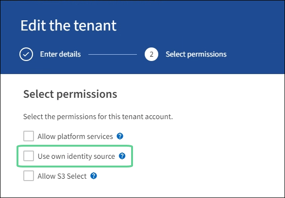

= Confirmer que les utilisateurs fédérés peuvent se connecter
:allow-uri-read: 
:icons: font
:imagesdir: ../media/

[role="lead"]
Avant d'activer l'authentification unique (SSO), vous devez confirmer qu'au moins un utilisateur fédéré peut se connecter au gestionnaire de grille et au gestionnaire de locataires pour tous les comptes de locataires existants.

.Avant de commencer
* Vous êtes connecté au Grid Manager à l'aide d'unlink:../admin/web-browser-requirements.html["navigateur Web pris en charge"] .
* Tu aslink:admin-group-permissions.html["autorisations d'accès spécifiques"] .
* Vous avez déjà configuré la fédération d’identité.

.Étapes
. S'il existe des comptes locataires existants, confirmez qu'aucun des locataires n'utilise sa propre source d'identité.
+

TIP: Lorsque vous activez SSO, une source d’identité configurée dans le gestionnaire de locataires est remplacée par la source d’identité configurée dans le gestionnaire de grille.  Les utilisateurs appartenant à la source d'identité du locataire ne pourront plus se connecter à moins qu'ils ne disposent d'un compte auprès de la source d'identité Grid Manager.

+
.. Sign in au gestionnaire de locataires pour chaque compte locataire.
.. Sélectionnez *GESTION DES ACCÈS* > *Fédération d'identité*.
.. Vérifiez que la case à cocher *Activer la fédération d’identité* n’est pas sélectionnée.
.. Si tel est le cas, confirmez que tous les groupes fédérés susceptibles d’être utilisés pour ce compte locataire ne sont plus nécessaires, décochez la case et sélectionnez *Enregistrer*.

. Confirmer qu'un utilisateur fédéré peut accéder au gestionnaire de grille :
+
.. Depuis le Gestionnaire de grille, sélectionnez *CONFIGURATION* > *Contrôle d'accès* > *Groupes d'administrateurs*.
.. Assurez-vous qu’au moins un groupe fédéré a été importé à partir de la source d’identité Active Directory et que l’autorisation d’accès racine lui a été attribuée.
.. Se déconnecter.
.. Confirmez que vous pouvez vous reconnecter au gestionnaire de grille en tant qu’utilisateur du groupe fédéré.

. S'il existe des comptes locataires existants, confirmez qu'un utilisateur fédéré disposant d'une autorisation d'accès root peut se connecter :
+
.. Depuis le gestionnaire de grille, sélectionnez *LOCATAIRES*.
.. Sélectionnez le compte locataire, puis sélectionnez *Actions* > *Modifier*.
.. Dans l’onglet Entrer les détails, sélectionnez *Continuer*.
.. Si la case à cocher *Utiliser sa propre source d'identité* est sélectionnée, décochez la case et sélectionnez *Enregistrer*.
+

+
La page Locataire apparaît.

.. Sélectionnez le compte locataire, sélectionnez * Sign in* et connectez-vous au compte locataire en tant qu'utilisateur root local.
.. Depuis le gestionnaire de locataires, sélectionnez *GESTION DES ACCÈS* > *Groupes*.
.. Assurez-vous qu’au moins un groupe fédéré du gestionnaire de grille s’est vu attribuer l’autorisation d’accès racine pour ce locataire.
.. Se déconnecter.
.. Confirmez que vous pouvez vous reconnecter au locataire en tant qu’utilisateur du groupe fédéré.

.Informations connexes
* link:requirements-for-sso.html["Exigences et considérations relatives à l'authentification unique"]
* link:managing-admin-groups.html["Gérer les groupes d'administrateurs"]
* link:../tenant/index.html["Utiliser un compte locataire"]

