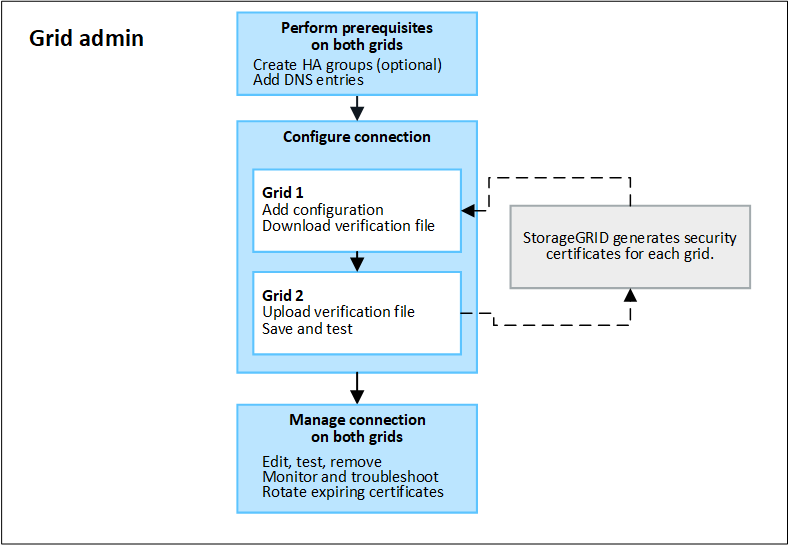

= Qu'est-ce que la fédération de réseau ?
:allow-uri-read: 
:icons: font
:imagesdir: ../media/

[role="lead"]
Vous pouvez utiliser la fédération de grille pour cloner des locataires et répliquer leurs objets entre deux systèmes StorageGRID pour la reprise après sinistre.

== Qu'est-ce qu'une connexion à une fédération de réseau ?

Une connexion de fédération de grille est une connexion bidirectionnelle, fiable et sécurisée entre les nœuds d'administration et de passerelle dans deux systèmes StorageGRID .

== Workflow pour la fédération de grilles

Le diagramme de flux de travail résume les étapes de configuration d'une connexion de fédération de grille entre deux grilles.

== Considérations et exigences relatives aux connexions de fédérations de réseaux

* Les grilles utilisées pour la fédération de grilles doivent exécuter des versions de StorageGRID qui sont soit identiques, soit ne présentant pas plus d'une différence de version majeure entre elles.
+
Pour plus de détails sur les exigences de version, reportez-vous à lalink:../release-notes/index.html["Notes de version"] .

* Une grille peut avoir une ou plusieurs connexions de fédération de grilles à d'autres grilles.  Chaque connexion de fédération de grille est indépendante de toutes les autres connexions.  Par exemple, si la grille 1 a une connexion avec la grille 2 et une deuxième connexion avec la grille 3, il n’y a pas de connexion implicite entre la grille 2 et la grille 3.
* Les connexions de la fédération de grille sont bidirectionnelles.  Une fois la connexion établie, vous pouvez surveiller et gérer la connexion à partir de l'une ou l'autre des grilles.
* Au moins une connexion à une fédération de grille doit exister avant de pouvoir utiliserlink:grid-federation-what-is-account-clone.html["clone de compte"] oulink:grid-federation-what-is-cross-grid-replication.html["réplication inter-réseaux"] .

=== Exigences en matière de réseau et d'adresse IP

* Les connexions de fédération de grille peuvent se produire sur le réseau de grille, le réseau d'administration ou le réseau client.
* Une connexion de fédération de grille connecte une grille à une autre grille.  La configuration de chaque grille spécifie un point de terminaison de fédération de grille sur l'autre grille composée de nœuds d'administration, de nœuds de passerelle ou des deux.
* La meilleure pratique consiste à se connecterlink:managing-high-availability-groups.html["groupes de haute disponibilité (HA)"] des nœuds de passerelle et d'administration sur chaque grille.  L’utilisation de groupes HA permet de garantir que les connexions de la fédération de grille resteront en ligne si les nœuds deviennent indisponibles.  Si l'interface active de l'un des groupes HA échoue, la connexion peut utiliser une interface de sauvegarde.
* Il n'est pas recommandé de créer une connexion de fédération de grille qui utilise l'adresse IP d'un seul nœud d'administration ou nœud de passerelle.  Si le nœud devient indisponible, la connexion à la fédération de grille deviendra également indisponible.
* link:grid-federation-what-is-cross-grid-replication.html["Réplication inter-réseaux"]des objets nécessite que les nœuds de stockage de chaque grille puissent accéder aux nœuds d'administration et de passerelle configurés sur l'autre grille.  Pour chaque grille, confirmez que tous les nœuds de stockage disposent d'une route à bande passante élevée vers les nœuds d'administration ou les nœuds de passerelle utilisés pour la connexion.

=== Utiliser les noms de domaine complets pour équilibrer la charge de la connexion

Pour un environnement de production, utilisez des noms de domaine complets (FQDN) pour identifier chaque grille de la connexion.  Ensuite, créez les entrées DNS appropriées, comme suit :

* Le nom de domaine complet (FQDN) de Grid 1 mappé à une ou plusieurs adresses IP virtuelles (VIP) pour les groupes HA de Grid 1 ou à l'adresse IP d'un ou plusieurs nœuds d'administration ou de passerelle de Grid 1.
* Le FQDN de Grid 2 mappé à une ou plusieurs adresses VIP pour Grid 2 ou à l'adresse IP d'un ou plusieurs nœuds d'administration ou de passerelle dans Grid 2.

Lorsque vous utilisez plusieurs entrées DNS, les demandes d’utilisation de la connexion sont équilibrées, comme suit :

* Les entrées DNS qui correspondent aux adresses VIP de plusieurs groupes HA sont équilibrées entre les nœuds actifs des groupes HA.
* Les entrées DNS qui correspondent aux adresses IP de plusieurs nœuds d'administration ou nœuds de passerelle sont équilibrées en charge entre les nœuds mappés.

=== Exigences portuaires

Lors de la création d'une connexion de fédération de grille, vous pouvez spécifier n'importe quel numéro de port inutilisé compris entre 23 000 et 23 999.  Les deux réseaux de cette connexion utiliseront le même port.

Vous devez vous assurer qu'aucun nœud de l'une ou l'autre grille n'utilise ce port pour d'autres connexions.

=== Exigences en matière de certificat

Lorsque vous configurez une connexion de fédération de grille, StorageGRID génère automatiquement quatre certificats SSL :

* Certificats serveur et client pour authentifier et crypter les informations envoyées de la grille 1 à la grille 2
* Certificats serveur et client pour authentifier et crypter les informations envoyées de la grille 2 à la grille 1

image::../media/grid-federation-certificates.png[Certificats de fédération de grille]

Par défaut, les certificats sont valables 730 jours (2 ans).  Lorsque ces certificats approchent de leur date d'expiration, l'alerte *Expiration du certificat de fédération de grille* vous rappelle de faire pivoter les certificats, ce que vous pouvez faire à l'aide du gestionnaire de grille.

CAUTION: Si les certificats à l’une ou l’autre extrémité de la connexion expirent, la connexion cessera de fonctionner.  La réplication des données sera en attente jusqu'à ce que les certificats soient mis à jour.

.Apprendre encore plus
* link:grid-federation-create-connection.html["Créer des connexions de fédération de grille"]
* link:grid-federation-manage-connection.html["Gérer les connexions de la fédération de réseau"]
* link:grid-federation-troubleshoot.html["Résoudre les erreurs de fédération de grille"]

