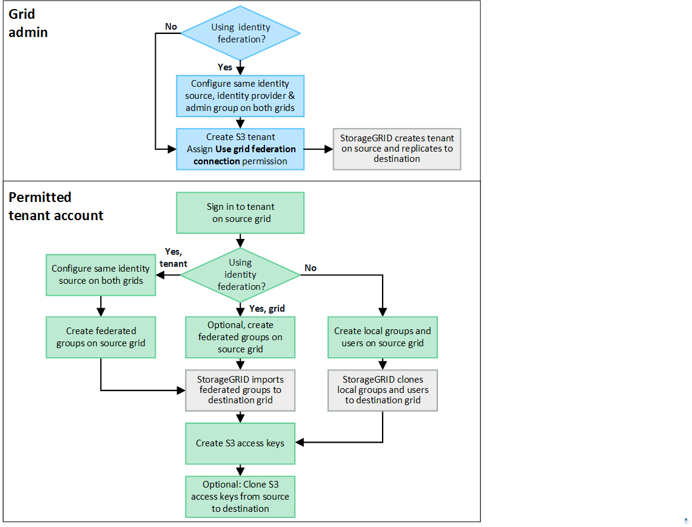

= Qu'est-ce que le clonage de compte ?
:allow-uri-read: 
:icons: font
:imagesdir: ../media/

[role="lead"]
Le clonage de compte est la réplication automatique d'un compte de locataire, de groupes de locataires, d'utilisateurs de locataires et, éventuellement, de clés d'accès S3 entre les systèmes StorageGRID d'unlink:grid-federation-overview.html["connexion à la fédération de réseau"] .

Le clonage de compte est requis pourlink:grid-federation-what-is-cross-grid-replication.html["réplication inter-réseaux"] .  Le clonage des informations de compte d'un système StorageGRID source vers un système StorageGRID de destination garantit que les utilisateurs et les groupes de locataires peuvent accéder aux compartiments et objets correspondants sur l'une ou l'autre grille.

== Flux de travail pour le clonage de compte

Le diagramme de flux de travail montre les étapes que les administrateurs de grille et les locataires autorisés effectueront pour configurer le clonage de compte.  Ces étapes sont effectuées après lalink:grid-federation-create-connection.html["la connexion à la fédération de grille est configurée"] .

== Flux de travail d'administration de la grille

Les étapes effectuées par les administrateurs de grille dépendent du fait que les systèmes StorageGRID dulink:grid-federation-overview.html["connexion à la fédération de réseau"] utiliser l'authentification unique (SSO) ou la fédération d'identité.

=== [[account-clone-sso]]Configurer SSO pour le clonage de compte (facultatif)

Si l’un des systèmes StorageGRID de la connexion de fédération de grille utilise SSO, les deux grilles doivent utiliser SSO.  Avant de créer les comptes de locataire pour la fédération de grille, les administrateurs de grille pour les grilles source et de destination du locataire doivent effectuer ces étapes.

.Étapes
. Configurez la même source d’identité pour les deux grilles. Voir link:using-identity-federation.html["Utiliser la fédération d'identité"] .
. Configurez le même fournisseur d’identité SSO (IdP) pour les deux grilles. Voir link:configuring-sso.html["Configurer l'authentification unique"] .
. link:managing-admin-groups.html["Créer le même groupe d'administrateurs"]sur les deux grilles en important le même groupe fédéré.
+
Lorsque vous créez le locataire, vous sélectionnez ce groupe pour disposer de l’autorisation d’accès racine initiale pour les comptes de locataire source et de destination.

+

NOTE: Si ce groupe d’administrateurs n’existe pas sur les deux grilles avant la création du locataire, le locataire n’est pas répliqué vers la destination.

=== [[account-clone-identity-federation]]Configurer la fédération d'identité au niveau de la grille pour le clonage de compte (facultatif)

Si l’un des systèmes StorageGRID utilise la fédération d’identité sans SSO, les deux grilles doivent utiliser la fédération d’identité.  Avant de créer les comptes de locataire pour la fédération de grille, les administrateurs de grille pour les grilles source et de destination du locataire doivent effectuer ces étapes.

.Étapes
. Configurez la même source d’identité pour les deux grilles. Voir link:using-identity-federation.html["Utiliser la fédération d'identité"] .
. En option, si un groupe fédéré dispose d'une autorisation d'accès racine initiale pour les comptes locataires source et de destination,link:managing-admin-groups.html["créer le même groupe d'administrateurs"] sur les deux grilles en important le même groupe fédéré.
+

NOTE: Si vous attribuez l’autorisation d’accès racine à un groupe fédéré qui n’existe pas sur les deux grilles, le locataire n’est pas répliqué sur la grille de destination.

. Si vous ne souhaitez pas qu'un groupe fédéré dispose d'une autorisation d'accès root initiale pour les deux comptes, spécifiez un mot de passe pour l'utilisateur root local.

=== Créer un compte locataire S3 autorisé

Après avoir configuré éventuellement SSO ou la fédération d'identité, un administrateur de grille exécute ces étapes pour déterminer quels locataires peuvent répliquer des objets de bucket vers d'autres systèmes StorageGRID .

.Étapes
. Déterminez la grille que vous souhaitez utiliser comme grille source du locataire pour les opérations de clonage de compte.
+
La grille sur laquelle le locataire est créé à l'origine est appelée _grille source_ du locataire.  La grille sur laquelle le locataire est répliqué est appelée _grille de destination_ du locataire.

. Sur cette grille, créez un nouveau compte locataire S3 ou modifiez un compte existant.
. Attribuer l'autorisation *Utiliser la connexion à la fédération de grille*.
. Si le compte locataire doit gérer ses propres utilisateurs fédérés, attribuez l'autorisation *Utiliser sa propre source d'identité*.
+
Si cette autorisation est attribuée, les comptes de locataire source et de destination doivent configurer la même source d’identité avant de créer des groupes fédérés.  Les groupes fédérés ajoutés au locataire source ne peuvent pas être clonés vers le locataire de destination, sauf si les deux grilles utilisent la même source d'identité.

. Sélectionnez une connexion de fédération de grille spécifique.
. Enregistrez le locataire nouveau ou modifié.
+
Lorsqu'un nouveau locataire avec l'autorisation *Utiliser la connexion à la fédération de grille* est enregistré, StorageGRID crée automatiquement une réplique de ce locataire sur l'autre grille, comme suit :

+
** Les deux comptes locataires ont le même ID de compte, le même nom, le même quota de stockage et les mêmes autorisations attribuées.
** Si vous avez sélectionné un groupe fédéré pour disposer de l’autorisation d’accès racine pour le locataire, ce groupe est cloné sur le locataire de destination.
** Si vous avez sélectionné un utilisateur local pour disposer de l’autorisation d’accès root pour le locataire, cet utilisateur est cloné sur le locataire de destination.  Cependant, le mot de passe de cet utilisateur n'est pas cloné.

Pour plus de détails, consultez la section link:grid-federation-manage-tenants.html["Gérer les locataires autorisés pour la fédération de réseau"] .

== Flux de travail des comptes locataires autorisés

Une fois qu'un locataire avec l'autorisation *Utiliser la connexion à la fédération de grille* est répliqué sur la grille de destination, les comptes de locataire autorisés peuvent effectuer ces étapes pour cloner des groupes de locataires, des utilisateurs et des clés d'accès S3.

.Étapes
. Sign in au compte locataire sur la grille source du locataire.
. Si cela est autorisé, configurez l'identification de la fédération sur les comptes locataires source et de destination.
. Créez des groupes et des utilisateurs sur le locataire source.
+
Lorsque de nouveaux groupes ou utilisateurs sont créés sur le locataire source, StorageGRID les clone automatiquement vers le locataire de destination, mais aucun clonage n'a lieu de la destination vers la source.

. Créer des clés d’accès S3.
. Vous pouvez également cloner les clés d’accès S3 du locataire source vers le locataire de destination.

Pour plus de détails sur le flux de travail du compte locataire autorisé et pour savoir comment les groupes, les utilisateurs et les clés d'accès S3 sont clonés, consultezlink:../tenant/grid-federation-account-clone.html["Cloner des groupes de locataires et des utilisateurs"] etlink:../tenant/grid-federation-clone-keys-with-api.html["Cloner les clés d'accès S3 à l'aide de l'API"] .
