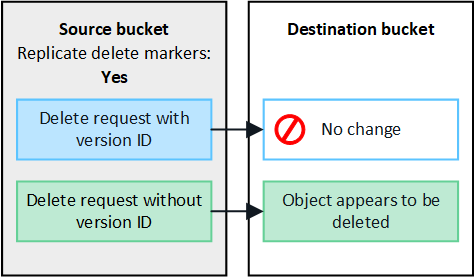

= Qu'est-ce que la réplication inter-réseau ?
:allow-uri-read: 
:icons: font
:imagesdir: ../media/

[role="lead"]
La réplication inter-grille est la réplication automatique d'objets entre des buckets S3 sélectionnés dans deux systèmes StorageGRID connectés dans unlink:grid-federation-overview.html["connexion à la fédération de réseau"] . link:grid-federation-what-is-account-clone.html["Clonage de compte"] est nécessaire pour la réplication inter-grille.

== Flux de travail pour la réplication inter-grille

Le diagramme de flux de travail résume les étapes de configuration de la réplication inter-grille entre les buckets sur deux grilles.

image::../media/grid-federation-cgr-workflow.png[Flux de travail de réplication inter-grille]

== Exigences pour la réplication inter-réseaux

Si un compte locataire dispose de l'autorisation *Utiliser la connexion à la fédération de grille* pour utiliser une ou plusieurslink:grid-federation-overview.html["connexions de fédération de réseau"] , un utilisateur locataire avec l'autorisation d'accès root peut créer des buckets identiques dans les comptes locataires correspondants sur chaque grille. Ces seaux :

* Doit avoir le même nom mais peut avoir des régions différentes
* Doit avoir le contrôle de version activé
* Le verrouillage d'objet S3 doit être désactivé
* Doit être vide

Une fois les deux buckets créés, la réplication inter-grille peut être configurée pour l'un ou les deux buckets.

.Apprendre encore plus
link:../tenant/grid-federation-manage-cross-grid-replication.html["Gérer la réplication inter-réseaux"]

== Comment fonctionne la réplication inter-réseaux

La réplication inter-grille peut être configurée pour se produire dans une direction ou dans les deux directions.

=== Réplication dans une direction

Si vous activez la réplication inter-grille pour un bucket sur une seule grille, les objets ajoutés à ce bucket (le bucket source) sont répliqués vers le bucket correspondant sur l'autre grille (le bucket de destination). Cependant, les objets ajoutés au bucket de destination ne sont pas répliqués vers la source. Dans la figure, la réplication inter-grille est activée pour `my-bucket` de la grille 1 à la grille 2, mais elle n'est pas activée dans l'autre sens.

image::../media/grid-federation-cross-grid-replication-one-direction.png[image montrant la connexion de la fédération de grille dans une direction]

=== Réplication dans les deux sens

Si vous activez la réplication inter-grille pour le même bucket sur les deux grilles, les objets ajoutés à l'un des buckets sont répliqués sur l'autre grille.  Dans la figure, la réplication inter-grille est activée pour `my-bucket` dans les deux sens.

image::../media/grid-federation-cross-grid-replication.png[image montrant la réplication dans une direction par rapport à la réplication dans les deux directions]

=== Que se passe-t-il lorsque des objets sont ingérés ?

Lorsqu'un client S3 ajoute un objet à un bucket pour lequel la réplication inter-grille est activée, ce qui suit se produit :

. StorageGRID réplique automatiquement l'objet du bucket source vers le bucket de destination.  Le temps nécessaire pour effectuer cette opération de réplication en arrière-plan dépend de plusieurs facteurs, notamment du nombre d’autres opérations de réplication en attente.
+
Le client S3 peut vérifier l'état de réplication d'un objet en émettant une requête GetObject ou HeadObject. La réponse inclut un StorageGRID spécifique `x-ntap-sg-cgr-replication-status` en-tête de réponse, qui aura l'une des valeurs suivantes : Le client S3 peut vérifier l'état de réplication d'un objet en émettant une requête GetObject ou HeadObject.  La réponse inclut un StorageGRID spécifique `x-ntap-sg-cgr-replication-status` en-tête de réponse, qui aura l'une des valeurs suivantes :

+
[cols="1a,2a"]
|===
| Grille | État de réplication 

 a| 
Source
 a| 
** *TERMINÉ* : La réplication a réussi pour toutes les connexions au réseau.
** *EN ATTENTE* : L'objet n'a pas été répliqué sur au moins une connexion au réseau.
** *ÉCHEC* : La réplication n'est en attente pour aucune connexion au réseau et au moins une a échoué avec une panne permanente. Un utilisateur doit résoudre l’erreur.

 a| 
Destination
 a| 
*RÉPLIQUE* : L'objet a été répliqué à partir de la grille source.

|===
+

NOTE: StorageGRID ne prend pas en charge le `x-amz-replication-status` en-tête.

. StorageGRID utilise les politiques ILM actives de chaque grille pour gérer les objets, comme il le ferait pour tout autre objet.  Par exemple, l'objet A sur la grille 1 peut être stocké sous forme de deux copies répliquées et conservées pour toujours, tandis que la copie de l'objet A qui a été répliquée sur la grille 2 peut être stockée à l'aide du codage d'effacement 2+1 et supprimée après trois ans.

=== Que se passe-t-il lorsque des objets sont supprimés ?

Comme décrit danslink:../primer/delete-data-flow.html["Supprimer le flux de données"] StorageGRID peut supprimer un objet pour l’une des raisons suivantes :

* Le client S3 émet une demande de suppression.
* Un utilisateur du gestionnaire de locataires sélectionne lelink:../tenant/deleting-s3-bucket-objects.html["Supprimer les objets dans le bucket"] option permettant de supprimer tous les objets d'un bucket.
* Le bucket a une configuration de cycle de vie qui expire.
* La dernière période de la règle ILM pour l'objet se termine et aucun autre placement n'est spécifié.

Lorsque StorageGRID supprime un objet en raison d'une opération de suppression d'objets dans un bucket, de l'expiration du cycle de vie du bucket ou de l'expiration du placement ILM, l'objet répliqué n'est jamais supprimé de l'autre grille dans une connexion de fédération de grille.  Cependant, les marqueurs de suppression ajoutés au bucket source par les suppressions du client S3 peuvent éventuellement être répliqués vers le bucket de destination.

Pour comprendre ce qui se passe lorsqu'un client S3 supprime des objets d'un bucket pour lequel la réplication inter-grille est activée, examinez comment les clients S3 suppriment des objets des buckets pour lesquels le contrôle de version est activé, comme suit :

* Si un client S3 émet une demande de suppression qui inclut un ID de version, cette version de l'objet est définitivement supprimée.  Aucun marqueur de suppression n’est ajouté au bucket.
* Si un client S3 émet une demande de suppression qui n'inclut pas d'ID de version, StorageGRID ne supprime aucune version d'objet. Au lieu de cela, il ajoute un marqueur de suppression au bucket. Le marqueur de suppression oblige StorageGRID à agir comme si l'objet avait été supprimé :
+
** Une requête GetObject sans ID de version échouera avec `404 No Object Found`
** Une demande GetObject avec un ID de version valide réussira et renverra la version de l'objet demandée.

Lorsqu'un client S3 supprime un objet d'un bucket pour lequel la réplication inter-grille est activée, StorageGRID détermine s'il faut répliquer la demande de suppression vers la destination, comme suit :

* Si la demande de suppression inclut un ID de version, cette version d'objet est définitivement supprimée de la grille source. Cependant, StorageGRID ne réplique pas les demandes de suppression qui incluent un ID de version, de sorte que la même version d'objet n'est pas supprimée de la destination.
* Si la demande de suppression n'inclut pas d'ID de version, StorageGRID peut éventuellement répliquer le marqueur de suppression, en fonction de la configuration de la réplication inter-grille pour le bucket :
+
** Si vous choisissez de répliquer les marqueurs de suppression (par défaut), un marqueur de suppression est ajouté au bucket source et répliqué vers le bucket de destination.  En effet, l'objet semble être supprimé sur les deux grilles.
** Si vous choisissez de ne pas répliquer les marqueurs de suppression, un marqueur de suppression est ajouté au bucket source mais n'est pas répliqué dans le bucket de destination. En effet, les objets supprimés sur la grille source ne sont pas supprimés sur la grille de destination.

Dans la figure, *Répliquer les marqueurs de suppression* était défini sur *Oui* lorsquelink:../tenant/grid-federation-manage-cross-grid-replication.html["la réplication inter-réseau a été activée"] . Les demandes de suppression pour le bucket source qui incluent un ID de version ne supprimeront pas les objets du bucket de destination.  Les demandes de suppression pour le bucket source qui n'incluent pas d'ID de version sembleront supprimer des objets dans le bucket de destination.

NOTE: Si vous souhaitez que les suppressions d'objets restent synchronisées entre les grilles, créez deslink:../s3/create-s3-lifecycle-configuration.html["Configurations du cycle de vie S3"] pour les seaux sur les deux grilles.

=== Comment les objets chiffrés sont répliqués

Lorsque vous utilisez la réplication inter-grille pour répliquer des objets entre des grilles, vous pouvez chiffrer des objets individuels, utiliser le chiffrement de compartiment par défaut ou configurer le chiffrement à l'échelle de la grille.  Vous pouvez ajouter, modifier ou supprimer les paramètres de chiffrement par défaut du bucket ou de la grille avant ou après avoir activé la réplication inter-grille pour un bucket.

Pour chiffrer des objets individuels, vous pouvez utiliser SSE (chiffrement côté serveur avec clés gérées par StorageGRID) lors de l'ajout des objets au bucket source.  Utilisez le `x-amz-server-side-encryption` en-tête de demande et spécifier `AES256` . Voir link:../s3/using-server-side-encryption.html["Utiliser le cryptage côté serveur"] .

NOTE: L'utilisation de SSE-C (chiffrement côté serveur avec clés fournies par le client) n'est pas prise en charge pour la réplication inter-grille. L'opération d'ingestion échouera.

Pour utiliser le cryptage par défaut pour un bucket, utilisez une requête PutBucketEncryption et définissez le `SSEAlgorithm` paramètre à `AES256` .  Le chiffrement au niveau du bucket s'applique à tous les objets ingérés sans le `x-amz-server-side-encryption` en-tête de requête. Voir link:../s3/operations-on-buckets.html["Opérations sur les godets"] .

Pour utiliser le chiffrement au niveau de la grille, définissez l'option *Chiffrement des objets stockés* sur *AES-256*.  Le chiffrement au niveau de la grille s'applique à tous les objets qui ne sont pas chiffrés au niveau du bucket ou qui sont ingérés sans le `x-amz-server-side-encryption` en-tête de requête. Voir link:../admin/changing-network-options-object-encryption.html["Configurer les options réseau et objet"] .

NOTE: SSE ne prend pas en charge AES-128.  Si l'option *Cryptage d'objet stocké* est activée pour la grille source à l'aide de l'option *AES-128*, l'utilisation de l'algorithme AES-128 ne sera pas propagée à l'objet répliqué.  Au lieu de cela, l'objet répliqué utilisera le bucket par défaut de la destination ou le paramètre de chiffrement au niveau de la grille, s'il est disponible.

Lors de la détermination de la manière de chiffrer les objets sources, StorageGRID applique ces règles :

. Utilisez le `x-amz-server-side-encryption` ingérer l'en-tête, s'il est présent.
. Si aucun en-tête d'ingestion n'est présent, utilisez le paramètre de chiffrement par défaut du bucket, s'il est configuré.
. Si aucun paramètre de bucket n'est configuré, utilisez le paramètre de chiffrement à l'échelle de la grille, s'il est configuré.
. Si un paramètre à l'échelle de la grille n'est pas présent, ne cryptez pas l'objet source.

Lors de la détermination de la manière de chiffrer les objets répliqués, StorageGRID applique ces règles dans cet ordre :

. Utilisez le même cryptage que l’objet source, sauf si cet objet utilise le cryptage AES-128.
. Si l'objet source n'est pas chiffré ou s'il utilise AES-128, utilisez le paramètre de chiffrement par défaut du bucket de destination, s'il est configuré.
. Si le bucket de destination ne dispose pas d'un paramètre de chiffrement, utilisez le paramètre de chiffrement à l'échelle de la grille de destination, s'il est configuré.
. Si un paramètre à l’échelle de la grille n’est pas présent, ne cryptez pas l’objet de destination.

=== PutObjectTagging et DeleteObjectTagging ne sont pas pris en charge

Les requêtes PutObjectTagging et DeleteObjectTagging ne sont pas prises en charge pour les objets dans les buckets pour lesquels la réplication inter-grille est activée.

Si un client S3 émet une requête PutObjectTagging ou DeleteObjectTagging, `501 Not Implemented` est retourné. Le message est `Put(Delete) ObjectTagging is not available for buckets that have cross-grid replication configured` .

=== Comment les objets segmentés sont répliqués

La taille de segment maximale de la grille source s'applique aux objets répliqués sur la grille de destination. Lorsque des objets sont répliqués sur une autre grille, le paramètre *Taille maximale du segment* (*CONFIGURATION* > *Système* > *Options de stockage*) de la grille source sera utilisé sur les deux grilles. Par exemple, supposons que la taille maximale du segment pour la grille source soit de 1 Go, tandis que la taille maximale du segment de la grille de destination soit de 50 Mo. Si vous ingérez un objet de 2 Go sur la grille source, cet objet est enregistré sous forme de deux segments de 1 Go.  Il sera également répliqué sur la grille de destination sous forme de deux segments de 1 Go, même si la taille maximale du segment de cette grille est de 50 Mo.
