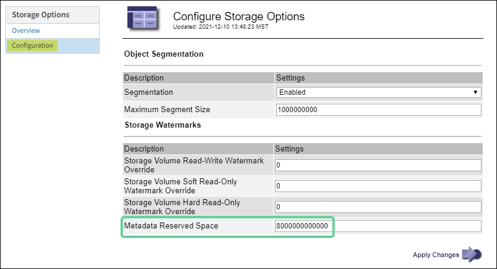

= Augmenter le paramètre d'espace réservé aux métadonnées
:allow-uri-read: 
:icons: font
:imagesdir: ../media/

[role="lead"]
Vous pourrez peut-être augmenter le paramètre système Espace réservé aux métadonnées si vos nœuds de stockage répondent à des exigences spécifiques en matière de RAM et d'espace disponible.

.Ce dont vous aurez besoin
* Vous êtes connecté au Grid Manager à l'aide d'unlink:web-browser-requirements.html["navigateur Web pris en charge"] .
* Vous avez lelink:admin-group-permissions.html["Autorisation d'accès racine ou configuration de la page de topologie de la grille et autres autorisations de configuration de la grille"] .

NOTE: La page Topologie de grille est obsolète et sera supprimée dans une prochaine version.

.À propos de cette tâche
Vous pourrez peut-être augmenter manuellement le paramètre d'espace réservé aux métadonnées à l'échelle du système jusqu'à 8 To.

Vous ne pouvez augmenter la valeur du paramètre Espace réservé aux métadonnées à l'échelle du système que si ces deux affirmations sont vraies :

* Les nœuds de stockage de n’importe quel site de votre système disposent chacun de 128 Go ou plus de RAM.
* Les nœuds de stockage de n’importe quel site de votre système disposent chacun d’un espace disponible suffisant sur le volume de stockage 0.

Sachez que si vous augmentez ce paramètre, vous réduirez simultanément l’espace disponible pour le stockage d’objets sur le volume de stockage 0 de tous les nœuds de stockage.  Pour cette raison, vous préférerez peut-être définir l'espace réservé aux métadonnées sur une valeur inférieure à 8 To, en fonction de vos besoins en métadonnées d'objet attendus.

NOTE: En général, il est préférable d’utiliser une valeur supérieure plutôt qu’une valeur inférieure.  Si le paramètre Espace réservé aux métadonnées est trop grand, vous pouvez le diminuer ultérieurement.  En revanche, si vous augmentez la valeur ultérieurement, le système devra peut-être déplacer les données de l'objet pour libérer de l'espace.

Pour une explication détaillée de la manière dont le paramètre Espace réservé aux métadonnées affecte l'espace autorisé pour le stockage des métadonnées d'objet sur un nœud de stockage particulier, voirlink:managing-object-metadata-storage.html["Gérer le stockage des métadonnées des objets"] .

.Étapes
. Déterminez le paramètre actuel de l'espace réservé aux métadonnées.
+
.. Sélectionnez *CONFIGURATION* > *Système* > *Options de stockage*.
.. Dans la section Filigranes de stockage, notez la valeur de *Espace réservé aux métadonnées*.

. Assurez-vous de disposer de suffisamment d’espace disponible sur le volume de stockage 0 de chaque nœud de stockage pour augmenter cette valeur.
+
.. Sélectionnez *NODES*.
.. Sélectionnez le premier nœud de stockage dans la grille.
.. Sélectionnez l’onglet Stockage.
.. Dans la section Volumes, recherchez l’entrée */var/local/rangedb/0*.
.. Confirmez que la valeur disponible est égale ou supérieure à la différence entre la nouvelle valeur que vous souhaitez utiliser et la valeur actuelle de l'espace réservé aux métadonnées.
+
Par exemple, si le paramètre Espace réservé aux métadonnées est actuellement de 4 To et que vous souhaitez l'augmenter à 6 To, la valeur Disponible doit être de 2 To ou plus.

.. Répétez ces étapes pour tous les nœuds de stockage.
+
*** Si un ou plusieurs nœuds de stockage ne disposent pas de suffisamment d'espace disponible, la valeur de l'espace réservé aux métadonnées ne peut pas être augmentée.  Ne continuez pas cette procédure.
*** Si chaque nœud de stockage dispose de suffisamment d’espace disponible sur le volume 0, passez à l’étape suivante.

. Assurez-vous d’avoir au moins 128 Go de RAM sur chaque nœud de stockage.
+
.. Sélectionnez *NODES*.
.. Sélectionnez le premier nœud de stockage dans la grille.
.. Sélectionnez l'onglet *Matériel*.
.. Passez votre curseur sur le graphique d’utilisation de la mémoire.  Assurez-vous que la *mémoire totale* est d'au moins 128 Go.
.. Répétez ces étapes pour tous les nœuds de stockage.
+
*** Si un ou plusieurs nœuds de stockage ne disposent pas de suffisamment de mémoire totale disponible, la valeur de l'espace réservé aux métadonnées ne peut pas être augmentée.  Ne continuez pas cette procédure.
*** Si chaque nœud de stockage dispose d’au moins 128 Go de mémoire totale, passez à l’étape suivante.

. Mettre à jour le paramètre Espace réservé aux métadonnées.
+
.. Sélectionnez *CONFIGURATION* > *Système* > *Options de stockage*.
.. Sélectionnez l’onglet Configuration.
.. Dans la section Filigranes de stockage, sélectionnez *Espace réservé aux métadonnées*.
.. Entrez la nouvelle valeur.
+
Par exemple, pour saisir 8 To, qui est la valeur maximale prise en charge, saisissez *8000000000000* (8, suivi de 12 zéros)

+

.. Sélectionnez *Appliquer les modifications*.

