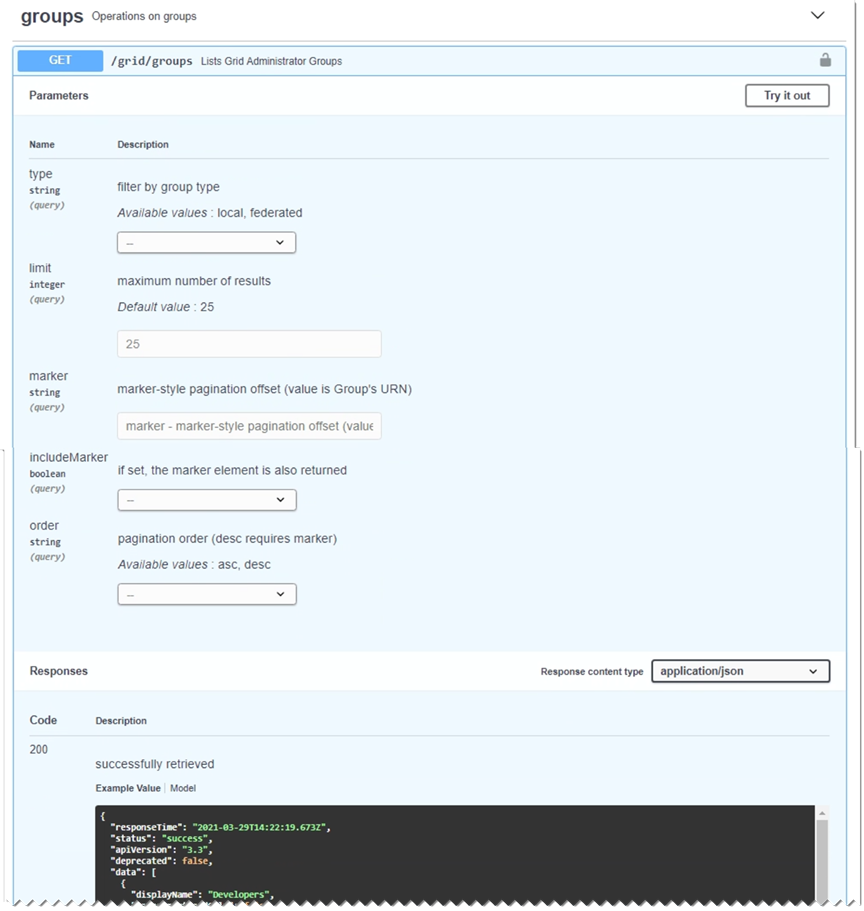

= Utiliser l'API de gestion de grille
:allow-uri-read: 
:icons: font
:imagesdir: ../media/

[role="lead"]
Vous pouvez effectuer des tâches de gestion du système à l’aide de l’API REST Grid Management au lieu de l’interface utilisateur Grid Manager.  Par exemple, vous souhaiterez peut-être utiliser l’API pour automatiser des opérations ou créer plusieurs entités, telles que des utilisateurs, plus rapidement.

== Ressources de haut niveau

L'API de gestion de grille fournit les ressources de niveau supérieur suivantes :

* `/grid`:L'accès est limité aux utilisateurs de Grid Manager et est basé sur les autorisations de groupe configurées.
* `/org`:L'accès est limité aux utilisateurs qui appartiennent à un groupe LDAP local ou fédéré pour un compte locataire. Pour plus de détails, consultez la section link:../tenant/index.html["Utiliser un compte locataire"] .
* `/private`:L'accès est limité aux utilisateurs de Grid Manager et est basé sur les autorisations de groupe configurées.  Les API privées sont susceptibles d'être modifiées sans préavis.  Les points de terminaison privés StorageGRID ignorent également la version API de la demande.

== Émettre des requêtes API

L'API de gestion de grille utilise la plate-forme API open source Swagger.  Swagger fournit une interface utilisateur intuitive qui permet aux développeurs et aux non-développeurs d'effectuer des opérations en temps réel dans StorageGRID avec l'API.

L'interface utilisateur de Swagger fournit des détails complets et une documentation pour chaque opération API.

.Avant de commencer
* Vous êtes connecté au Grid Manager à l'aide d'unlink:../admin/web-browser-requirements.html["navigateur Web pris en charge"] .
* Tu aslink:admin-group-permissions.html["autorisations d'accès spécifiques"] .

CAUTION: Toutes les opérations API que vous effectuez à l’aide de la page Web de documentation API sont des opérations en direct.  Veillez à ne pas créer, mettre à jour ou supprimer des données de configuration ou d’autres données par erreur.

.Étapes
. Depuis l'en-tête du gestionnaire de grille, sélectionnez l'icône d'aide et sélectionnez *Documentation API*.
+
image::../media/help_menu.png[Menu d'aide]

. Pour effectuer une opération avec l'API privée, sélectionnez *Accéder à la documentation de l'API privée* sur la page API de gestion StorageGRID .
+
Les API privées sont susceptibles d'être modifiées sans préavis.  Les points de terminaison privés StorageGRID ignorent également la version API de la demande.

. Sélectionnez l’opération souhaitée.
+
Lorsque vous développez une opération API, vous pouvez voir les actions HTTP disponibles, telles que GET, PUT, UPDATE et DELETE.

. Sélectionnez une action HTTP pour afficher les détails de la demande, y compris l'URL du point de terminaison, une liste de tous les paramètres obligatoires ou facultatifs, un exemple du corps de la demande (si nécessaire) et les réponses possibles.
+

. Déterminez si la demande nécessite des paramètres supplémentaires, tels qu’un ID de groupe ou d’utilisateur.  Ensuite, obtenez ces valeurs.  Vous devrez peut-être d’abord émettre une demande d’API différente pour obtenir les informations dont vous avez besoin.
. Déterminez si vous devez modifier le corps de la demande d’exemple.  Si tel est le cas, vous pouvez sélectionner *Modèle* pour connaître les exigences de chaque champ.
. Sélectionnez *Essayer*.
. Fournissez tous les paramètres requis ou modifiez le corps de la demande selon vos besoins.
. Sélectionnez *Exécuter*.
. Consultez le code de réponse pour déterminer si la demande a réussi.

