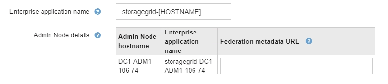
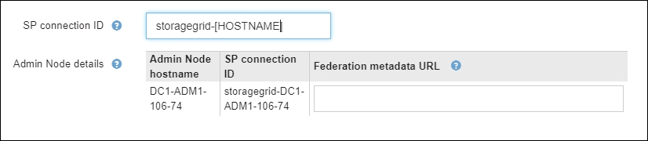

= Utiliser le mode sandbox
:allow-uri-read: 
:icons: font
:imagesdir: ../media/

[role="lead"]
Vous pouvez utiliser le mode sandbox pour configurer et tester l'authentification unique (SSO) avant de l'activer pour tous les utilisateurs StorageGRID .  Une fois l'authentification unique activée, vous pouvez revenir au mode sandbox chaque fois que vous devez modifier ou retester la configuration.

.Avant de commencer
* Vous êtes connecté au Grid Manager à l'aide d'unlink:../admin/web-browser-requirements.html["navigateur Web pris en charge"] .
* Vous avez lelink:admin-group-permissions.html["Autorisation d'accès root"] .
* Vous avez configuré la fédération d’identité pour votre système StorageGRID .
* Pour le type de service LDAP de fédération d’identité, vous avez sélectionné Active Directory ou Azure, en fonction du fournisseur d’identité SSO que vous prévoyez d’utiliser.
+
[cols="1a,1a"]
|===
| Type de service LDAP configuré | Options pour le fournisseur d'identité SSO 

 a| 
Active Directory
 a| 
** Active Directory
** Azuré
** PingFédéré

 a| 
Azuré
 a| 
Azuré

|===

.À propos de cette tâche
Lorsque SSO est activé et qu'un utilisateur tente de se connecter à un nœud d'administration, StorageGRID envoie une demande d'authentification au fournisseur d'identité SSO.  À son tour, le fournisseur d’identité SSO renvoie une réponse d’authentification à StorageGRID, indiquant si la demande d’authentification a réussi.  Pour des demandes réussies :

* La réponse d’Active Directory ou de PingFederate inclut un identifiant unique universel (UUID) pour l’utilisateur.
* La réponse d’Azure inclut un nom d’utilisateur principal (UPN).

Pour permettre à StorageGRID (le fournisseur de services) et au fournisseur d'identité SSO de communiquer en toute sécurité sur les demandes d'authentification des utilisateurs, vous devez configurer certains paramètres dans StorageGRID.  Ensuite, vous devez utiliser le logiciel du fournisseur d’identité SSO pour créer une approbation de partie de confiance (AD FS), une application d’entreprise (Azure) ou un fournisseur de services (PingFederate) pour chaque nœud d’administration.  Enfin, vous devez revenir à StorageGRID pour activer SSO.

Le mode Sandbox facilite l’exécution de cette configuration aller-retour et permet de tester tous vos paramètres avant d’activer SSO. Lorsque vous utilisez le mode sandbox, les utilisateurs ne peuvent pas se connecter à l'aide de SSO.

== Accéder au mode sandbox

.Étapes
. Sélectionnez *CONFIGURATION* > *Contrôle d'accès* > *Authentification unique*.
+
La page d’authentification unique s’affiche, avec l’option *Désactivé* sélectionnée.

+
image::../media/sso_status_disabled.png[Page d'authentification unique avec statut SSO désactivé]

+

NOTE: Si les options d’état SSO n’apparaissent pas, confirmez que vous avez configuré le fournisseur d’identité comme source d’identité fédérée. Voir link:requirements-for-sso.html["Exigences et considérations relatives à l'authentification unique"] .

. Sélectionnez *Mode Sandbox*.
+
La section Fournisseur d’identité apparaît.

== Entrez les détails du fournisseur d'identité

.Étapes
. Sélectionnez le *type SSO* dans la liste déroulante.
. Remplissez les champs de la section Fournisseur d’identité en fonction du type SSO que vous avez sélectionné.
+
[role="tabbed-block"]
====
.Active Directory
--
.. Saisissez le *Nom du service de fédération* pour le fournisseur d’identité, exactement tel qu’il apparaît dans Active Directory Federation Service (AD FS).
+

NOTE: Pour localiser le nom du service de fédération, accédez au Gestionnaire de serveur Windows.  Sélectionnez *Outils* > *Gestion AD FS*.  Dans le menu Action, sélectionnez *Modifier les propriétés du service de fédération*.  Le nom du service de fédération est affiché dans le deuxième champ.

.. Spécifiez quel certificat TLS sera utilisé pour sécuriser la connexion lorsque le fournisseur d’identité envoie des informations de configuration SSO en réponse aux demandes StorageGRID .
+
*** *Utiliser le certificat CA du système d'exploitation* : utilisez le certificat CA par défaut installé sur le système d'exploitation pour sécuriser la connexion.
*** *Utiliser un certificat CA personnalisé* : utilisez un certificat CA personnalisé pour sécuriser la connexion.
+
Si vous sélectionnez ce paramètre, copiez le texte du certificat personnalisé et collez-le dans la zone de texte *Certificat CA*.

*** *Ne pas utiliser TLS* : N'utilisez pas de certificat TLS pour sécuriser la connexion.
+

CAUTION: Si vous modifiez le certificat CA, immédiatementlink:../maintain/starting-or-restarting-service.html["redémarrer le service mgmt-api sur les nœuds d'administration"] et tester une connexion SSO réussie dans le Grid Manager.

.. Dans la section Partie de confiance, spécifiez l'*identifiant de la partie de confiance* pour StorageGRID. Cette valeur contrôle le nom que vous utilisez pour chaque approbation de partie de confiance dans AD FS.
+
*** Par exemple, si votre grille ne comporte qu'un seul nœud d'administration et que vous ne prévoyez pas d'ajouter d'autres nœuds d'administration à l'avenir, entrez `SG` ou `StorageGRID` .
*** Si votre grille comprend plusieurs nœuds d'administration, incluez la chaîne `[HOSTNAME]` dans l'identifiant. Par exemple :  `SG-[HOSTNAME]` . Cela génère un tableau qui affiche l'identifiant de la partie de confiance pour chaque nœud d'administration de votre système, en fonction du nom d'hôte du nœud.
+
image::../media/sso_status_sandbox_mode_active_directory.png[Authentification unique,Sandbox mode enabled,Relying party identifiers shown for several Admin Nodes]

+

NOTE: Vous devez créer une approbation de partie de confiance pour chaque nœud d’administration de votre système StorageGRID .  Le fait de disposer d'une partie de confiance pour chaque nœud d'administration garantit que les utilisateurs peuvent se connecter et se déconnecter en toute sécurité de n'importe quel nœud d'administration.

.. Sélectionnez *Enregistrer*.
+
Une coche verte apparaît sur le bouton *Enregistrer* pendant quelques secondes.

+
image::../media/save_button_green_checkmark.gif[Bouton Enregistrer avec une coche verte]

--
.Azuré
--
.. Spécifiez quel certificat TLS sera utilisé pour sécuriser la connexion lorsque le fournisseur d’identité envoie des informations de configuration SSO en réponse aux demandes StorageGRID .
+
*** *Utiliser le certificat CA du système d'exploitation* : utilisez le certificat CA par défaut installé sur le système d'exploitation pour sécuriser la connexion.
*** *Utiliser un certificat CA personnalisé* : utilisez un certificat CA personnalisé pour sécuriser la connexion.
+
Si vous sélectionnez ce paramètre, copiez le texte du certificat personnalisé et collez-le dans la zone de texte *Certificat CA*.

*** *Ne pas utiliser TLS* : N'utilisez pas de certificat TLS pour sécuriser la connexion.
+

CAUTION: Si vous modifiez le certificat CA, immédiatementlink:../maintain/starting-or-restarting-service.html["redémarrer le service mgmt-api sur les nœuds d'administration"] et tester une connexion SSO réussie dans le Grid Manager.

.. Dans la section Application d'entreprise, spécifiez le *Nom de l'application d'entreprise* pour StorageGRID. Cette valeur contrôle le nom que vous utilisez pour chaque application d’entreprise dans Azure AD.
+
*** Par exemple, si votre grille ne comporte qu'un seul nœud d'administration et que vous ne prévoyez pas d'ajouter d'autres nœuds d'administration à l'avenir, entrez `SG` ou `StorageGRID` .
*** Si votre grille comprend plusieurs nœuds d'administration, incluez la chaîne `[HOSTNAME]` dans l'identifiant. Par exemple :  `SG-[HOSTNAME]` . Cela génère un tableau qui affiche un nom d'application d'entreprise pour chaque nœud d'administration de votre système, en fonction du nom d'hôte du nœud.
+

+

NOTE: Vous devez créer une application d’entreprise pour chaque nœud d’administration de votre système StorageGRID .  Disposer d'une application d'entreprise pour chaque nœud d'administration garantit que les utilisateurs peuvent se connecter et se déconnecter en toute sécurité de n'importe quel nœud d'administration.

.. Suivez les étapes danslink:../admin/creating-enterprise-application-azure.html["Créer des applications d'entreprise dans Azure AD"] pour créer une application d'entreprise pour chaque nœud d'administration répertorié dans le tableau.
.. Depuis Azure AD, copiez l’URL des métadonnées de fédération pour chaque application d’entreprise. Ensuite, collez cette URL dans le champ *URL des métadonnées de la fédération* correspondant dans StorageGRID.
.. Après avoir copié et collé une URL de métadonnées de fédération pour tous les nœuds d'administration, sélectionnez *Enregistrer*.
+
Une coche verte apparaît sur le bouton *Enregistrer* pendant quelques secondes.

+
image::../media/save_button_green_checkmark.gif[Bouton Enregistrer avec une coche verte]

--
.PingFédéré
--
.. Spécifiez quel certificat TLS sera utilisé pour sécuriser la connexion lorsque le fournisseur d’identité envoie des informations de configuration SSO en réponse aux demandes StorageGRID .
+
*** *Utiliser le certificat CA du système d'exploitation* : utilisez le certificat CA par défaut installé sur le système d'exploitation pour sécuriser la connexion.
*** *Utiliser un certificat CA personnalisé* : utilisez un certificat CA personnalisé pour sécuriser la connexion.
+
Si vous sélectionnez ce paramètre, copiez le texte du certificat personnalisé et collez-le dans la zone de texte *Certificat CA*.

*** *Ne pas utiliser TLS* : N'utilisez pas de certificat TLS pour sécuriser la connexion.
+

CAUTION: Si vous modifiez le certificat CA, immédiatementlink:../maintain/starting-or-restarting-service.html["redémarrer le service mgmt-api sur les nœuds d'administration"] et tester une connexion SSO réussie dans le Grid Manager.

.. Dans la section Fournisseur de services (SP), spécifiez l'*ID de connexion SP * pour StorageGRID.  Cette valeur contrôle le nom que vous utilisez pour chaque connexion SP dans PingFederate.
+
*** Par exemple, si votre grille ne comporte qu'un seul nœud d'administration et que vous ne prévoyez pas d'ajouter d'autres nœuds d'administration à l'avenir, entrez `SG` ou `StorageGRID` .
*** Si votre grille comprend plusieurs nœuds d'administration, incluez la chaîne `[HOSTNAME]` dans l'identifiant. Par exemple :  `SG-[HOSTNAME]` . Cela génère un tableau qui affiche l'ID de connexion SP pour chaque nœud d'administration de votre système, en fonction du nom d'hôte du nœud.
+

+

NOTE: Vous devez créer une connexion SP pour chaque nœud d’administration de votre système StorageGRID .  Disposer d'une connexion SP pour chaque nœud d'administration garantit que les utilisateurs peuvent se connecter et se déconnecter en toute sécurité de n'importe quel nœud d'administration.

.. Spécifiez l'URL des métadonnées de la fédération pour chaque nœud d'administration dans le champ *URL des métadonnées de la fédération*.
+
Utilisez le format suivant :

+
[listing]
----
https://<Federation Service Name>:<port>/pf/federation_metadata.ping?PartnerSpId=<SP Connection ID>
----
.. Sélectionnez *Enregistrer*.
+
Une coche verte apparaît sur le bouton *Enregistrer* pendant quelques secondes.

+
image::../media/save_button_green_checkmark.gif[Bouton Enregistrer avec une coche verte]

--
====

== Configurer les approbations des parties de confiance, les applications d'entreprise ou les connexions SP

Lorsque la configuration est enregistrée, l'avis de confirmation du mode Sandbox apparaît.  Cet avis confirme que le mode sandbox est désormais activé et fournit des instructions générales.

StorageGRID peut rester en mode sandbox aussi longtemps que nécessaire. Cependant, lorsque le *Mode Sandbox* est sélectionné sur la page d'authentification unique, l'authentification unique est désactivée pour tous les utilisateurs de StorageGRID .  Seuls les utilisateurs locaux peuvent se connecter.

Suivez ces étapes pour configurer les approbations des parties de confiance (Active Directory), compléter les applications d’entreprise (Azure) ou configurer les connexions SP (PingFederate).

[role="tabbed-block"]
====
.Active Directory
--
.Étapes
. Accédez aux services de fédération Active Directory (AD FS).
. Créez une ou plusieurs approbations de partie de confiance pour StorageGRID, en utilisant chaque identifiant de partie de confiance indiqué dans le tableau de la page d'authentification unique StorageGRID .
+
Vous devez créer une approbation pour chaque nœud d’administration affiché dans le tableau.

+
Pour obtenir des instructions, rendez-vous surlink:../admin/creating-relying-party-trusts-in-ad-fs.html["Créer des approbations de parties de confiance dans AD FS"] .

--
.Azuré
--
.Étapes
. Depuis la page d’authentification unique du nœud d’administration auquel vous êtes actuellement connecté, sélectionnez le bouton pour télécharger et enregistrer les métadonnées SAML.
. Ensuite, pour tous les autres nœuds d’administration de votre grille, répétez ces étapes :
+
.. Sign in au nœud.
.. Sélectionnez *CONFIGURATION* > *Contrôle d'accès* > *Authentification unique*.
.. Téléchargez et enregistrez les métadonnées SAML pour ce nœud.

. Accédez au portail Azure.
. Suivez les étapes danslink:../admin/creating-enterprise-application-azure.html["Créer des applications d'entreprise dans Azure AD"] pour télécharger le fichier de métadonnées SAML pour chaque nœud d’administration dans son application d’entreprise Azure correspondante.

--
.PingFédéré
--
.Étapes
. Depuis la page d’authentification unique du nœud d’administration auquel vous êtes actuellement connecté, sélectionnez le bouton pour télécharger et enregistrer les métadonnées SAML.
. Ensuite, pour tous les autres nœuds d’administration de votre grille, répétez ces étapes :
+
.. Sign in au nœud.
.. Sélectionnez *CONFIGURATION* > *Contrôle d'accès* > *Authentification unique*.
.. Téléchargez et enregistrez les métadonnées SAML pour ce nœud.

. Accédez à PingFederate.
. link:../admin/creating-sp-connection-ping.html["Créer une ou plusieurs connexions de fournisseur de services (SP) pour StorageGRID"] . Utilisez l’ID de connexion SP pour chaque nœud d’administration (affiché dans le tableau de la page d’authentification unique StorageGRID ) et les métadonnées SAML que vous avez téléchargées pour ce nœud d’administration.
+
Vous devez créer une connexion SP pour chaque nœud d’administration indiqué dans le tableau.

--
====

== Tester les connexions SSO

Avant d'appliquer l'utilisation de l'authentification unique pour l'ensemble de votre système StorageGRID , vous devez confirmer que l'authentification unique et la déconnexion unique sont correctement configurées pour chaque nœud d'administration.

[role="tabbed-block"]
====
.Active Directory
--
.Étapes
. À partir de la page d’authentification unique StorageGRID , recherchez le lien dans le message du mode Sandbox.
+
L'URL est dérivée de la valeur que vous avez saisie dans le champ *Nom du service de fédération*.

+
image::../media/sso_sandbox_mode_url.gif[URL de la page de connexion du fournisseur d'identité]

. Sélectionnez le lien ou copiez et collez l'URL dans un navigateur pour accéder à la page de connexion de votre fournisseur d'identité.
. Pour confirmer que vous pouvez utiliser SSO pour vous connecter à StorageGRID, sélectionnez * Sign in à l'un des sites suivants*, sélectionnez l'identifiant de la partie de confiance pour votre nœud d'administration principal et sélectionnez * Sign in*.
+
image::../media/sso_sandbox_mode_testing.gif[Tester les approbations des parties de confiance en mode Sandbox SSO]

. Entrez votre nom d'utilisateur et votre mot de passe fédérés.
+
** Si les opérations de connexion et de déconnexion SSO réussissent, un message de réussite s'affiche.
+
image::../media/sso_sandbox_mode_sign_in_success.gif[Message de réussite du test d'authentification et de déconnexion SSO]

** Si l’opération SSO échoue, un message d’erreur s’affiche.  Résolvez le problème, effacez les cookies du navigateur et réessayez.

. Répétez ces étapes pour vérifier la connexion SSO pour chaque nœud d’administration de votre grille.

--
.Azuré
--
.Étapes
. Accédez à la page d’authentification unique dans le portail Azure.
. Sélectionnez *Tester cette application*.
. Saisissez les informations d’identification d’un utilisateur fédéré.
+
** Si les opérations de connexion et de déconnexion SSO réussissent, un message de réussite s'affiche.
+
image::../media/sso_sandbox_mode_sign_in_success.gif[Message de réussite du test d'authentification et de déconnexion SSO]

** Si l’opération SSO échoue, un message d’erreur s’affiche.  Résolvez le problème, effacez les cookies du navigateur et réessayez.

. Répétez ces étapes pour vérifier la connexion SSO pour chaque nœud d’administration de votre grille.

--
.PingFédéré
--
.Étapes
. À partir de la page d’authentification unique StorageGRID , sélectionnez le premier lien dans le message du mode Sandbox.
+
Sélectionnez et testez un lien à la fois.

+
image::../media/sso_sandbox_mode_enabled_ping.png[Authentification unique]

. Saisissez les informations d’identification d’un utilisateur fédéré.
+
** Si les opérations de connexion et de déconnexion SSO réussissent, un message de réussite s'affiche.
+
image::../media/sso_sandbox_mode_sign_in_success.gif[Message de réussite du test d'authentification et de déconnexion SSO]

** Si l’opération SSO échoue, un message d’erreur s’affiche.  Résolvez le problème, effacez les cookies du navigateur et réessayez.

. Sélectionnez le lien suivant pour vérifier la connexion SSO pour chaque nœud d’administration de votre grille.
+
Si vous voyez un message indiquant que la page a expiré, sélectionnez le bouton *Retour* dans votre navigateur et soumettez à nouveau vos informations d'identification.

--
====

== Activer l'authentification unique

Une fois que vous avez confirmé que vous pouvez utiliser SSO pour vous connecter à chaque nœud d'administration, vous pouvez activer SSO pour l'ensemble de votre système StorageGRID .

TIP: Lorsque SSO est activé, tous les utilisateurs doivent utiliser SSO pour accéder au gestionnaire de grille, au gestionnaire de locataires, à l'API de gestion de grille et à l'API de gestion de locataires.  Les utilisateurs locaux ne peuvent plus accéder à StorageGRID.

.Étapes
. Sélectionnez *CONFIGURATION* > *Contrôle d'accès* > *Authentification unique*.
. Modifiez le statut SSO sur *Activé*.
. Sélectionnez *Enregistrer*.
. Lisez le message d’avertissement et sélectionnez *OK*.
+
L'authentification unique est désormais activée.

TIP: Si vous utilisez le portail Azure et que vous accédez à StorageGRID à partir du même ordinateur que celui que vous utilisez pour accéder à Azure, assurez-vous que l’utilisateur du portail Azure est également un utilisateur StorageGRID autorisé (un utilisateur d’un groupe fédéré qui a été importé dans StorageGRID) ou déconnectez-vous du portail Azure avant de tenter de vous connecter à StorageGRID.
