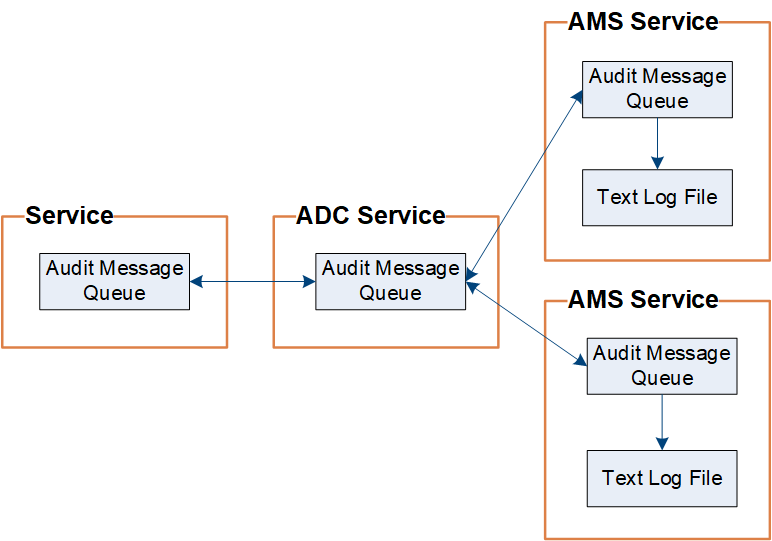

= Auditer le flux et la rétention des messages
:allow-uri-read: 
:icons: font
:imagesdir: ../media/

[role="lead"]
Tous les services StorageGRID génèrent des messages d’audit pendant le fonctionnement normal du système.  Vous devez comprendre comment ces messages d'audit circulent à travers le système StorageGRID vers le `audit.log` déposer.

== Flux de messages d'audit

Les messages d'audit sont traités par les nœuds d'administration et par les nœuds de stockage dotés d'un service de contrôleur de domaine administratif (ADC).

Comme indiqué dans le diagramme de flux de messages d’audit, chaque nœud StorageGRID envoie ses messages d’audit à l’un des services ADC sur le site du centre de données.  Le service ADC est automatiquement activé pour les trois premiers nœuds de stockage installés sur chaque site.

À son tour, chaque service ADC agit comme un relais et envoie sa collection de messages d'audit à chaque nœud d'administration du système StorageGRID , ce qui donne à chaque nœud d'administration un enregistrement complet de l'activité du système.

Chaque nœud d'administration stocke les messages d'audit dans des fichiers journaux texte ; le fichier journal actif est nommé `audit.log` .

image::../media/audit_message_flow.gif[Diagramme résumant le flux des messages d'audit à travers les relais]

=== Rétention des messages d'audit

StorageGRID utilise un processus de copie et de suppression pour garantir qu'aucun message d'audit n'est perdu avant de pouvoir être écrit dans le journal d'audit.

Lorsqu'un nœud génère ou relaie un message d'audit, le message est stocké dans une file d'attente de messages d'audit sur le disque système du nœud de grille. Une copie du message est toujours conservée dans une file d'attente de messages d'audit jusqu'à ce que le message soit écrit dans le fichier journal d'audit du nœud d'administration. `/var/local/log` annuaire. Cela permet d’éviter la perte d’un message d’audit pendant le transport.

La file d'attente des messages d'audit peut augmenter temporairement en raison de problèmes de connectivité réseau ou d'une capacité d'audit insuffisante. À mesure que les files d'attente augmentent, elles consomment davantage d'espace disponible dans chaque nœud. `/var/local/` annuaire. Si le problème persiste et que le répertoire des messages d'audit d'un nœud devient trop plein, les nœuds individuels donneront la priorité au traitement de leur arriéré et deviendront temporairement indisponibles pour les nouveaux messages.

Plus précisément, vous pourriez observer les comportements suivants :

* Si le `/var/local/log` le répertoire utilisé par un nœud d'administration devient plein, le nœud d'administration sera marqué comme indisponible pour les nouveaux messages d'audit jusqu'à ce que le répertoire ne soit plus plein. Les demandes des clients S3 ne sont pas affectées. L'alarme XAMS (Unreachable Audit Repositories) est déclenchée lorsqu'un référentiel d'audit est inaccessible.
* Si le `/var/local/` le répertoire utilisé par un nœud de stockage avec le service ADC devient plein à 92 %, le nœud sera marqué comme indisponible pour les messages d'audit jusqu'à ce que le répertoire ne soit plein qu'à 87 %. Les demandes des clients S3 adressées à d’autres nœuds ne sont pas affectées. L'alarme NRLY (relais d'audit disponibles) est déclenchée lorsque les relais d'audit sont inaccessibles.
+

NOTE: S'il n'y a pas de nœuds de stockage disponibles avec le service ADC, les nœuds de stockage stockent les messages d'audit localement dans le `/var/local/log/localaudit.log` déposer.

* Si le `/var/local/` répertoire utilisé par un nœud de stockage devient plein à 85 %, le nœud commencera à refuser les demandes des clients S3 avec `503 Service Unavailable` .

Les types de problèmes suivants peuvent entraîner une augmentation considérable de la taille des files d'attente de messages d'audit :

* La panne d'un nœud d'administration ou d'un nœud de stockage avec le service ADC.  Si l’un des nœuds du système est en panne, les nœuds restants peuvent être en retard.
* Un taux d’activité soutenu qui dépasse la capacité d’audit du système.
* Le `/var/local/` l'espace sur un nœud de stockage ADC devient plein pour des raisons sans rapport avec les messages d'audit.  Lorsque cela se produit, le nœud cesse d’accepter de nouveaux messages d’audit et donne la priorité à son arriéré actuel, ce qui peut entraîner des arriérés sur d’autres nœuds.

=== Alerte de file d'attente d'audit volumineuse et alarme de messages d'audit en file d'attente (AMQS)

Pour vous aider à surveiller la taille des files d'attente de messages d'audit au fil du temps, l'alerte *Grande file d'attente d'audit* et l'alarme AMQS héritée sont déclenchées lorsque le nombre de messages dans une file d'attente de nœud de stockage ou une file d'attente de nœud d'administration atteint certains seuils.

Si l'alerte *Grande file d'attente d'audit* ou l'alarme AMQS héritée est déclenchée, commencez par vérifier la charge sur le système : s'il y a eu un nombre important de transactions récentes, l'alerte et l'alarme devraient se résoudre au fil du temps et peuvent être ignorées.

Si l’alerte ou l’alarme persiste et augmente en gravité, affichez un graphique de la taille de la file d’attente. Si le nombre augmente régulièrement au fil des heures ou des jours, la charge d’audit a probablement dépassé la capacité d’audit du système. Réduisez le taux de fonctionnement du client ou diminuez le nombre de messages d'audit enregistrés en modifiant le niveau d'audit pour les écritures et les lectures du client sur Erreur ou Désactivé. Voir link:../monitor/configure-audit-messages.html["Configurer les messages d'audit et les destinations des journaux"] .

=== Messages en double

Le système StorageGRID adopte une approche conservatrice en cas de défaillance d'un réseau ou d'un nœud.  Pour cette raison, des messages en double peuvent exister dans le journal d'audit.
