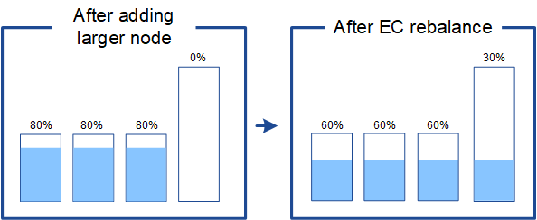

= Considérations pour le rééquilibrage des données codées par effacement
:allow-uri-read: 
:icons: font
:imagesdir: ../media/

[role="lead"]
Si vous effectuez une extension pour ajouter des nœuds de stockage et que vous utilisez des règles ILM pour effacer les données de code, vous devrez peut-être effectuer la procédure de rééquilibrage du codage d'effacement (EC) si vous ne pouvez pas ajouter suffisamment de nœuds de stockage pour le schéma de codage d'effacement que vous utilisez.

Après avoir examiné ces considérations, effectuez l’extension, puis passez àlink:rebalancing-erasure-coded-data-after-adding-storage-nodes.html["Rééquilibrer les données codées par effacement après l'ajout de nœuds de stockage"] pour exécuter la procédure.

== Qu'est-ce que le rééquilibrage CE ?

Le rééquilibrage EC est une procédure StorageGRID qui peut être requise après une extension de nœud de stockage.  La procédure est exécutée en tant que script de ligne de commande à partir du nœud d’administration principal.  Lorsque vous exécutez la procédure de rééquilibrage EC, StorageGRID redistribue les fragments codés par effacement entre les nœuds de stockage existants et nouvellement ajoutés sur un site.

La procédure de rééquilibrage de la CE :

* Déplace uniquement les données d'objet codées par effacement.  Il ne déplace pas les données d’objets répliquées.
* Redistribue les données au sein d'un site.  Il ne déplace pas de données entre les sites.
* Redistribue les données entre tous les nœuds de stockage d’un site.  Il ne redistribue pas les données au sein des volumes de stockage.
* Ne prend pas en compte l'utilisation des données répliquées sur chaque nœud de stockage lors de la détermination de l'emplacement où déplacer les données codées par effacement.
* Redistribue les données codées par effacement de manière uniforme entre les nœuds de stockage sans tenir compte des capacités relatives de chaque nœud.
* Ne distribuera pas de données codées par effacement aux nœuds de stockage qui sont remplis à plus de 80 %.
* Cela pourrait diminuer les performances des opérations ILM et des opérations client S3 lors de son exécution ; des ressources supplémentaires sont nécessaires pour redistribuer les fragments de codage d'effacement.

Une fois la procédure de rééquilibrage de la CE terminée :

* Les données codées par effacement seront déplacées des nœuds de stockage avec moins d'espace disponible vers les nœuds de stockage avec plus d'espace disponible.
* La protection des données des objets codés par effacement restera inchangée.
* Les valeurs utilisées (%) peuvent être différentes entre les nœuds de stockage pour deux raisons :
+
** Les copies d'objets répliquées continueront à consommer de l'espace sur les nœuds existants : la procédure de rééquilibrage EC ne déplace pas les données répliquées.
** Les nœuds de plus grande capacité seront relativement moins remplis que les nœuds de plus petite capacité, même si tous les nœuds se retrouveront avec approximativement la même quantité de données codées par effacement.
+
Par exemple, supposons que trois nœuds de 200 To soient chacun remplis à 80 % (200 &#215; 0,8 = 160 To sur chaque nœud, ou 480 To pour le site).  Si vous ajoutez un nœud de 400 To et exécutez la procédure de rééquilibrage, tous les nœuds auront désormais approximativement la même quantité de données de code d'effacement (480/4 = 120 To).  Cependant, le pourcentage utilisé (%) pour le nœud le plus grand sera inférieur au pourcentage utilisé (%) pour les nœuds plus petits.

+

== Quand rééquilibrer les données codées par effacement

Considérez le scénario suivant :

* StorageGRID s'exécute sur un seul site, qui contient trois nœuds de stockage.
* La politique ILM utilise une règle de codage d'effacement 2+1 pour tous les objets supérieurs à 1,0 Mo et une règle de réplication à 2 copies pour les objets plus petits.
* Tous les nœuds de stockage sont complètement pleins.  L'alerte *Low Object Storage* a été déclenchée au niveau de gravité majeur.
+
image::../media/used_space_before_expansion.png[Espace utilisé avant l'agrandissement]

=== Le rééquilibrage n'est pas nécessaire si vous ajoutez suffisamment de nœuds

Pour comprendre quand le rééquilibrage EC n’est pas nécessaire, supposons que vous ayez ajouté trois (ou plus) nouveaux nœuds de stockage.  Dans ce cas, vous n’avez pas besoin d’effectuer un rééquilibrage EC.  Les nœuds de stockage d'origine resteront pleins, mais les nouveaux objets utiliseront désormais les trois nouveaux nœuds pour le codage d'effacement 2+1 : les deux fragments de données et le fragment de parité peuvent chacun être stockés sur un nœud différent.

image::../media/used_space_after_3_node_expansion.png[Espace utilisé après l'extension à 3 nœuds]

CAUTION: Bien que vous puissiez exécuter la procédure de rééquilibrage EC dans ce cas, le déplacement des données codées par effacement existantes diminuera temporairement les performances de la grille, ce qui pourrait avoir un impact sur les opérations du client.

=== Un rééquilibrage est nécessaire si vous ne pouvez pas ajouter suffisamment de nœuds

Pour comprendre quand un rééquilibrage EC est nécessaire, supposons que vous ne puissiez ajouter que deux nœuds de stockage, au lieu de trois.  Étant donné que le schéma 2+1 nécessite au moins trois nœuds de stockage pour disposer d'espace disponible, les nœuds vides ne peuvent pas être utilisés pour les nouvelles données codées par effacement.

image::../media/used_space_after_2_node_expansion.png[Espace utilisé après l'extension à 2 nœuds]

Pour utiliser les nouveaux nœuds de stockage, vous devez exécuter la procédure de rééquilibrage EC.  Lorsque cette procédure s'exécute, StorageGRID redistribue les données codées par effacement existantes et les fragments de parité entre tous les nœuds de stockage du site.  Dans cet exemple, lorsque la procédure de rééquilibrage EC est terminée, les cinq nœuds ne sont désormais remplis qu'à 60 % et les objets peuvent continuer à être ingérés dans le schéma de codage d'effacement 2+1 sur tous les nœuds de stockage.

image::../media/used_space_after_ec_rebalance.png[Espace utilisé après le rééquilibrage de l'EC]

== Recommandations pour le rééquilibrage de la CE

NetApp nécessite un rééquilibrage EC si _toutes_ les affirmations suivantes sont vraies :

* Vous utilisez le codage d’effacement pour vos données d’objet.
* L'alerte *Low Object Storage* a été déclenchée pour un ou plusieurs nœuds de stockage sur un site, indiquant que les nœuds sont remplis à 80 % ou plus.
* Vous ne parvenez pas à ajouter suffisamment de nouveaux nœuds de stockage pour le schéma de codage d'effacement utilisé. Voir link:adding-storage-capacity-for-erasure-coded-objects.html["Ajouter une capacité de stockage pour les objets à code d'effacement"] .
* Vos clients S3 peuvent tolérer des performances inférieures pour leurs opérations d’écriture et de lecture pendant que la procédure de rééquilibrage EC est en cours d’exécution.

Vous pouvez éventuellement exécuter la procédure de rééquilibrage EC si vous préférez que les nœuds de stockage soient remplis à des niveaux similaires et que vos clients S3 puissent tolérer des performances inférieures pour leurs opérations d'écriture et de lecture pendant l'exécution de la procédure de rééquilibrage EC.

== Comment la procédure de rééquilibrage EC interagit avec d'autres tâches de maintenance

Vous ne pouvez pas effectuer certaines procédures de maintenance en même temps que vous exécutez la procédure de rééquilibrage EC.

[cols="1a,2a"]
|===
| Procédure | Autorisé pendant la procédure de rééquilibrage de la CE ? 

 a| 
Procédures supplémentaires de rééquilibrage de la CE
 a| 
Non.

Vous ne pouvez exécuter qu'une seule procédure de rééquilibrage EC à la fois.

 a| 
Procédure de déclassement

Travaux de réparation de données EC
 a| 
Non.

* Vous ne pouvez pas démarrer une procédure de mise hors service ou une réparation de données EC pendant que la procédure de rééquilibrage EC est en cours d'exécution.
* Vous ne pouvez pas démarrer la procédure de rééquilibrage EC pendant qu'une procédure de mise hors service d'un nœud de stockage ou qu'une réparation de données EC est en cours d'exécution.

 a| 
Procédure d'extension
 a| 
Non.

Si vous devez ajouter de nouveaux nœuds de stockage dans une extension, exécutez la procédure de rééquilibrage EC après avoir ajouté tous les nouveaux nœuds.

 a| 
Procédure de mise à niveau
 a| 
Non.

Si vous devez mettre à niveau le logiciel StorageGRID , effectuez la procédure de mise à niveau avant ou après l'exécution de la procédure de rééquilibrage EC.  Si nécessaire, vous pouvez mettre fin à la procédure de rééquilibrage EC pour effectuer une mise à niveau du logiciel.

 a| 
Procédure de clonage du nœud de l'appareil
 a| 
Non.

Si vous devez cloner un nœud de stockage d'appliance, exécutez la procédure de rééquilibrage EC après avoir ajouté le nouveau nœud.

 a| 
Procédure de correctif
 a| 
Oui.

Vous pouvez appliquer un correctif StorageGRID pendant que la procédure de rééquilibrage EC est en cours d'exécution.

 a| 
Autres procédures de maintenance
 a| 
Non.

Vous devez terminer la procédure de rééquilibrage EC avant d'exécuter d'autres procédures de maintenance.

|===

== Comment la procédure de rééquilibrage de la CE interagit avec l'ILM

Pendant que la procédure de rééquilibrage EC est en cours d'exécution, évitez d'effectuer des modifications ILM susceptibles de modifier l'emplacement des objets codés par effacement existants.  Par exemple, ne commencez pas à utiliser une règle ILM qui a un profil de codage d’effacement différent.  Si vous devez effectuer de telles modifications ILM, vous devez mettre fin à la procédure de rééquilibrage EC.
