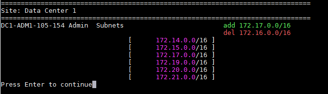

= Ajouter ou modifier des listes de sous-réseaux sur le réseau d'administration
:allow-uri-read: 
:icons: font
:imagesdir: ../media/

[role="lead"]
Vous pouvez ajouter, supprimer ou modifier les sous-réseaux dans la liste des sous-réseaux du réseau d'administration d'un ou de plusieurs nœuds.

.Avant de commencer
* Vous avez le `Passwords.txt` déposer.

Vous pouvez ajouter, supprimer ou modifier des sous-réseaux pour tous les nœuds de la liste des sous-réseaux du réseau d'administration.

[NOTE]
====
N'utilisez pas de sous-réseaux contenant les adresses IPv4 suivantes pour le réseau de grille, le réseau d'administration ou le réseau client d'un nœud :

* 192 168 130 101
* 192 168 131 101
* 192 168 130 102
* 192 168 131 102
* 198.51.100.2
* 198.51.100.4

Par exemple, n'utilisez pas les plages de sous-réseaux suivantes pour le réseau de grille, le réseau d'administration ou le réseau client d'un nœud :

* 192.168.130.0/24 car cette plage de sous-réseaux contient les adresses IP 192.168.130.101 et 192.168.130.102
* 192.168.131.0/24 car cette plage de sous-réseaux contient les adresses IP 192.168.131.101 et 192.168.131.102
* 198.51.100.0/24 car cette plage de sous-réseaux contient les adresses IP 198.51.100.2 et 198.51.100.4

====
.Étapes
. Connectez-vous au nœud d’administration principal :
+
.. Entrez la commande suivante : `ssh admin@_primary_Admin_Node_IP_`
.. Entrez le mot de passe indiqué dans le `Passwords.txt` déposer.
.. Entrez la commande suivante pour passer en root : `su -`
.. Entrez le mot de passe indiqué dans le `Passwords.txt` déposer.

+
Lorsque vous êtes connecté en tant que root, l'invite passe de `$` à `#` .

. Démarrez l’outil Change IP en entrant la commande suivante : `change-ip`
. Saisissez la phrase secrète de provisionnement à l’invite.
+
Le menu principal apparaît.

+
image::../media/change_ip_tool_main_menu.png[capture d'écran montrant l'écran d'accueil de l'outil de changement d'IP]

. Vous pouvez également limiter les réseaux/nœuds sur lesquels les opérations sont effectuées.  Choisissez l’une des options suivantes :
+
** Sélectionnez les nœuds à modifier en choisissant *1*, si vous souhaitez filtrer sur des nœuds spécifiques sur lesquels effectuer l'opération.  Sélectionnez l’une des options suivantes :
+
*** *1*: Nœud unique (sélectionner par nom)
*** *2* : Nœud unique (sélection par site, puis par nom)
*** *3* : Nœud unique (sélection par IP actuelle)
*** *4*: Tous les nœuds d'un site
*** *5*: Tous les nœuds de la grille
*** *0*: Retour

** Autoriser « tous » à rester sélectionné.  Une fois la sélection effectuée, l’écran du menu principal apparaît.  Le champ Nœuds sélectionnés reflète votre nouvelle sélection et désormais toutes les opérations sélectionnées ne seront effectuées que sur cet élément.

. Dans le menu principal, sélectionnez l'option permettant de modifier les sous-réseaux du réseau d'administration (option *3*).
. Choisissez l’une des options suivantes :
+
--
** Ajoutez un sous-réseau en entrant cette commande : `add CIDR`
** Supprimez un sous-réseau en entrant cette commande : `del CIDR`
** Définissez la liste des sous-réseaux en entrant cette commande : `set CIDR`

--
+
--

NOTE: Pour toutes les commandes, vous pouvez saisir plusieurs adresses en utilisant ce format : `add CIDR, CIDR`

Exemple: `add 172.14.0.0/16, 172.15.0.0/16, 172.16.0.0/16`

TIP: Vous pouvez réduire la quantité de saisie requise en utilisant la « flèche vers le haut » pour rappeler les valeurs précédemment saisies dans l'invite de saisie actuelle, puis les modifier si nécessaire.

L'exemple d'entrée ci-dessous montre l'ajout de sous-réseaux à la liste des sous-réseaux du réseau d'administration :

image::../media/change_ip_tool_aesl_sample_input.gif[outil de changement d'adresse IP, exemple AESL]

--
. Lorsque vous êtes prêt, entrez *q* pour revenir à l'écran du menu principal.  Vos modifications sont conservées jusqu'à ce qu'elles soient effacées ou appliquées.
+

NOTE: Si vous avez sélectionné l'un des modes de sélection de nœuds « tous » à l'étape 2, appuyez sur *Entrée* (sans *q*) pour accéder au nœud suivant dans la liste.

. Choisissez l’une des options suivantes :
+
** Sélectionnez l'option *5* pour afficher les modifications dans la sortie qui est isolée pour afficher uniquement l'élément modifié.  Les modifications sont surlignées en vert (ajouts) ou en rouge (suppressions), comme indiqué dans l'exemple de sortie ci-dessous :
+

** Sélectionnez l'option *6* pour afficher les modifications dans la sortie qui affiche la configuration complète.  Les modifications sont surlignées en vert (ajouts) ou en rouge (suppressions).  *Remarque :* certains émulateurs de terminal peuvent afficher les ajouts et les suppressions à l'aide d'un formatage barré.
+
Lorsque vous essayez de modifier la liste des sous-réseaux, le message suivant s'affiche :

+
[listing]
----
CAUTION: The Admin Network subnet list on the node might contain /32 subnets derived from automatically applied routes that aren't persistent. Host routes (/32 subnets) are applied automatically if the IP addresses provided for external services such as NTP or DNS aren't reachable using default StorageGRID routing, but are reachable using a different interface and gateway. Making and applying changes to the subnet list will make all automatically applied subnets persistent. If you don't want that to happen, delete the unwanted subnets before applying changes. If you know that all /32 subnets in the list were added intentionally, you can ignore this caution.
----
+
Si vous n'avez pas spécifiquement attribué les sous-réseaux de serveur NTP et DNS à un réseau, StorageGRID crée automatiquement une route hôte (/32) pour la connexion.  Si, par exemple, vous préférez avoir une route /16 ou /24 pour la connexion sortante vers un serveur DNS ou NTP, vous devez supprimer la route /32 créée automatiquement et ajouter les routes souhaitées.  Si vous ne supprimez pas la route hôte créée automatiquement, elle sera conservée après avoir appliqué les modifications à la liste des sous-réseaux.

+

NOTE: Bien que vous puissiez utiliser ces routes d'hôtes découvertes automatiquement, vous devez en général configurer manuellement les routes DNS et NTP pour garantir la connectivité.

. Sélectionnez l’option *7* pour valider toutes les modifications mises en place.
+
Cette validation garantit que les règles des réseaux Grid, Admin et Client sont respectées, comme l'utilisation de sous-réseaux qui se chevauchent.

. Vous pouvez également sélectionner l'option *8* pour enregistrer toutes les modifications effectuées et revenir ultérieurement pour continuer à apporter des modifications.
+
Cette option vous permet de quitter l'outil Change IP et de le redémarrer plus tard, sans perdre les modifications non appliquées.

. Effectuez l’une des opérations suivantes :
+
** Sélectionnez l’option *9* si vous souhaitez effacer toutes les modifications sans enregistrer ni appliquer la nouvelle configuration réseau.
** Sélectionnez l’option *10* si vous êtes prêt à appliquer les modifications et à provisionner la nouvelle configuration réseau.  Pendant l'approvisionnement, la sortie affiche l'état au fur et à mesure que les mises à jour sont appliquées, comme indiqué dans l'exemple de sortie suivant :
+
[listing]
----
Generating new grid networking description file...

Running provisioning...

Updating grid network configuration on Name
----

. Téléchargez un nouveau package de récupération à partir du gestionnaire de grille.
+
.. Sélectionnez *MAINTENANCE* > *Système* > *Package de récupération*.
.. Saisissez la phrase secrète d’approvisionnement.

