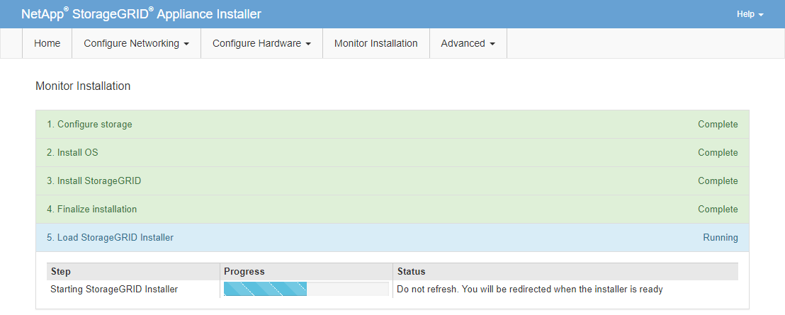

= Surveillance de l'installation des appareils de services
:allow-uri-read: 
:icons: font
:imagesdir: ../media/

[role="lead"]
Le programme d'installation de l'appliance StorageGRID fournit un état jusqu'à ce que l'installation soit terminée.  Une fois l’installation du logiciel terminée, l’appareil est redémarré.

.Étapes
. Pour suivre la progression de l'installation, cliquez sur *Surveiller l'installation* dans la barre de menus.
+
La page d’installation du moniteur affiche la progression de l’installation.

+
image::../media/monitor_installation_services_appl.png[Installation du moniteur - Services Appl]

+
La barre d'état bleue indique quelle tâche est actuellement en cours.  Les barres d’état vertes indiquent les tâches qui ont été effectuées avec succès.

+

NOTE: Le programme d'installation garantit que les tâches effectuées lors d'une installation précédente ne sont pas réexécutées.  Si vous réexécutez une installation, toutes les tâches qui n'ont pas besoin d'être réexécutées sont affichées avec une barre d'état verte et un statut « Ignoré ».

. Passez en revue la progression des deux premières étapes de l’installation.
+
** *1.  Configurer le stockage*
+
Au cours de cette étape, le programme d’installation efface toute configuration existante des lecteurs et configure les paramètres de l’hôte.

** *2.  Installer le système d'exploitation*
+
Au cours de cette étape, le programme d'installation copie l'image du système d'exploitation de base pour StorageGRID du nœud d'administration principal vers l'appliance ou installe le système d'exploitation de base à partir du package d'installation du nœud d'administration principal.

. Continuez à surveiller la progression de l’installation jusqu’à ce que l’un des événements suivants se produise :
+
** Pour les nœuds de passerelle d'appliance ou les nœuds d'administration d'appliance non principaux, l'étape *Install StorageGRID* s'interrompt et un message s'affiche sur la console intégrée, vous invitant à approuver ce nœud sur le nœud d'administration à l'aide du gestionnaire de grille.
+
image::../media/monitor_installation_install_sgws.gif[L'image est décrite par le texte environnant]

** Pour les nœuds d’administration principaux de l’appliance, une cinquième phase (charger le programme d’installation de StorageGRID ) apparaît.  Si la cinquième phase est en cours depuis plus de 10 minutes, actualisez la page manuellement.
+

. Passez à l’étape suivante du processus de récupération pour le type de nœud de grille d’appareil que vous récupérez.
+
[cols="1a,2a"]
|===
| Type de récupération | Référence 

 a| 
Nœud de passerelle
 a| 
link:selecting-start-recovery-to-configure-gateway-node.html["Sélectionnez Démarrer la récupération pour configurer le nœud de passerelle"]

 a| 
Nœud d'administration non principal
 a| 
link:selecting-start-recovery-to-configure-non-primary-admin-node.html["Sélectionnez Démarrer la récupération pour configurer le nœud d’administration non principal"]

 a| 
Nœud d'administration principal
 a| 
link:configuring-replacement-primary-admin-node.html["Configurer le nœud d'administration principal de remplacement"]

|===

