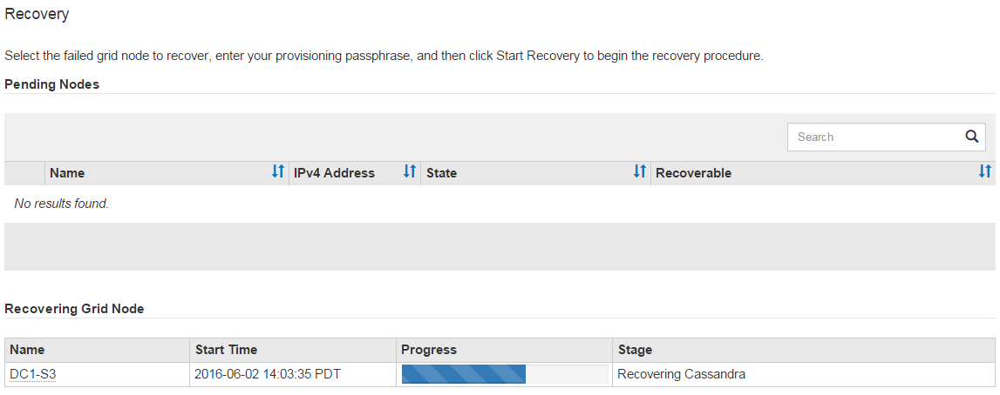

= Remonter et reformater les volumes de stockage de l'appareil (étapes manuelles)
:allow-uri-read: 
:icons: font
:imagesdir: ../media/

[role="lead"]
Vous devez exécuter manuellement deux scripts pour remonter les volumes de stockage préservés et reformater tous les volumes de stockage défaillants.  Le premier script remonte les volumes correctement formatés en tant que volumes de stockage StorageGRID .  Le deuxième script reformate tous les volumes non montés, reconstruit la base de données Cassandra, si nécessaire, et démarre les services.

.Avant de commencer
* Vous avez déjà remplacé le matériel de tous les volumes de stockage défaillants dont vous savez qu'ils doivent être remplacés.
+
Exécution du `sn-remount-volumes` Le script peut vous aider à identifier des volumes de stockage supplémentaires défaillants.

* Vous avez vérifié qu'une mise hors service du nœud de stockage n'est pas en cours ou vous avez suspendu la procédure de mise hors service du nœud. (Dans le gestionnaire de grille, sélectionnez *MAINTENANCE* > *Tâches* > *Désactivation*.)
* Vous avez vérifié qu'une extension n'est pas en cours. (Dans le gestionnaire de grille, sélectionnez *MAINTENANCE* > *Tâches* > *Extension*.)

CAUTION: Contactez le support technique si plusieurs nœuds de stockage sont hors ligne ou si un nœud de stockage de cette grille a été reconstruit au cours des 15 derniers jours. Ne courez pas le `sn-recovery-postinstall.sh` scénario.  La reconstruction de Cassandra sur deux ou plusieurs nœuds de stockage à 15 jours d'intervalle peut entraîner une perte de données.

.À propos de cette tâche
Pour réaliser cette procédure, vous effectuez ces tâches de haut niveau :

* Connectez-vous au nœud de stockage récupéré.
* Exécutez le `sn-remount-volumes` script pour remonter des volumes de stockage correctement formatés.  Lorsque ce script s'exécute, il effectue les opérations suivantes :
+
** Monte et démonte chaque volume de stockage pour relire le journal XFS.
** Effectue une vérification de cohérence du fichier XFS.
** Si le système de fichiers est cohérent, détermine si le volume de stockage est un volume de stockage StorageGRID correctement formaté.
** Si le volume de stockage est correctement formaté, remonte le volume de stockage.  Toutes les données existantes sur le volume restent intactes.

* Vérifiez la sortie du script et résolvez les problèmes.
* Exécutez le `sn-recovery-postinstall.sh` scénario.  Lorsque ce script s'exécute, il effectue les opérations suivantes.
+

CAUTION: Ne redémarrez pas un nœud de stockage pendant la récupération avant l'exécution `sn-recovery-postinstall.sh` (étape 4) pour reformater les volumes de stockage défaillants et restaurer les métadonnées de l'objet.  Redémarrer le nœud de stockage avant `sn-recovery-postinstall.sh` complète provoque des erreurs pour les services qui tentent de démarrer et provoque la sortie des nœuds de l'appliance StorageGRID du mode de maintenance.

+
** Reformate tous les volumes de stockage que le `sn-remount-volumes` les scripts n'ont pas pu être montés ou ont été trouvés comme étant mal formatés.
+

NOTE: Si un volume de stockage est reformaté, toutes les données de ce volume sont perdues.  Vous devez effectuer une procédure supplémentaire pour restaurer les données d'objet à partir d'autres emplacements de la grille, en supposant que les règles ILM ont été configurées pour stocker plusieurs copies d'objet.

** Reconstruit la base de données Cassandra sur le nœud, si nécessaire.
** Démarre les services sur le nœud de stockage.

.Étapes
. Connectez-vous au nœud de stockage récupéré :
+
.. Entrez la commande suivante : `ssh admin@_grid_node_IP_`
.. Entrez le mot de passe indiqué dans le `Passwords.txt` déposer.
.. Entrez la commande suivante pour passer en root : `su -`
.. Entrez le mot de passe indiqué dans le `Passwords.txt` déposer.

+
Lorsque vous êtes connecté en tant que root, l'invite passe de `$` à `#` .

. Exécutez le premier script pour remonter tous les volumes de stockage correctement formatés.
+

NOTE: Si tous les volumes de stockage sont nouveaux et doivent être formatés, ou si tous les volumes de stockage sont tombés en panne, vous pouvez ignorer cette étape et exécuter le deuxième script pour reformater tous les volumes de stockage non montés.

+
.. Exécutez le script : `sn-remount-volumes`
+
Ce script peut prendre des heures à s'exécuter sur des volumes de stockage contenant des données.

.. Pendant que le script s’exécute, examinez la sortie et répondez à toutes les invites.
+

NOTE: Selon vos besoins, vous pouvez utiliser le `tail -f` commande pour surveiller le contenu du fichier journal du script(`/var/local/log/sn-remount-volumes.log` ) .  Le fichier journal contient des informations plus détaillées que la sortie de la ligne de commande.

+
[listing]
----
root@SG:~ # sn-remount-volumes
The configured LDR noid is 12632740

====== Device /dev/sdb ======
Mount and unmount device /dev/sdb and checking file system consistency:
The device is consistent.
Check rangedb structure on device /dev/sdb:
Mount device /dev/sdb to /tmp/sdb-654321 with rangedb mount options
This device has all rangedb directories.
Found LDR node id 12632740, volume number 0 in the volID file
Attempting to remount /dev/sdb
Device /dev/sdb remounted successfully

====== Device /dev/sdc ======
Mount and unmount device /dev/sdc and checking file system consistency:
Error: File system consistency check retry failed on device /dev/sdc.
You can see the diagnosis information in the /var/local/log/sn-remount-volumes.log.

This volume could be new or damaged. If you run sn-recovery-postinstall.sh, this volume and any data on this volume will be deleted. If you only had two copies of object data, you will temporarily have only a single copy.
StorageGRID will attempt to restore data redundancy by making additional replicated copies or EC fragments, according to the rules in the active ILM policies.

Don't continue to the next step if you believe that the data remaining on this volume can't be rebuilt from elsewhere in the grid (for example, if your ILM policy uses a rule that makes only one copy or if volumes have failed on multiple nodes). Instead, contact support to determine how to recover your data.

====== Device /dev/sdd ======
Mount and unmount device /dev/sdd and checking file system consistency:
Failed to mount device /dev/sdd
This device could be an uninitialized disk or has corrupted superblock.
File system check might take a long time. Do you want to continue? (y or n) [y/N]? y

Error: File system consistency check retry failed on device /dev/sdd.
You can see the diagnosis information in the /var/local/log/sn-remount-volumes.log.

This volume could be new or damaged. If you run sn-recovery-postinstall.sh, this volume and any data on this volume will be deleted. If you only had two copies of object data, you will temporarily have only a single copy.
StorageGRID will attempt to restore data redundancy by making additional replicated copies or EC fragments, according to the rules in the active ILM policies.

Don't continue to the next step if you believe that the data remaining on this volume can't be rebuilt from elsewhere in the grid (for example, if your ILM policy uses a rule that makes only one copy or if volumes have failed on multiple nodes). Instead, contact support to determine how to recover your data.

====== Device /dev/sde ======
Mount and unmount device /dev/sde and checking file system consistency:
The device is consistent.
Check rangedb structure on device /dev/sde:
Mount device /dev/sde to /tmp/sde-654321 with rangedb mount options
This device has all rangedb directories.
Found LDR node id 12000078, volume number 9 in the volID file
Error: This volume does not belong to this node. Fix the attached volume and re-run this script.
----
+
Dans l'exemple de sortie, un volume de stockage a été remonté avec succès et trois volumes de stockage présentaient des erreurs.

+
*** `/dev/sdb`a réussi le contrôle de cohérence du système de fichiers XFS et avait une structure de volume valide, il a donc été remonté avec succès.  Les données sur les appareils remontés par le script sont conservées.
*** `/dev/sdc`échec de la vérification de cohérence du système de fichiers XFS car le volume de stockage était nouveau ou corrompu.
*** `/dev/sdd`n'a pas pu être monté car le disque n'a pas été initialisé ou le superbloc du disque était corrompu.  Lorsque le script ne peut pas monter un volume de stockage, il vous demande si vous souhaitez exécuter la vérification de cohérence du système de fichiers.
+
**** Si le volume de stockage est connecté à un nouveau disque, répondez *N* à l'invite.  Vous n’avez pas besoin de vérifier le système de fichiers sur un nouveau disque.
**** Si le volume de stockage est connecté à un disque existant, répondez *Y* à l'invite.  Vous pouvez utiliser les résultats de la vérification du système de fichiers pour déterminer la source de la corruption.  Les résultats sont enregistrés dans le `/var/local/log/sn-remount-volumes.log` fichier journal.

*** `/dev/sde`a réussi le contrôle de cohérence du système de fichiers XFS et avait une structure de volume valide ; cependant, l'ID de nœud LDR dans le `volID` le fichier ne correspond pas à l'ID de ce nœud de stockage (le `configured LDR noid` affiché en haut).  Ce message indique que ce volume appartient à un autre nœud de stockage.

. Vérifiez la sortie du script et résolvez les problèmes.
+

CAUTION: Si un volume de stockage a échoué à la vérification de cohérence du système de fichiers XFS ou n'a pas pu être monté, examinez attentivement les messages d'erreur dans la sortie.  Vous devez comprendre les implications de l’exécution de la `sn-recovery-postinstall.sh` script sur ces volumes.

+
.. Vérifiez que les résultats incluent une entrée pour tous les volumes attendus.  Si des volumes ne sont pas répertoriés, réexécutez le script.
.. Consultez les messages de tous les périphériques montés.  Assurez-vous qu’il n’y a aucune erreur indiquant qu’un volume de stockage n’appartient pas à ce nœud de stockage.
+
Dans l'exemple, la sortie pour /dev/sde inclut le message d'erreur suivant :

+
[listing]
----
Error: This volume does not belong to this node. Fix the attached volume and re-run this script.
----
+

CAUTION: Si un volume de stockage est signalé comme appartenant à un autre nœud de stockage, contactez le support technique.  Si vous exécutez le `sn-recovery-postinstall.sh` script, le volume de stockage sera reformaté, ce qui pourrait entraîner une perte de données.

.. Si des périphériques de stockage n'ont pas pu être montés, notez le nom du périphérique et réparez ou remplacez-le.
+

NOTE: Vous devez réparer ou remplacer tout périphérique de stockage qui n’a pas pu être monté.

+
Vous utiliserez le nom de l'appareil pour rechercher l'ID du volume, qui est une entrée requise lorsque vous exécutez le `repair-data` script pour restaurer les données de l'objet sur le volume (la procédure suivante).

.. Après avoir réparé ou remplacé tous les périphériques non montables, exécutez le `sn-remount-volumes` script à nouveau pour confirmer que tous les volumes de stockage qui peuvent être remontés ont été remontés.
+

CAUTION: Si un volume de stockage ne peut pas être monté ou est mal formaté et que vous passez à l'étape suivante, le volume et toutes les données qu'il contient seront supprimés.  Si vous aviez deux copies des données de l'objet, vous n'en aurez qu'une seule jusqu'à ce que vous terminiez la procédure suivante (restauration des données de l'objet).

+

CAUTION: Ne courez pas le `sn-recovery-postinstall.sh` script si vous pensez que les données restantes sur un volume de stockage défaillant ne peuvent pas être reconstruites ailleurs dans la grille (par exemple, si votre politique ILM utilise une règle qui ne fait qu'une seule copie ou si les volumes ont échoué sur plusieurs nœuds).  Contactez plutôt le support technique pour déterminer comment récupérer vos données.

. Exécutez le `sn-recovery-postinstall.sh` scénario: `sn-recovery-postinstall.sh`
+
Ce script reformate tous les volumes de stockage qui n'ont pas pu être montés ou qui se sont avérés mal formatés ; reconstruit la base de données Cassandra sur le nœud, si nécessaire ; et démarre les services sur le nœud de stockage.

+
Soyez attentif aux points suivants :

+
** L'exécution du script peut prendre des heures.
** En général, vous devez laisser la session SSH seule pendant que le script est en cours d'exécution.
** N'appuyez pas sur *Ctrl+C* lorsque la session SSH est active.
** Le script s'exécutera en arrière-plan si une interruption du réseau se produit et met fin à la session SSH, mais vous pouvez afficher la progression à partir de la page de récupération.
** Si le nœud de stockage utilise le service RSM, le script peut sembler se bloquer pendant 5 minutes lorsque les services du nœud sont redémarrés.  Ce délai de 5 minutes est attendu à chaque démarrage du service RSM pour la première fois.
+

NOTE: Le service RSM est présent sur les nœuds de stockage qui incluent le service ADC.

+

NOTE: Certaines procédures de récupération StorageGRID utilisent Reaper pour gérer les réparations Cassandra.  Les réparations se produisent automatiquement dès que les services concernés ou requis ont commencé.  Vous remarquerez peut-être une sortie de script qui mentionne « reaper » ou « réparation Cassandra ».  Si vous voyez un message d’erreur indiquant que la réparation a échoué, exécutez la commande indiquée dans le message d’erreur.

. Comme le `sn-recovery-postinstall.sh` le script s'exécute, surveillez la page de récupération dans le gestionnaire de grille.
+
La barre de progression et la colonne Étape de la page de récupération fournissent un état de haut niveau de l'état de récupération. `sn-recovery-postinstall.sh` scénario.

+

. Après le `sn-recovery-postinstall.sh` le script a démarré les services sur le nœud, vous pouvez restaurer les données de l'objet sur n'importe quel volume de stockage formaté par le script.
+
Le script vous demande si vous souhaitez utiliser le processus de restauration du volume Grid Manager.

+
** Dans la plupart des cas, vous devriezlink:../maintain/restoring-volume.html["restaurer les données d'objet à l'aide de Grid Manager"] .  Répondre `y` pour utiliser le gestionnaire de grille.
** Dans de rares cas, par exemple lorsque le support technique vous le demande ou lorsque vous savez que le nœud de remplacement dispose de moins de volumes disponibles pour le stockage d'objets que le nœud d'origine, vous devezlink:restoring-object-data-to-storage-volume-for-appliance.html["restaurer les données de l'objet manuellement"] en utilisant le `repair-data` scénario.  Si l'un de ces cas s'applique, répondez `n` .
+
[NOTE]
====
Si vous répondez `n` pour utiliser le processus de restauration de volume de Grid Manager (restaurer les données d'objet manuellement) :

*** Vous ne pouvez pas restaurer les données d'objet à l'aide de Grid Manager.
*** Vous pouvez surveiller la progression des tâches de restauration manuelle à l'aide de Grid Manager.

====
+
Après avoir effectué votre sélection, le script se termine et les étapes suivantes pour récupérer les données de l'objet s'affichent.  Après avoir examiné ces étapes, appuyez sur n’importe quelle touche pour revenir à la ligne de commande.

