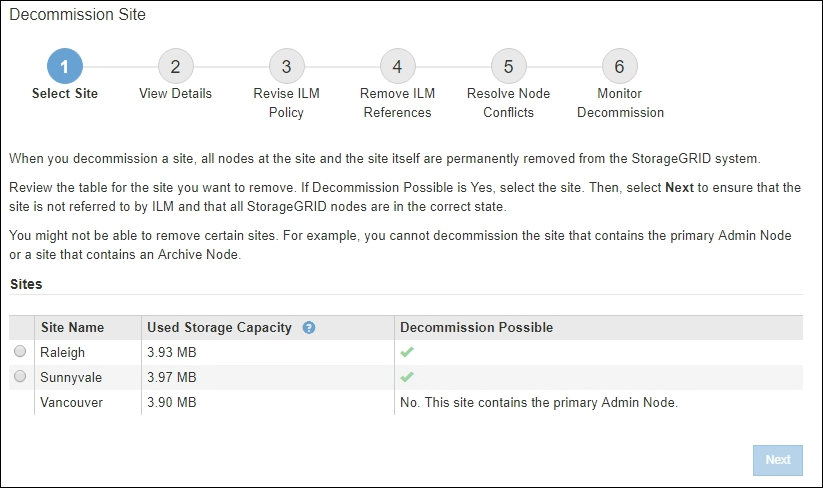

= Étape 1 : Sélectionner le site
:allow-uri-read: 
:icons: font
:imagesdir: ../media/

[role="lead"]
Pour déterminer si un site peut être mis hors service, commencez par accéder à l’assistant de mise hors service du site.

.Avant de commencer
* Vous avez obtenu tous les matériaux requis.
* Vous avez examiné les considérations relatives à la suppression d’un site.
* Vous êtes connecté au Grid Manager à l'aide d'unlink:../admin/web-browser-requirements.html["navigateur Web pris en charge"] .
* Vous avez lelink:../admin/admin-group-permissions.html["Autorisation d'accès root ou autorisations de maintenance et ILM"] .

.Étapes
. Sélectionnez *MAINTENANCE* > *Tâches* > *Mise hors service*.
. Sélectionnez *Site de déclassement*.
+
L’étape 1 (Sélectionner un site) de l’assistant de déclassement du site s’affiche.  Cette étape comprend une liste alphabétique des sites de votre système StorageGRID .

+

. Affichez les valeurs dans la colonne *Capacité de stockage utilisée* pour déterminer la quantité de stockage actuellement utilisée pour les données d'objet sur chaque site.
+
La capacité de stockage utilisée est une estimation.  Si les nœuds sont hors ligne, la capacité de stockage utilisée est la dernière valeur connue du site.

+
** Pour la mise hors service d'un site connecté, cette valeur représente la quantité de données d'objet qui devront être déplacées vers d'autres sites ou supprimées par ILM avant que vous puissiez mettre hors service ce site en toute sécurité.
** Pour une mise hors service d'un site déconnecté, cette valeur représente la quantité de stockage de données de votre système qui deviendra inaccessible lorsque vous mettrez hors service ce site.
+

NOTE: Si votre politique ILM a été conçue pour protéger contre la perte d’un seul site, des copies de vos données d’objet doivent toujours exister sur les sites restants.

. Consultez les raisons dans la colonne *Déclassement possible* pour déterminer quels sites peuvent être déclassés actuellement.
+

NOTE: S'il existe plusieurs raisons pour lesquelles un site ne peut pas être mis hors service, la raison la plus critique est indiquée.

+
[cols="1a,1a,1a"]
|===
| Déclassement Raison possible | Description | Prochaine étape 

 a| 
Coche verte (image:../media/icon_alert_green_checkmark.png["Icône d'alerte Coche verte"] )
 a| 
Vous pouvez désactiver ce site.
 a| 
Aller à<<decommission_possible,la prochaine étape>> .

 a| 
Non. Ce site contient le nœud d’administration principal.
 a| 
Vous ne pouvez pas désactiver un site contenant le nœud d'administration principal.
 a| 
Aucun.  Vous ne pouvez pas effectuer cette procédure.

 a| 
Non. Ce site contient un ou plusieurs nœuds d’archives.
 a| 
Vous ne pouvez pas désactiver un site contenant un nœud d'archive.
 a| 
Aucun.  Vous ne pouvez pas effectuer cette procédure.

 a| 
Non. Tous les nœuds de ce site sont déconnectés.  Contactez votre représentant de compte NetApp .
 a| 
Vous ne pouvez pas effectuer la mise hors service d'un site connecté à moins que chaque nœud du site ne soit connecté (image:../media/icon_alert_green_checkmark.png["Icône d'alerte Coche verte"] ).
 a| 
Si vous souhaitez effectuer une décommission d'un site déconnecté, vous devez contacter votre représentant de compte NetApp , qui examinera vos besoins et activera le reste de l'assistant de décommission du site.

*IMPORTANT* : Ne mettez jamais les nœuds en ligne hors ligne afin de pouvoir supprimer un site.  Vous perdrez des données.

|===
+
L'exemple montre un système StorageGRID avec trois sites.  La coche verte (image:../media/icon_alert_green_checkmark.png["Icône d'alerte Coche verte"] ) pour les sites de Raleigh et de Sunnyvale indique que vous pouvez mettre hors service ces sites.  Cependant, vous ne pouvez pas désactiver le site de Vancouver car il contient le nœud d'administration principal.

[[decommission_possible]]
. Si la mise hors service est possible, sélectionnez le bouton radio correspondant au site.
+
Le bouton *Suivant* est activé.

. Sélectionnez *Suivant*.
+
L’étape 2 (Afficher les détails) apparaît.

