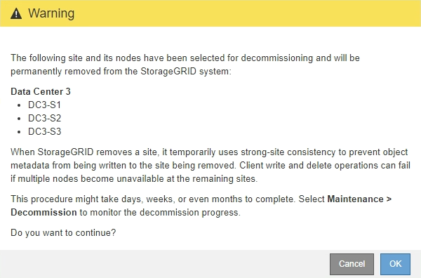

= Étape 5 : Résoudre les conflits de nœuds (et démarrer la mise hors service)
:allow-uri-read: 
:icons: font
:imagesdir: ../media/

[role="lead"]
À partir de l'étape 5 (Résoudre les conflits de nœuds) de l'assistant de mise hors service du site, vous pouvez déterminer si des nœuds de votre système StorageGRID sont déconnectés ou si des nœuds du site sélectionné appartiennent à un groupe de haute disponibilité (HA).  Une fois les conflits de nœuds résolus, vous démarrez la procédure de mise hors service à partir de cette page.

.Avant de commencer
Vous devez vous assurer que tous les nœuds de votre système StorageGRID sont dans l’état correct, comme suit :

* Tous les nœuds de votre système StorageGRID doivent être connectés (image:../media/icon_alert_green_checkmark.png["Icône d'alerte Coche verte"] ).
+

NOTE: Si vous effectuez une mise hors service d'un site déconnecté, tous les nœuds du site que vous supprimez doivent être déconnectés et tous les nœuds de tous les autres sites doivent être connectés.

+

NOTE: La mise hors service ne démarrera pas si un ou plusieurs volumes sont hors ligne (démontés) ou s'ils sont en ligne (montés) mais dans un état d'erreur.

+

NOTE: Si un ou plusieurs volumes sont mis hors ligne pendant qu'une mise hors service est en cours, le processus de mise hors service se termine une fois que ces volumes sont remis en ligne.

* Aucun nœud du site que vous supprimez ne peut avoir une interface appartenant à un groupe de haute disponibilité (HA).

.À propos de cette tâche
Si un nœud est répertorié pour l’étape 5 (Résoudre les conflits de nœuds), vous devez corriger le problème avant de pouvoir démarrer la mise hors service.

Avant de commencer la procédure de déclassement du site à partir de cette page, passez en revue les considérations suivantes :

* Vous devez prévoir suffisamment de temps pour que la procédure de mise hors service soit terminée.
+

NOTE: Le déplacement ou la suppression des données d'objet d'un site peut prendre des jours, des semaines, voire des mois, en fonction de la quantité de données sur le site, de la charge sur votre système, des latences du réseau et de la nature des modifications ILM requises.

* Pendant que la procédure de déclassement du site est en cours :
+
** Vous ne pouvez pas créer de règles ILM qui font référence au site en cours de mise hors service.  Vous ne pouvez pas non plus modifier une règle ILM existante pour faire référence au site.
** Vous ne pouvez pas effectuer d’autres procédures de maintenance, telles que l’extension ou la mise à niveau.
+

NOTE: Si vous devez effectuer une autre procédure de maintenance lors de la mise hors service d'un site connecté, vous pouvez suspendre la procédure pendant la suppression des nœuds de stockage.  Le bouton *Pause* est activé pendant l'étape « Décommissionnement des données répliquées et codées par effacement ».

** Si vous devez récupérer un nœud après avoir démarré la procédure de mise hors service du site, vous devez contacter le support.

.Étapes
. Consultez la section des nœuds déconnectés de l'étape 5 (Résoudre les conflits de nœuds) pour déterminer si des nœuds de votre système StorageGRID ont un état de connexion inconnu (image:../media/icon_alarm_blue_unknown.png["Icône Alarme Bleue Inconnue"] ) ou administrativement vers le bas (image:../media/icon_alarm_gray_administratively_down.png["Icône d'alarme grise administrativement en panne"] ).
+
image::../media/decommission_site_step_5_disconnected_nodes.png[Étape 5 du site de déclassement : Résoudre les conflits de nœuds]

. Si des nœuds sont déconnectés, remettez-les en ligne.
+
Voir lelink:../maintain/grid-node-procedures.html["Procédures de nœud"] . Contactez le support technique si vous avez besoin d'aide.

. Une fois tous les nœuds déconnectés remis en ligne, consultez la section Groupes HA de l’étape 5 (Résoudre les conflits de nœuds).
+
Ce tableau répertorie tous les nœuds du site sélectionné qui appartiennent à un groupe de haute disponibilité (HA).

+
image::../media/decommission_site_step_5_ha_groups.png[Groupes HA de l'étape 5 du site de déclassement]

. Si des nœuds sont répertoriés, effectuez l’une des opérations suivantes :
+
** Modifiez chaque groupe HA affecté pour supprimer l’interface de nœud.
** Supprimez un groupe HA qui inclut uniquement les nœuds de ce site.  Consultez les instructions d’administration de StorageGRID.

+
Si tous les nœuds sont connectés et qu'aucun nœud du site sélectionné n'est utilisé dans un groupe HA, le champ *Phrase de passe de provisionnement* est activé.

. Saisissez la phrase secrète d’approvisionnement.
+
Le bouton *Démarrer la mise hors service* devient activé.

+
image::../media/decommission_site_step_5_provision_passphrase.png[Phrase de passe de fourniture de l'étape 5 du site de déclassement]

. Si vous êtes prêt à démarrer la procédure de déclassement du site, sélectionnez *Démarrer la déclassement*.
+
Un avertissement répertorie le site et les nœuds qui seront supprimés.  Nous vous rappelons qu’il faudra peut-être des jours, des semaines, voire des mois pour supprimer complètement le site.

+

. Relisez l’avertissement.  Si vous êtes prêt à commencer, sélectionnez *OK*.
+
Un message apparaît lorsque la nouvelle configuration de grille est générée.  Ce processus peut prendre un certain temps, en fonction du type et du nombre de nœuds de réseau mis hors service.

+
image::../media/decommission_site_step_5_grid_configuration.png[Configuration de la grille de l'étape 5 du site de déclassement]

+
Une fois la nouvelle configuration de grille générée, l'étape 6 (Décommission du moniteur) s'affiche.

+

NOTE: Le bouton *Précédent* reste désactivé jusqu'à ce que la mise hors service soit terminée.

