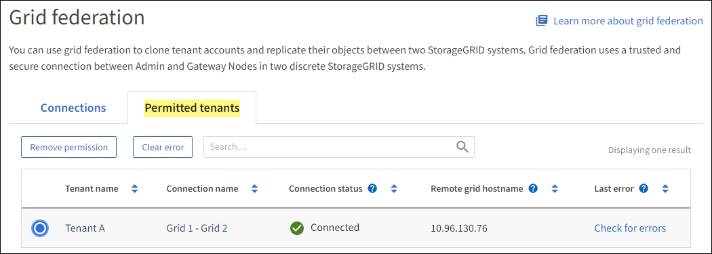

= Surveiller les connexions de la fédération de réseau
:allow-uri-read: 
:icons: font
:imagesdir: ../media/

[role="lead"]
Vous pouvez surveiller les informations de base sur touslink:../admin/grid-federation-overview.html["connexions de fédération de réseau"] , des informations détaillées sur une connexion spécifique ou des mesures Prometheus sur les opérations de réplication inter-grille.  Vous pouvez surveiller une connexion à partir de l'une ou l'autre des grilles.

.Avant de commencer
* Vous êtes connecté au gestionnaire de grille sur l'une ou l'autre grille à l'aide d'unlink:../admin/web-browser-requirements.html["navigateur Web pris en charge"] .
* Vous avez lelink:../admin/admin-group-permissions.html["Autorisation d'accès root"] pour la grille à laquelle vous êtes connecté.

== Voir toutes les connexions

La page Fédération de grille affiche des informations de base sur toutes les connexions de fédération de grille et sur tous les comptes de locataire autorisés à utiliser les connexions de fédération de grille.

.Étapes
. Sélectionnez *CONFIGURATION* > *Système* > *Fédération de grille*.
+
La page de la fédération Grid apparaît.

. Pour voir les informations de base de toutes les connexions sur cette grille, sélectionnez l'onglet *Connexions*.
+
Depuis cet onglet, vous pouvez :

+
** link:../admin/grid-federation-create-connection.html["Créer une nouvelle connexion"] .
** Sélectionnez une connexion existante pourlink:../admin/grid-federation-manage-connection.html["modifier ou tester"] .

+
image::../media/grid-federation-connections-tab.png[Onglet Connexions à la fédération de grille]

. Pour afficher les informations de base de tous les comptes locataires de cette grille disposant de l'autorisation *Utiliser la connexion à la fédération de grille*, sélectionnez l'onglet *Locataires autorisés*.
+
Depuis cet onglet, vous pouvez :

+
** link:../monitor/monitoring-tenant-activity.html["Consultez la page de détails pour chaque locataire autorisé"] .
** Consultez la page de détails pour chaque connexion. Voir <<view-specific-connection,Afficher une connexion spécifique>> .
** Sélectionnez un locataire autorisé etlink:../admin/grid-federation-manage-tenants.html["supprimer l'autorisation"] .
** Vérifiez les erreurs de réplication inter-grille et effacez la dernière erreur, le cas échéant. Voir link:../admin/grid-federation-troubleshoot.html["Résoudre les erreurs de fédération de grille"] .
+

== [[view-specific-connection]]Afficher une connexion spécifique

Vous pouvez afficher les détails d'une connexion de fédération de grille spécifique.

.Étapes
. Sélectionnez l’un des onglets de la page Fédération de grille, puis sélectionnez le nom de la connexion dans le tableau.
+
Depuis la page de détails de la connexion, vous pouvez :

+
** Consultez les informations d'état de base sur la connexion, y compris les noms d'hôtes locaux et distants, le port et l'état de la connexion.
** Sélectionnez une connexion àlink:../admin/grid-federation-manage-connection.html["modifier, tester ou supprimer"] .

. Lorsque vous visualisez une connexion spécifique, sélectionnez l'onglet * Locataires autorisés * pour afficher les détails sur les locataires autorisés pour la connexion.
+
Depuis cet onglet, vous pouvez :

+
** link:../monitor/monitoring-tenant-activity.html["Consultez la page de détails pour chaque locataire autorisé"] .
** link:../admin/grid-federation-manage-tenants.html["Supprimer l'autorisation d'un locataire"]pour utiliser la connexion.
** Vérifiez les erreurs de réplication inter-grille et effacez la dernière erreur. Voir link:../admin/grid-federation-troubleshoot.html["Résoudre les erreurs de fédération de grille"] .
+
image::../media/grid-federation-permitted-tenants-tab-for-connection.png[onglet-locataires-autorisés-pour-la-connexion-de-la-fédération-de-grille]

. Lorsque vous affichez une connexion spécifique, sélectionnez l'onglet *Certificats* pour afficher les certificats serveur et client générés par le système pour cette connexion.
+
Depuis cet onglet, vous pouvez :

+
** link:../admin/grid-federation-manage-connection.html["Faire tourner les certificats de connexion"] .
** Sélectionnez *Serveur* ou *Client* pour afficher ou télécharger le certificat associé ou copier le certificat PEM.
+
image::../media/grid-federation-certificates-tab.png[onglet certificats de la fédération de grille]

== Examiner les mesures de réplication inter-grille

Vous pouvez utiliser le tableau de bord de réplication inter-grille dans Grafana pour afficher les métriques Prometheus sur les opérations de réplication inter-grille sur votre grille.

.Étapes
. Depuis le gestionnaire de grille, sélectionnez *SUPPORT* > *Outils* > *Métriques*.
+

NOTE: Les outils disponibles sur la page Métriques sont destinés à être utilisés par le support technique.  Certaines fonctionnalités et éléments de menu de ces outils sont intentionnellement non fonctionnels et sont susceptibles d'être modifiés.  Voir la liste deslink:../monitor/commonly-used-prometheus-metrics.html["métriques Prometheus couramment utilisées"] .

. Dans la section Grafana de la page, sélectionnez *Réplication inter-grille*.
+
Pour des instructions détaillées, voirlink:../monitor/reviewing-support-metrics.html["Examiner les mesures de support"] .

. Pour réessayer la réplication des objets dont la réplication a échoué, voirlink:../admin/grid-federation-retry-failed-replication.html["Identifier et réessayer les opérations de réplication ayant échoué"] .

