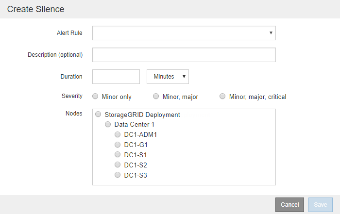

= Notifications d'alerte silencieuses
:allow-uri-read: 
:icons: font
:imagesdir: ../media/

[role="lead"]
En option, vous pouvez configurer des silences pour supprimer temporairement les notifications d'alerte.

.Avant de commencer
* Vous êtes connecté au Grid Manager à l'aide d'unlink:../admin/web-browser-requirements.html["navigateur Web pris en charge"] .
* Vous avez lelink:../admin/admin-group-permissions.html["Gérer les alertes ou l'autorisation d'accès root"] .

.À propos de cette tâche
Vous pouvez désactiver les règles d'alerte sur l'ensemble de la grille, sur un seul site ou sur un seul nœud et pour un ou plusieurs niveaux de gravité.  Chaque silence supprime toutes les notifications pour une seule règle d’alerte ou pour toutes les règles d’alerte.

Si vous avez activé l'agent SNMP, les silences suppriment également les interruptions et les informations SNMP.

CAUTION: Soyez prudent lorsque vous décidez de désactiver une règle d’alerte.  Si vous désactivez une alerte, vous risquez de ne pas détecter un problème sous-jacent jusqu'à ce qu'il empêche une opération critique de se terminer.

.Étapes
. Sélectionnez *ALERTES* > *Silences*.
+
La page Silences apparaît.

+
image::../media/alerts_silences_page.png[Alertes > Page Silences]

. Sélectionnez *Créer*.
+
La boîte de dialogue Créer un silence s’affiche.

+

. Sélectionnez ou saisissez les informations suivantes :
+
[cols="1a,3a"]
|===
| Champ | Description 

 a| 
Règle d'alerte
 a| 
Le nom de la règle d’alerte que vous souhaitez désactiver.  Vous pouvez sélectionner n’importe quelle règle d’alerte par défaut ou personnalisée, même si la règle d’alerte est désactivée.

*Remarque :* sélectionnez *Toutes les règles* si vous souhaitez désactiver toutes les règles d’alerte à l’aide des critères spécifiés dans cette boîte de dialogue.

 a| 
Description
 a| 
En option, une description du silence.  Par exemple, décrivez le but de ce silence.

 a| 
Durée
 a| 
Combien de temps souhaitez-vous que ce silence reste en vigueur, en minutes, en heures ou en jours.  Un silence peut être en vigueur de 5 minutes à 1 825 jours (5 ans).

*Remarque :* vous ne devez pas désactiver une règle d’alerte pendant une période prolongée.  Si une règle d’alerte est désactivée, vous risquez de ne pas détecter un problème sous-jacent jusqu’à ce qu’il empêche une opération critique de se terminer.  Cependant, vous devrez peut-être utiliser un silence prolongé si une alerte est déclenchée par une configuration spécifique et intentionnelle, comme cela peut être le cas pour les alertes *Lien de l'appliance de services interrompu* et les alertes *Lien de l'appliance de stockage interrompu*.

 a| 
Gravité
 a| 
Quelle(s) gravité(s) d'alerte doit(vent) être désactivée(s) ?  Si l'alerte est déclenchée à l'un des niveaux de gravité sélectionnés, aucune notification n'est envoyée.

 a| 
Nœuds
 a| 
À quel(s) nœud(s) souhaitez-vous que ce silence s'applique.  Vous pouvez supprimer une règle d'alerte ou toutes les règles sur l'ensemble de la grille, un seul site ou un seul nœud.  Si vous sélectionnez la grille entière, le silence s'applique à tous les sites et à tous les nœuds.  Si vous sélectionnez un site, le silence s’applique uniquement aux nœuds de ce site.

*Remarque :* vous ne pouvez pas sélectionner plus d’un nœud ou plus d’un site pour chaque silence.  Vous devez créer des silences supplémentaires si vous souhaitez supprimer la même règle d'alerte sur plusieurs nœuds ou plusieurs sites à la fois.

|===
. Sélectionnez *Enregistrer*.
. Si vous souhaitez modifier ou mettre fin à un silence avant son expiration, vous pouvez le modifier ou le supprimer.
+
[cols="1a,3a"]
|===
| Option | Description 

 a| 
Modifier un silence
 a| 
.. Sélectionnez *ALERTES* > *Silences*.
.. Dans le tableau, sélectionnez le bouton radio correspondant au silence que vous souhaitez modifier.
.. Sélectionnez *Modifier*.
.. Modifiez la description, la durée restante, les niveaux de gravité sélectionnés ou le nœud affecté.
.. Sélectionnez *Enregistrer*.

 a| 
Supprimer un silence
 a| 
.. Sélectionnez *ALERTES* > *Silences*.
.. Dans le tableau, sélectionnez le bouton radio correspondant au silence que vous souhaitez supprimer.
.. Sélectionnez *Supprimer*.
.. Sélectionnez *OK* pour confirmer que vous souhaitez supprimer ce silence.
+
*Remarque* : les notifications seront désormais envoyées lorsque cette alerte est déclenchée (sauf si elle est supprimée par un autre silence).  Si cette alerte est actuellement déclenchée, l'envoi des notifications par e-mail ou SNMP et la mise à jour de la page Alertes peuvent prendre quelques minutes.

|===

.Informations connexes
link:configuring-snmp-agent.html["Configurer l'agent SNMP"]
