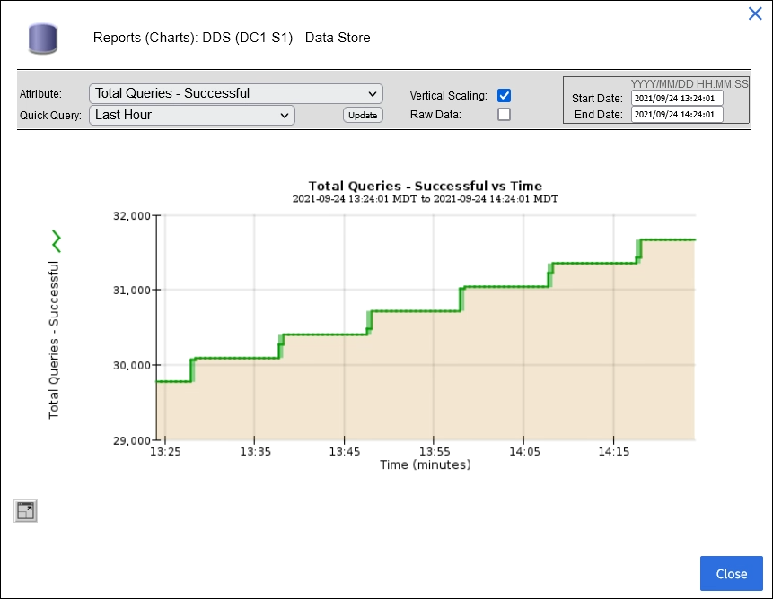

= Utiliser des tableaux et des graphiques
:allow-uri-read: 
:icons: font
:imagesdir: ../media/

[role="lead"]
Vous pouvez utiliser des graphiques et des rapports pour surveiller l’état du système StorageGRID et résoudre les problèmes.

NOTE: Le gestionnaire de grille est mis à jour à chaque version et peut ne pas correspondre aux exemples de captures d'écran sur cette page.

== Types de graphiques

Les graphiques et diagrammes résument les valeurs des métriques et attributs StorageGRID spécifiques.

Le tableau de bord Grid Manager comprend des cartes qui résument le stockage disponible pour la grille et chaque site.

image::../media/dashboard_data_and_metadata_space_usage_breakdown.png[Répartition de l'utilisation de l'espace de données et de métadonnées du tableau de bord]

Le panneau d’utilisation du stockage sur le tableau de bord du gestionnaire de locataires affiche les éléments suivants :

* Une liste des plus grands buckets (S3) ou conteneurs (Swift) pour le locataire
* Un graphique à barres qui représente les tailles relatives des plus grands seaux ou conteneurs
* La quantité totale d'espace utilisé et, si un quota est défini, la quantité et le pourcentage d'espace restant

image::../media/tenant_dashboard_with_buckets.png[Tableau de bord du locataire]

De plus, des graphiques montrant comment les métriques et les attributs StorageGRID évoluent au fil du temps sont disponibles sur la page Nœuds et sur la page *SUPPORT* > *Outils* > *Topologie de grille*.

Il existe quatre types de graphiques :

* *Graphiques Grafana* : Affichés sur la page Nœuds, les graphiques Grafana sont utilisés pour tracer les valeurs des métriques Prometheus au fil du temps.  Par exemple, l’onglet *NODES* > *Network* pour un nœud de stockage inclut un graphique Grafana pour le trafic réseau.
+
image::../media/nodes_page_network_tab.png[Page Nœuds Onglet Réseau]

+

NOTE: Les graphiques Grafana sont également inclus dans les tableaux de bord pré-construits disponibles sur la page *SUPPORT* > *Outils* > *Métriques*.

* *Graphiques linéaires* : Disponibles à partir de la page Nœuds et de la page *SUPPORT* > *Outils* > *Topologie de grille* (sélectionnez l'icône du graphiqueimage:../media/icon_chart_new_for_11_5.png["Graphique d'icônes (nouveau)"] (après une valeur de données), des graphiques linéaires sont utilisés pour tracer les valeurs des attributs StorageGRID qui ont une valeur unitaire (comme le décalage de fréquence NTP, en ppm).  Les variations de valeur sont représentées dans des intervalles de données réguliers (bins) au fil du temps.
+
image::../media/line_graph.gif[Graphique linéaire]

* *Graphiques de zone* : Disponibles à partir de la page Nœuds et de la page *SUPPORT* > *Outils* > *Topologie de grille* (sélectionnez l'icône du graphiqueimage:../media/icon_chart_new_for_11_5.png["Graphique d'icônes (nouveau)"] (après une valeur de données), les graphiques de zone sont utilisés pour tracer des quantités d'attributs volumétriques, telles que le nombre d'objets ou les valeurs de charge de service.  Les graphiques de surface sont similaires aux graphiques linéaires, mais incluent un ombrage marron clair sous la ligne.  Les variations de valeur sont représentées dans des intervalles de données réguliers (bins) au fil du temps.
+
image::../media/area_graph.gif[Graphique de zone]

* Certains graphiques sont indiqués par un type d'icône de graphique différentimage:../media/icon_chart_new_for_11_5.png["Icône de graphique"] et ont un format différent :
+
image::../media/charts_lost_object_detected.png[Cartes Objet perdu détecté]

* *Graphique d'état* : Disponible à partir de la page *SUPPORT* > *Outils* > *Topologie de grille* (sélectionnez l'icône du graphiqueimage:../media/icon_chart_new_for_11_5.png["Graphique d'icônes (nouveau)"] (après une valeur de données), les graphiques d'état sont utilisés pour tracer des valeurs d'attribut qui représentent des états distincts tels qu'un état de service qui peut être en ligne, en veille ou hors ligne.  Les graphiques d'état sont similaires aux graphiques linéaires, mais la transition est discontinue ; c'est-à-dire que la valeur passe d'une valeur d'état à une autre.
+
image::../media/state_graph.gif[Graphique d'état]

.Informations connexes
* link:viewing-nodes-page.html["Afficher la page Nœuds"]
* link:viewing-grid-topology-tree.html["Afficher l'arborescence de la topologie de la grille"]
* link:reviewing-support-metrics.html["Examiner les mesures de support"]

== Légende du graphique

Les lignes et les couleurs utilisées pour dessiner des cartes ont une signification spécifique.

[cols="1a,3a"]
|===
| Exemple | Signification 

 a| 
image:../media/dark_green_chart_line.gif["capture d'écran montrant une ligne vert foncé"]
 a| 
Les valeurs d’attribut signalées sont tracées à l’aide de lignes vert foncé.

 a| 
image:../media/light_green_chart_line.gif["capture d'écran montrant un ombrage indiquant le regroupement des données"]
 a| 
Un ombrage vert clair autour des lignes vert foncé indique que les valeurs réelles dans cette plage de temps varient et ont été « regroupées » pour un traçage plus rapide.  La ligne sombre représente la moyenne pondérée.  La plage en vert clair indique les valeurs maximales et minimales dans le bac.  Un ombrage marron clair est utilisé pour les graphiques de zone afin d'indiquer les données volumétriques.

 a| 
image:../media/no_data_plotted_chart.gif["capture d'écran montrant des zones vides sur la ligne de tracé"]
 a| 
Les zones vides (aucune donnée tracée) indiquent que les valeurs d'attribut n'étaient pas disponibles.  L'arrière-plan peut être bleu, gris ou un mélange de gris et de bleu, selon l'état du service signalant l'attribut.

 a| 
image:../media/light_blue_chart_shading.gif["capture d'écran montrant un ombrage bleu clair indiquant des valeurs indéterminées"]
 a| 
L'ombrage bleu clair indique que certaines ou toutes les valeurs d'attribut à ce moment-là étaient indéterminées ; l'attribut ne rapportait pas de valeurs car le service était dans un état inconnu.

 a| 
image:../media/gray_chart_shading.gif["capture d'écran montrant un ombrage gris dû à des valeurs inconnues"]
 a| 
L'ombrage gris indique que certaines ou toutes les valeurs d'attribut à ce moment-là n'étaient pas connues car le service signalant les attributs était administrativement hors service.

 a| 
image:../media/gray_blue_chart_shading.gif["capture d'écran montrant un mélange de valeurs indéterminées et inconnues"]
 a| 
Un mélange de nuances grises et bleues indique que certaines des valeurs d'attribut à ce moment-là étaient indéterminées (car le service était dans un état inconnu), tandis que d'autres n'étaient pas connues car le service signalant les attributs était administrativement en panne.

|===

== Afficher des tableaux et des graphiques

La page Nœuds contient les graphiques et diagrammes auxquels vous devez accéder régulièrement pour surveiller des attributs tels que la capacité de stockage et le débit.  Dans certains cas, notamment lorsque vous travaillez avec le support technique, vous pouvez utiliser la page *SUPPORT* > *Outils* > *Topologie de grille* pour accéder à des graphiques supplémentaires.

.Avant de commencer
Vous devez être connecté au Grid Manager à l'aide d'unlink:../admin/web-browser-requirements.html["navigateur Web pris en charge"] .

.Étapes
. Sélectionnez *NODES*. Ensuite, sélectionnez un nœud, un site ou la grille entière.
. Sélectionnez l’onglet pour lequel vous souhaitez afficher les informations.
+
Certains onglets incluent un ou plusieurs graphiques Grafana, qui sont utilisés pour tracer les valeurs des métriques Prometheus au fil du temps.  Par exemple, l’onglet *NODES* > *Hardware* pour un nœud inclut deux graphiques Grafana.

+
image::../media/nodes_page_hardware_tab_graphs.png[Nœuds Page Onglet Matériel Graphiques]

. Vous pouvez également positionner votre curseur sur le graphique pour voir des valeurs plus détaillées pour un moment précis.
+
image::../media/nodes_page_memory_usage_details.png[Détails de l'utilisation de la mémoire de la page des nœuds]

. Selon les besoins, vous pouvez souvent afficher un graphique pour un attribut ou une mesure spécifique.  Dans le tableau de la page Nœuds, sélectionnez l’icône du graphiqueimage:../media/icon_chart_new_for_11_5.png["Icône de graphique"] à droite du nom de l'attribut.
+

NOTE: Les graphiques ne sont pas disponibles pour toutes les métriques et tous les attributs.

+
*Exemple 1* : Dans l'onglet Objets d'un nœud de stockage, vous pouvez sélectionner l'icône de graphiqueimage:../media/icon_chart_new_for_11_5.png["Icône de graphique"] pour voir le nombre total de requêtes de stockage de métadonnées réussies pour le nœud de stockage.

+

+
image::../media/nodes_page-objects_chart_successful_metadata_queries.png[Graphiques Requêtes de métadonnées réussies]

+
*Exemple 2* : Dans l'onglet Objets d'un nœud de stockage, vous pouvez sélectionner l'icône de graphiqueimage:../media/icon_chart_new_for_11_5.png["Icône de graphique"] pour voir le graphique Grafana du nombre d'objets perdus détectés au fil du temps.

+
image::../media/object_count_table.png[Tableau de comptage d'objets]

+
image::../media/charts_lost_object_detected.png[Cartes Objet perdu détecté]

. Pour afficher les graphiques des attributs qui ne sont pas affichés sur la page Nœud, sélectionnez *SUPPORT* > *Outils* > *Topologie de grille*.
. Sélectionnez *_nœud de grille_* > *_composant ou service_* > *Aperçu* > *Principal*.
+
image::../media/nms_chart.gif[capture d'écran décrite par le texte environnant]

. Sélectionnez l'icône du graphiqueimage:../media/icon_chart_new_for_11_5.png["Icône de graphique"] à côté de l'attribut.
+
L'affichage passe automatiquement à la page *Rapports* > *Graphiques*.  Le graphique affiche les données de l'attribut au cours de la dernière journée.

== Générer des graphiques

Les graphiques affichent une représentation graphique des valeurs des données d’attribut.  Vous pouvez générer un rapport sur un site de centre de données, un nœud de grille, un composant ou un service.

.Avant de commencer
* Vous devez être connecté au Grid Manager à l'aide d'unlink:../admin/web-browser-requirements.html["navigateur Web pris en charge"] .
* Tu aslink:../admin/admin-group-permissions.html["autorisations d'accès spécifiques"] .

.Étapes
. Sélectionnez *SUPPORT* > *Outils* > *Topologie de grille*.
. Sélectionnez *_nœud de grille_* > *_composant ou service_* > *Rapports* > *Graphiques*.
. Sélectionnez l'attribut sur lequel générer le rapport dans la liste déroulante *Attribut*.
. Pour forcer l'axe Y à démarrer à zéro, décochez la case *Mise à l'échelle verticale*.
. Pour afficher les valeurs avec une précision totale, cochez la case *Données brutes* ou pour arrondir les valeurs à un maximum de trois décimales (par exemple, pour les attributs indiqués sous forme de pourcentages), décochez la case *Données brutes*.
. Sélectionnez la période sur laquelle porter le rapport dans la liste déroulante *Requête rapide*.
+
Sélectionnez l’option Requête personnalisée pour sélectionner une plage horaire spécifique.

+
Le graphique apparaît après quelques instants.  Prévoyez quelques minutes pour la tabulation des plages de temps longues.

. Si vous avez sélectionné Requête personnalisée, personnalisez la période du graphique en saisissant la *Date de début* et la *Date de fin*.
+
Utiliser le format `_YYYY/MM/DDHH:MM:SS_` en heure locale.  Des zéros non significatifs sont requis pour correspondre au format.  Par exemple, 2017/4/6 7:30:00 échoue à la validation.  Le format correct est : 2017/04/06 07:30:00.

. Sélectionnez *Mettre à jour*.
+
Un graphique est généré après quelques secondes.  Prévoyez quelques minutes pour la tabulation des plages de temps longues.  En fonction de la durée définie pour la requête, un rapport de texte brut ou un rapport de texte agrégé s'affiche.

