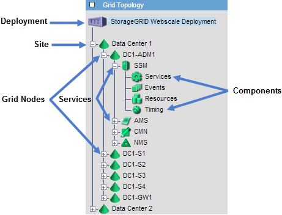

= Afficher l'arborescence de la topologie de la grille
:allow-uri-read: 
:icons: font
:imagesdir: ../media/

[role="lead"]
L'arborescence de topologie de grille donne accès à des informations détaillées sur les éléments du système StorageGRID , notamment les sites, les nœuds de grille, les services et les composants.  Dans la plupart des cas, vous n'avez besoin d'accéder à l'arborescence de la topologie de la grille que lorsque cela est indiqué dans la documentation ou lorsque vous travaillez avec le support technique.

Pour accéder à l'arborescence de topologie de grille, sélectionnez *SUPPORT* > *Outils* > *Topologie de grille*.

Pour développer ou réduire l'arborescence de la topologie de la grille, cliquez surimage:../media/nms_tree_expand.gif["icône du signe plus"] ouimage:../media/nms_tree_collapse.gif["icône du signe moins"] au niveau du site, du nœud ou du service.  Pour développer ou réduire tous les éléments de l'ensemble du site ou de chaque nœud, maintenez la touche *<Ctrl>* enfoncée et cliquez.

== Attributs StorageGRID

Les attributs signalent les valeurs et les statuts de nombreuses fonctions du système StorageGRID .  Les valeurs d’attribut sont disponibles pour chaque nœud de grille, chaque site et la grille entière.

Les attributs StorageGRID sont utilisés à plusieurs endroits dans le Grid Manager :

* *Page Nœuds* : de nombreuses valeurs affichées sur la page Nœuds sont des attributs StorageGRID .  (Les métriques Prometheus sont également affichées sur les pages Nœuds.)
* *Arborescence de topologie de grille* : les valeurs d'attribut sont affichées dans l'arborescence de topologie de grille (*SUPPORT* > *Outils* > *Topologie de grille*).
* *Événements* : des événements système se produisent lorsque certains attributs enregistrent une condition d’erreur ou de défaut pour un nœud, y compris des erreurs telles que des erreurs réseau.

=== Valeurs d'attribut

Les attributs sont rapportés dans la mesure du possible et sont approximativement corrects.  Les mises à jour d'attributs peuvent être perdues dans certaines circonstances, comme le crash d'un service ou l'échec et la reconstruction d'un nœud de grille.

De plus, les délais de propagation peuvent ralentir la génération de rapports sur les attributs.  Les valeurs mises à jour pour la plupart des attributs sont envoyées au système StorageGRID à intervalles fixes.  Il peut s'écouler plusieurs minutes avant qu'une mise à jour soit visible dans le système, et deux attributs qui changent plus ou moins simultanément peuvent être signalés à des moments légèrement différents.
