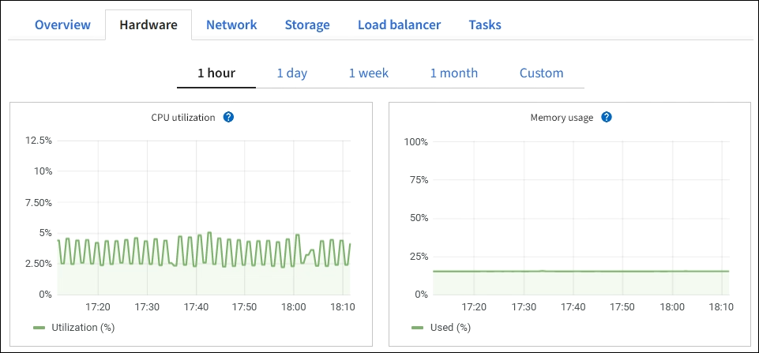
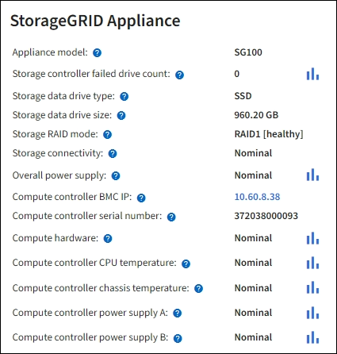

= Afficher l'onglet Matériel
:allow-uri-read: 
:icons: font
:imagesdir: ../media/

[role="lead"]
L'onglet Matériel affiche l'utilisation du processeur et de la mémoire pour chaque nœud, ainsi que des informations matérielles supplémentaires sur les appareils.

NOTE: Le gestionnaire de grille est mis à jour à chaque version et peut ne pas correspondre aux exemples de captures d'écran sur cette page.

L'onglet Matériel est affiché pour tous les nœuds.

image::../media/nodes_page_hardware_tab_graphs.png[Page Nœuds Onglet Matériel]

Pour afficher un intervalle de temps différent, sélectionnez l’un des contrôles au-dessus du graphique ou du diagramme.  Vous pouvez afficher les informations disponibles pour des intervalles de 1 heure, 1 jour, 1 semaine ou 1 mois.  Vous pouvez également définir un intervalle personnalisé, qui vous permet de spécifier des plages de dates et d'heures.

Pour voir les détails de l'utilisation du processeur et de la mémoire, placez votre curseur sur chaque graphique.

image::../media/nodes_page_memory_usage_details.png[Page Nœuds > Matériel > Détails d'utilisation de la mémoire]

Si le nœud est un nœud d’appliance, cet onglet inclut également une section contenant plus d’informations sur le matériel de l’appliance.

== Afficher les informations sur les nœuds de stockage de l'appliance

La page Nœuds répertorie les informations sur l'état du service et toutes les ressources de calcul, de disque et de réseau pour chaque nœud de stockage de l'appliance.  Vous pouvez également voir la mémoire, le matériel de stockage, la version du micrologiciel du contrôleur, les ressources réseau, les interfaces réseau, les adresses réseau et recevoir et transmettre des données.

.Étapes
. Depuis la page Nœuds, sélectionnez un nœud de stockage d’appliance.
. Sélectionnez *Aperçu*.
+
La section Informations sur le nœud de l'onglet Présentation affiche des informations récapitulatives sur le nœud, telles que le nom, le type, l'ID et l'état de connexion du nœud.  La liste des adresses IP comprend le nom de l'interface pour chaque adresse, comme suit :

+
** *eth* : Le réseau Grid, le réseau administrateur ou le réseau client.
** *hic*: L'un des ports physiques 10, 25 ou 100 GbE de l'appareil.  Ces ports peuvent être liés ensemble et connectés au réseau de grille StorageGRID (eth0) et au réseau client (eth2).
** *mtc* : l’un des ports physiques 1 GbE de l’appareil.  Une ou plusieurs interfaces mtc sont liées pour former l'interface réseau d'administration StorageGRID (eth1).  Vous pouvez laisser d’autres interfaces mtc disponibles pour une connectivité locale temporaire pour un technicien du centre de données.
+
image::../media/nodes_page_overview_tab_extended.png[Présentation étendue de la page des nœuds]

+
La section Alertes de l’onglet Présentation affiche toutes les alertes actives pour le nœud.

. Sélectionnez *Matériel* pour voir plus d’informations sur l’appareil.
+
.. Affichez les graphiques d’utilisation du processeur et de la mémoire pour déterminer les pourcentages d’utilisation du processeur et de la mémoire au fil du temps.  Pour afficher un intervalle de temps différent, sélectionnez l’un des contrôles au-dessus du graphique ou du diagramme.  Vous pouvez afficher les informations disponibles pour des intervalles de 1 heure, 1 jour, 1 semaine ou 1 mois.  Vous pouvez également définir un intervalle personnalisé, qui vous permet de spécifier des plages de dates et d'heures.
+
image::../media/nodes_page_hardware_tab_graphs.png[Graphiques matériels]

.. Faites défiler vers le bas pour afficher le tableau des composants de l'appareil.  Ce tableau contient des informations telles que le nom du modèle de l'appareil, les noms des contrôleurs, les numéros de série et les adresses IP, ainsi que l'état de chaque composant.
+

NOTE: Certains champs, tels que l'adresse IP du contrôleur de calcul BMC et le matériel de calcul, n'apparaissent que pour les appliances dotées de cette fonctionnalité.

+
Les composants des étagères de stockage et des étagères d'extension si elles font partie de l'installation apparaissent dans un tableau séparé sous le tableau des appareils.

+
image::../media/nodes_page_hardware_tab_for_appliance.png[Page Nœuds - Onglet Matériel pour l'appliance]

+
[cols="1a,2a"]
|===
| Champ dans la table Appliance | Description 

 a| 
Modèle d'appareil
 a| 
Le numéro de modèle de cet appareil StorageGRID affiché dans SANtricity OS.

 a| 
Nom du contrôleur de stockage
 a| 
Le nom de cet appareil StorageGRID affiché dans SANtricity OS.

 a| 
Contrôleur de stockage Une adresse IP de gestion
 a| 
Adresse IP pour le port de gestion 1 sur le contrôleur de stockage A. Vous utilisez cette adresse IP pour accéder à SANtricity OS afin de résoudre les problèmes de stockage.

 a| 
IP de gestion du contrôleur de stockage B
 a| 
Adresse IP pour le port de gestion 1 sur le contrôleur de stockage B. Vous utilisez cette adresse IP pour accéder à SANtricity OS afin de résoudre les problèmes de stockage.

Certains modèles d'appareils ne disposent pas de contrôleur de stockage B.

 a| 
WWID du contrôleur de stockage
 a| 
L'identifiant mondial du contrôleur de stockage affiché dans SANtricity OS.

 a| 
Numéro de série du châssis de l'appareil de stockage
 a| 
Le numéro de série du châssis de l'appareil.

 a| 
Version du micrologiciel du contrôleur de stockage
 a| 
La version du micrologiciel sur le contrôleur de stockage de cet appareil.

 a| 
Version du système d'exploitation SANtricity du contrôleur de stockage
 a| 
La version du système d'exploitation SANtricity du contrôleur de stockage A.

 a| 
Contrôleur de stockage version NVSRAM
 a| 
Version NVSRAM du contrôleur de stockage telle que rapportée par SANtricity System Manager.

Pour les SG6060 et SG6160, s'il existe une incompatibilité de version NVSRAM entre les deux contrôleurs, la version du contrôleur A s'affiche.  Si le contrôleur A n'est pas installé ou opérationnel, la version du contrôleur B s'affiche.

 a| 
Matériel de stockage
 a| 
L'état général du matériel du contrôleur de stockage.  Si SANtricity System Manager signale un état « Nécessite une attention particulière » pour le matériel de stockage, le système StorageGRID signale également cette valeur.

Si le statut est « nécessite une attention particulière », vérifiez d’abord le contrôleur de stockage à l’aide de SANtricity OS.  Ensuite, assurez-vous qu’aucune autre alerte n’existe qui s’applique au contrôleur de calcul.

 a| 
Nombre de disques défaillants du contrôleur de stockage
 a| 
Le nombre de lecteurs qui ne sont pas optimaux.

 a| 
Contrôleur de stockage A
 a| 
L'état du contrôleur de stockage A.

 a| 
Contrôleur de stockage B
 a| 
L'état du contrôleur de stockage B. Certains modèles d'appareils ne disposent pas de contrôleur de stockage B.

 a| 
Alimentation du contrôleur de stockage A
 a| 
L'état de l'alimentation A pour le contrôleur de stockage.

 a| 
Alimentation du contrôleur de stockage B
 a| 
L'état de l'alimentation B du contrôleur de stockage.

 a| 
Type de lecteur de données de stockage
 a| 
Le type de lecteurs de l'appareil, tels que HDD (disque dur) ou SSD (disque SSD).

 a| 
Taille du lecteur de données de stockage
 a| 
La taille effective d'un lecteur de données.

Pour le SG6160, la taille du lecteur de cache s'affiche également.

*Remarque* : Pour les nœuds avec des étagères d'extension, utilisez le<<shelf_data_drive_size,Taille du lecteur de données pour chaque étagère>> plutôt.  La taille effective du lecteur peut varier selon l'étagère.

 a| 
Mode RAID de stockage
 a| 
Le mode RAID configuré pour l'appareil.

 a| 
Connectivité de stockage
 a| 
L'état de connectivité du stockage.

 a| 
Alimentation électrique globale
 a| 
L'état de toutes les alimentations électriques de l'appareil.

 a| 
Contrôleur de calcul BMC IP
 a| 
L'adresse IP du port du contrôleur de gestion de la carte mère (BMC) dans le contrôleur de calcul.  Vous utilisez cette IP pour vous connecter à l'interface BMC afin de surveiller et de diagnostiquer le matériel de l'appliance.

Ce champ n'est pas affiché pour les modèles d'appareils qui ne contiennent pas de BMC.

 a| 
Numéro de série du contrôleur de calcul
 a| 
Le numéro de série du contrôleur de calcul.

 a| 
Matériel informatique
 a| 
L'état du matériel du contrôleur de calcul.  Ce champ ne s'affiche pas pour les modèles d'appliance qui ne disposent pas de matériel de calcul et de stockage distincts.

 a| 
Température du processeur du contrôleur de calcul
 a| 
L'état de température du processeur du contrôleur de calcul.

 a| 
Température du châssis du contrôleur de calcul
 a| 
L'état de température du contrôleur de calcul.

|===
+
[cols="1a,2a"]
|===
| Colonne dans le tableau des étagères de rangement | Description 

 a| 
Numéro de série du châssis d'étagère
 a| 
Le numéro de série du châssis de l'étagère de stockage.

 a| 
ID d'étagère
 a| 
L'identifiant numérique de l'étagère de stockage.

*** 99 : Étagère de contrôleur de stockage
*** 0 : Première étagère d'extension
*** 1 : Deuxième étagère d'extension

*Remarque :* les étagères d’extension s’appliquent uniquement aux modèles SG6060 et SG6160.

 a| 
État des étagères
 a| 
L'état général de l'étagère de stockage.

 a| 
Statut de l'OIM
 a| 
L'état des modules d'entrée/sortie (IOM) dans toutes les étagères d'extension.  N/A s'il ne s'agit pas d'une étagère d'extension.

 a| 
État de l'alimentation électrique
 a| 
L'état général des alimentations électriques de l'étagère de stockage.

 a| 
État du tiroir
 a| 
L'état des tiroirs de l'étagère de rangement.  N/A si l'étagère ne contient pas de tiroirs.

 a| 
Statut du ventilateur
 a| 
L'état général des ventilateurs de refroidissement dans l'étagère de stockage.

 a| 
Emplacements de lecteur
 a| 
Le nombre total d'emplacements de lecteur dans l'étagère de stockage.

 a| 
Lecteurs de données
 a| 
Le nombre de lecteurs dans l'étagère de stockage qui sont utilisés pour le stockage des données.

 a| 
[[shelf_data_drive_size]]Taille du lecteur de données
 a| 
La taille effective d'un lecteur de données dans l'étagère de stockage.

 a| 
Lecteurs de cache
 a| 
Le nombre de lecteurs dans l'étagère de stockage qui sont utilisés comme cache.

 a| 
Taille du lecteur de cache
 a| 
La taille du plus petit lecteur de cache dans l'étagère de stockage.  Normalement, les lecteurs de cache ont tous la même taille.

 a| 
État de la configuration
 a| 
L'état de configuration de l'étagère de stockage.

|===
.. Confirmez que tous les statuts sont « Nominaux ».
+
Si un statut n'est pas « Nominal », vérifiez toutes les alertes actuelles.  Vous pouvez également utiliser SANtricity System Manager pour en savoir plus sur certaines de ces valeurs matérielles.  Consultez les instructions d'installation et d'entretien de votre appareil.

. Sélectionnez *Réseau* pour afficher les informations de chaque réseau.
+
Le graphique du trafic réseau fournit un résumé du trafic réseau global.

+
image::../media/nodes_page_network_traffic_graph.png[Graphique du trafic réseau des pages de nœuds]

+
.. Consultez la section Interfaces réseau.
+
image::../media/nodes_page_network_interfaces.png[Nœuds Page Interfaces réseau]

+
Utilisez le tableau suivant avec les valeurs de la colonne *Vitesse* du tableau Interfaces réseau pour déterminer si les ports réseau 10/25-GbE de l'appliance ont été configurés pour utiliser le mode actif/de secours ou le mode LACP.

+

NOTE: Les valeurs indiquées dans le tableau supposent que les quatre liens sont utilisés.

+
[cols="1a,1a,1a,1a"]
|===
| Mode de liaison | Mode liaison | Vitesse de liaison HIC individuelle (hic1, hic2, hic3, hic4) | Vitesse attendue du réseau grille/client (eth0, eth2) 

 a| 
Agrégat
 a| 
LACP
 a| 
25
 a| 
100

 a| 
Fixé
 a| 
LACP
 a| 
25
 a| 
50

 a| 
Fixé
 a| 
Actif/Sauvegarde
 a| 
25
 a| 
25

 a| 
Agrégat
 a| 
LACP
 a| 
10
 a| 
40

 a| 
Fixé
 a| 
LACP
 a| 
10
 a| 
20

 a| 
Fixé
 a| 
Actif/Sauvegarde
 a| 
10
 a| 
10

|===
+
Voir https://docs.netapp.com/us-en/storagegrid-appliances/installconfig/configuring-network-links.html["Configurer les liens réseau"^] pour plus d'informations sur la configuration des ports 10/25-GbE.

.. Consultez la section Communication réseau.
+
Les tableaux de réception et de transmission indiquent le nombre d'octets et de paquets reçus et envoyés sur chaque réseau, ainsi que d'autres mesures de réception et de transmission.

+
image::../media/nodes_page_network_communication.png[Nœuds Page Réseau Comm]

. Sélectionnez *Stockage* pour afficher les graphiques qui montrent les pourcentages de stockage utilisés au fil du temps pour les données d'objet et les métadonnées d'objet, ainsi que des informations sur les périphériques de disque, les volumes et les magasins d'objets.
+
image::../media/nodes_page_storage_used_object_data.png[Stockage utilisé - Données d'objet]

+
image::../media/storage_used_object_metadata.png[Stockage utilisé - Métadonnées de l'objet]

+
.. Faites défiler vers le bas pour afficher les quantités de stockage disponibles pour chaque volume et magasin d’objets.
+
Le nom mondial de chaque disque correspond à l'identifiant mondial du volume (WWID) qui apparaît lorsque vous affichez les propriétés du volume standard dans SANtricity OS (le logiciel de gestion connecté au contrôleur de stockage de l'appliance).

+
Pour vous aider à interpréter les statistiques de lecture et d'écriture sur disque liées aux points de montage de volume, la première partie du nom affichée dans la colonne *Nom* du tableau Périphériques de disque (c'est-à-dire _sdc_, _sdd_, _sde_, etc.) correspond à la valeur affichée dans la colonne *Périphérique* du tableau Volumes.

+
image::../media/nodes_page_storage_tables.png[Tables de stockage de pages de nœuds]

== Afficher les informations sur les nœuds d'administration et les nœuds de passerelle de l'appareil

La page Nœuds répertorie les informations sur l'état du service et toutes les ressources de calcul, de périphérique de disque et de réseau pour chaque dispositif de services utilisé comme nœud d'administration ou nœud de passerelle.  Vous pouvez également voir la mémoire, le matériel de stockage, les ressources réseau, les interfaces réseau, les adresses réseau et recevoir et transmettre des données.

.Étapes
. À partir de la page Nœuds, sélectionnez un nœud d’administration d’appareil ou un nœud de passerelle d’appareil.
. Sélectionnez *Aperçu*.
+
La section Informations sur le nœud de l'onglet Présentation affiche des informations récapitulatives sur le nœud, telles que le nom, le type, l'ID et l'état de connexion du nœud.  La liste des adresses IP comprend le nom de l'interface pour chaque adresse, comme suit :

+
** *adllb* et *adlli* : affichés si la liaison active/de secours est utilisée pour l'interface réseau d'administration
** *eth* : Le réseau Grid, le réseau administrateur ou le réseau client.
** *hic*: L'un des ports physiques 10, 25 ou 100 GbE de l'appareil.  Ces ports peuvent être liés ensemble et connectés au réseau de grille StorageGRID (eth0) et au réseau client (eth2).
** *mtc* : l’un des ports physiques 1 GbE de l’appareil.  Une ou plusieurs interfaces mtc sont liées pour former l'interface réseau d'administration (eth1).  Vous pouvez laisser d’autres interfaces mtc disponibles pour une connectivité locale temporaire pour un technicien du centre de données.
+
image::../media/nodes_page_overview_tab_services_appliance.png[Page Nœuds, onglet Présentation pour l'appliance de services]

+
La section Alertes de l’onglet Présentation affiche toutes les alertes actives pour le nœud.

. Sélectionnez *Matériel* pour voir plus d’informations sur l’appareil.
+
.. Affichez les graphiques d’utilisation du processeur et de la mémoire pour déterminer les pourcentages d’utilisation du processeur et de la mémoire au fil du temps.  Pour afficher un intervalle de temps différent, sélectionnez l’un des contrôles au-dessus du graphique ou du diagramme.  Vous pouvez afficher les informations disponibles pour des intervalles de 1 heure, 1 jour, 1 semaine ou 1 mois.  Vous pouvez également définir un intervalle personnalisé, qui vous permet de spécifier des plages de dates et d'heures.
+

.. Faites défiler vers le bas pour afficher le tableau des composants de l'appareil.  Ce tableau contient des informations telles que le nom du modèle, le numéro de série, la version du micrologiciel du contrôleur et l'état de chaque composant.
+

+
[cols="1a,2a"]
|===
| Champ dans la table Appliance | Description 

 a| 
Modèle d'appareil
 a| 
Le numéro de modèle de cet appareil StorageGRID .

 a| 
Nombre de disques défaillants du contrôleur de stockage
 a| 
Le nombre de lecteurs qui ne sont pas optimaux.

 a| 
Type de lecteur de données de stockage
 a| 
Le type de lecteurs de l'appareil, tels que HDD (disque dur) ou SSD (disque SSD).

 a| 
Taille du lecteur de données de stockage
 a| 
La taille effective d'un lecteur de données.

 a| 
Mode RAID de stockage
 a| 
Le mode RAID de l'appareil.

 a| 
Alimentation électrique globale
 a| 
L'état de toutes les alimentations de l'appareil.

 a| 
Contrôleur de calcul BMC IP
 a| 
L'adresse IP du port du contrôleur de gestion de la carte mère (BMC) dans le contrôleur de calcul.  Vous pouvez utiliser cette IP pour vous connecter à l'interface BMC afin de surveiller et de diagnostiquer le matériel de l'appliance.

Ce champ n'est pas affiché pour les modèles d'appareils qui ne contiennent pas de BMC.

 a| 
Numéro de série du contrôleur de calcul
 a| 
Le numéro de série du contrôleur de calcul.

 a| 
Matériel informatique
 a| 
L'état du matériel du contrôleur de calcul.

 a| 
Température du processeur du contrôleur de calcul
 a| 
L'état de température du processeur du contrôleur de calcul.

 a| 
Température du châssis du contrôleur de calcul
 a| 
L'état de température du contrôleur de calcul.

|===
.. Confirmez que tous les statuts sont « Nominaux ».
+
Si un statut n'est pas « Nominal », vérifiez toutes les alertes actuelles.

. Sélectionnez *Réseau* pour afficher les informations de chaque réseau.
+
Le graphique du trafic réseau fournit un résumé du trafic réseau global.

+
image::../media/nodes_page_network_traffic_graph.png[Graphique du trafic réseau des pages de nœuds]

+
.. Consultez la section Interfaces réseau.
+
image::../media/nodes_page_hardware_tab_network_services_appliance.png[Page Nœuds Onglet Matériel Appareil de services réseau]

+
Utilisez le tableau suivant avec les valeurs de la colonne *Vitesse* du tableau Interfaces réseau pour déterminer si les quatre ports réseau 40/100-GbE de l'appliance ont été configurés pour utiliser le mode actif/de secours ou le mode LACP.

+

NOTE: Les valeurs indiquées dans le tableau supposent que les quatre liens sont utilisés.

+
[cols="1a,1a,1a,1a"]
|===
| Mode de liaison | Mode liaison | Vitesse de liaison HIC individuelle (hic1, hic2, hic3, hic4) | Vitesse attendue du réseau grille/client (eth0, eth2) 

 a| 
Agrégat
 a| 
LACP
 a| 
100
 a| 
400

 a| 
Fixé
 a| 
LACP
 a| 
100
 a| 
200

 a| 
Fixé
 a| 
Actif/Sauvegarde
 a| 
100
 a| 
100

 a| 
Agrégat
 a| 
LACP
 a| 
40
 a| 
160

 a| 
Fixé
 a| 
LACP
 a| 
40
 a| 
80

 a| 
Fixé
 a| 
Actif/Sauvegarde
 a| 
40
 a| 
40

|===
.. Consultez la section Communication réseau.
+
Les tableaux de réception et de transmission indiquent le nombre d'octets et de paquets reçus et envoyés sur chaque réseau, ainsi que d'autres mesures de réception et de transmission.

+
image::../media/nodes_page_network_communication.png[Nœuds Page Réseau Comm]

. Sélectionnez *Stockage* pour afficher des informations sur les périphériques de disque et les volumes sur le dispositif de services.
+
image::../media/nodes_page_storage_tab_services_appliance.png[Page Nœuds Onglet Stockage Services Appliance]

