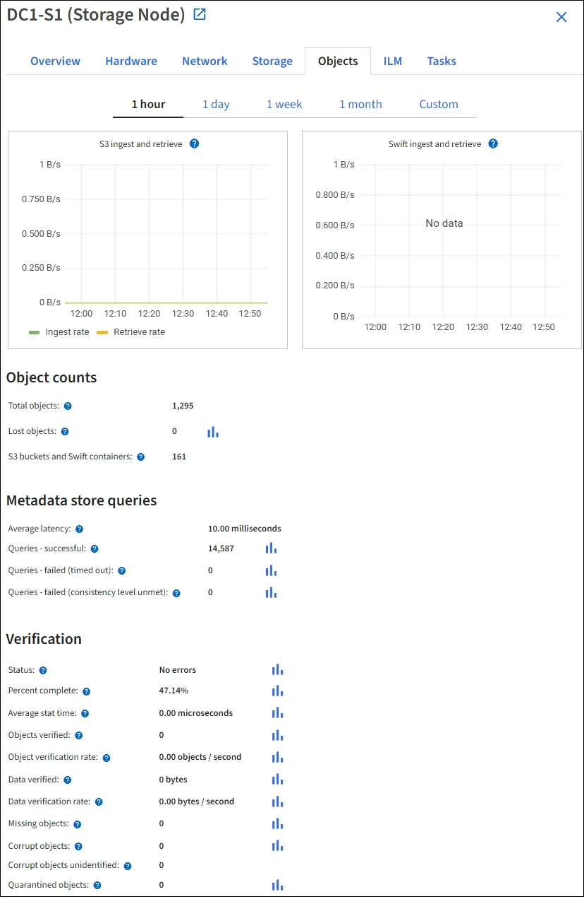

= Afficher l'onglet Objets
:allow-uri-read: 
:icons: font
:imagesdir: ../media/

[role="lead"]
L'onglet Objets fournit des informations surlink:../s3/index.html["Taux d'ingestion et de récupération S3"] .

L'onglet Objets s'affiche pour chaque nœud de stockage, chaque site et la grille entière.  Pour les nœuds de stockage, l'onglet Objets fournit également le nombre d'objets et des informations sur les requêtes de métadonnées et la vérification en arrière-plan.

