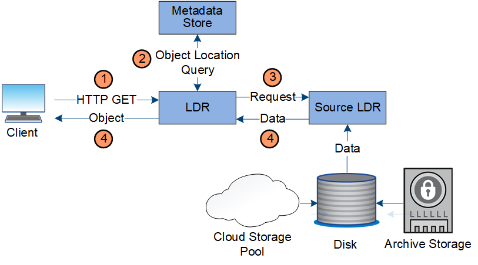

= Récupérer le flux de données
:allow-uri-read: 
:icons: font
:imagesdir: ../media/

[role="lead"]
Une opération de récupération consiste en un flux de données défini entre le système StorageGRID et le client.  Le système utilise des attributs pour suivre la récupération de l'objet à partir d'un nœud de stockage ou, si nécessaire, d'un pool de stockage cloud.

Le service LDR du nœud de stockage interroge le magasin de métadonnées pour connaître l'emplacement des données de l'objet et les récupère à partir du service LDR source.  De préférence, la récupération s'effectue à partir d'un nœud de stockage.  Si l'objet n'est pas disponible sur un nœud de stockage, la demande de récupération est dirigée vers un pool de stockage cloud.

NOTE: Si la seule copie d’objet se trouve sur le stockage AWS Glacier ou sur le niveau Azure Archive, l’application cliente doit émettre une demande S3 RestoreObject pour restaurer une copie récupérable dans le pool de stockage cloud.

. Le service LDR reçoit une demande de récupération de l'application cliente.
. Le service LDR interroge le magasin de métadonnées pour connaître l'emplacement des données de l'objet et les métadonnées.
. Le service LDR transmet la demande de récupération au service LDR source.
. Le service LDR source renvoie les données d’objet du service LDR interrogé et le système renvoie l’objet à l’application cliente.

