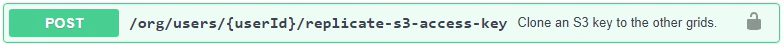

= Cloner les clés d'accès S3 à l'aide de l'API
:allow-uri-read: 
:icons: font
:imagesdir: ../media/

[role="lead"]
Si votre compte de locataire dispose de l'autorisation *Utiliser la connexion à la fédération de grille*, vous pouvez utiliser l'API de gestion des locataires pour cloner manuellement les clés d'accès S3 du locataire sur la grille source vers le locataire sur la grille de destination.

.Avant de commencer
* Le compte locataire dispose de l'autorisation *Utiliser la connexion à la fédération de grille*.
* La connexion à la fédération de grille a un *statut de connexion* de *Connecté*.
* Vous êtes connecté au gestionnaire de locataires sur la grille source du locataire à l'aide d'unlink:../admin/web-browser-requirements.html["navigateur Web pris en charge"] .
* Vous appartenez à un groupe d'utilisateurs qui possède lelink:tenant-management-permissions.html["Gérez vos propres informations d'identification S3 ou autorisation d'accès root"] .
* Si vous clonez des clés d’accès pour un utilisateur local, l’utilisateur existe déjà sur les deux grilles.
+

NOTE: Lorsque vous clonez des clés d’accès S3 pour un utilisateur fédéré, l’utilisateur et les clés d’accès S3 sont ajoutés au locataire de destination.

== Clonez vos propres clés d'accès

Vous pouvez cloner vos propres clés d’accès si vous devez accéder aux mêmes compartiments sur les deux grilles.

.Étapes
. En utilisant le gestionnaire de locataires sur la grille source,link:creating-your-own-s3-access-keys.html["créez vos propres clés d'accès"] et téléchargez le `.csv` déposer.
. En haut du gestionnaire de locataires, sélectionnez l’icône d’aide et sélectionnez *Documentation API*.
. Dans la section *s3*, sélectionnez le point de terminaison suivant :
+
`POST /org/users/current-user/replicate-s3-access-key`

+
image::../media/grid-federation-post-current-user-replicate.png[Point de terminaison POST pour la réplication de sa propre clé d'accès]

. Sélectionnez *Essayer*.
. Dans la zone de texte *body*, remplacez les exemples d'entrées pour *accessKey* et *secretAccessKey* par les valeurs du fichier *.csv* que vous avez téléchargé.
+
Assurez-vous de conserver les guillemets doubles autour de chaque chaîne.

+
image::../media/grid-federation-clone-access-key.png[API Tenant Manager saisissant des valeurs pour cloner la clé d'accès]

. Si la clé expire, remplacez l'exemple d'entrée pour *expires* par la date et l'heure d'expiration sous forme de chaîne au format de données-heure ISO 8601 (par exemple, `2024-02-28T22:46:33-08:00` ).  Si la clé n'expire pas, entrez *null* comme valeur pour l'entrée *expires* (ou supprimez la ligne *Expires* et la virgule précédente).
. Sélectionnez *Exécuter*.
. Confirmez que le code de réponse du serveur est *204*, indiquant que la clé a été clonée avec succès sur la grille de destination.

== Cloner les clés d'accès d'un autre utilisateur

Vous pouvez cloner les clés d'accès d'un autre utilisateur s'il doit accéder aux mêmes compartiments sur les deux grilles.

.Étapes
. En utilisant le gestionnaire de locataires sur la grille source,link:creating-another-users-s3-access-keys.html["créer les clés d'accès S3 de l'autre utilisateur"] et téléchargez le `.csv` déposer.
. En haut du gestionnaire de locataires, sélectionnez l’icône d’aide et sélectionnez *Documentation API*.
. Obtenir l'ID utilisateur.  Vous aurez besoin de cette valeur pour cloner les clés d’accès de l’autre utilisateur.
+
.. Dans la section *utilisateurs*, sélectionnez le point de terminaison suivant :
+
`GET /org/users`

.. Sélectionnez *Essayer*.
.. Spécifiez les paramètres que vous souhaitez utiliser lors de la recherche d’utilisateurs.
.. Sélectionnez *Exécuter*.
.. Recherchez l'utilisateur dont vous souhaitez cloner les clés et copiez le numéro dans le champ *id*.

. Dans la section *s3*, sélectionnez le point de terminaison suivant :
+
`POST /org/users/{userId}/replicate-s3-access-key`

+

. Sélectionnez *Essayer*.
. Dans la zone de texte *userId*, collez l'ID utilisateur que vous avez copié.
. Dans la zone de texte *corps*, remplacez les exemples d'entrées pour *exemple de clé d'accès* et *clé d'accès secrète* par les valeurs du fichier *.csv* pour cet utilisateur.
+
Assurez-vous de conserver les guillemets doubles autour de la chaîne.

. Si la clé expire, remplacez l'exemple d'entrée pour *expires* par la date et l'heure d'expiration sous forme de chaîne au format de données-heure ISO 8601 (par exemple, `2023-02-28T22:46:33-08:00` ).  Si la clé n'expire pas, entrez *null* comme valeur pour l'entrée *expires* (ou supprimez la ligne *Expires* et la virgule précédente).
. Sélectionnez *Exécuter*.
. Confirmez que le code de réponse du serveur est *204*, indiquant que la clé a été clonée avec succès sur la grille de destination.

