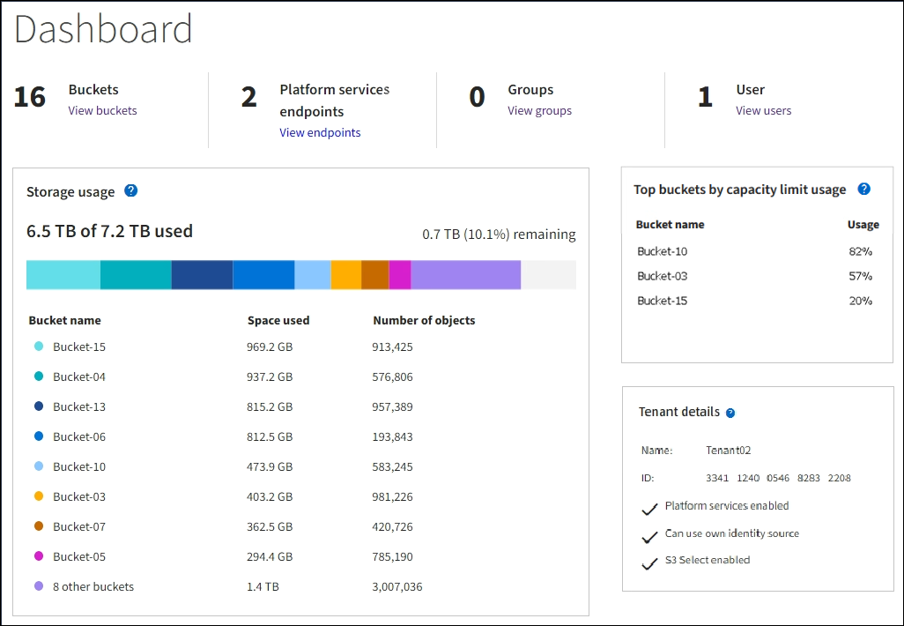

= Comprendre le tableau de bord du Tenant Manager
:allow-uri-read: 
:icons: font
:imagesdir: ../media/

[role="lead"]
Le tableau de bord du gestionnaire de locataires fournit un aperçu de la configuration d'un compte de locataire et de la quantité d'espace utilisée par les objets dans les compartiments (S3) ou les conteneurs (Swift) du locataire. Si le locataire dispose d'un quota, le tableau de bord indique la part du quota utilisée et la part restante. S'il y a des erreurs liées au compte locataire, les erreurs sont affichées sur le tableau de bord.

NOTE: Les valeurs de l'espace utilisé sont des estimations. Ces estimations sont affectées par le moment des ingestions, la connectivité réseau et l’état du nœud.

Une fois les objets téléchargés, le tableau de bord ressemble à l’exemple suivant :

== Informations sur le compte du locataire

La partie supérieure du tableau de bord affiche le nombre de buckets ou de conteneurs, de groupes et d’utilisateurs configurés.  Il affiche également le nombre de points de terminaison des services de la plateforme, si des points ont été configurés.  Sélectionnez les liens pour afficher les détails.

En fonction de lalink:tenant-management-permissions.html["autorisations de gestion des locataires"] vous disposez des options que vous avez configurées, le reste du tableau de bord affiche diverses combinaisons de directives, d'utilisation du stockage, d'informations sur les objets et de détails sur les locataires.

== Utilisation du stockage et des quotas

Le panneau Utilisation du stockage contient les informations suivantes :

* La quantité de données d'objet pour le locataire.
+
Cette valeur indique la quantité totale de données d'objet téléchargées et ne représente pas l'espace utilisé pour stocker des copies de ces objets et leurs métadonnées.

* Si un quota est défini, la quantité totale d'espace disponible pour les données de l'objet ainsi que la quantité et le pourcentage d'espace restant.  Le quota limite la quantité de données d’objet pouvant être ingérées.
+

CAUTION: L'utilisation des quotas est basée sur des estimations internes et peut être dépassée dans certains cas.  Par exemple, StorageGRID vérifie le quota lorsqu'un locataire commence à télécharger des objets et rejette les nouvelles acquisitions si le locataire a dépassé le quota.  Cependant, StorageGRID ne prend pas en compte la taille du téléchargement actuel pour déterminer si le quota a été dépassé.  Si des objets sont supprimés, un locataire peut être temporairement empêché de télécharger de nouveaux objets jusqu'à ce que l'utilisation du quota soit recalculée.  Les calculs d’utilisation des quotas peuvent prendre 10 minutes ou plus.

* Un graphique à barres qui représente les tailles relatives des plus grands seaux ou conteneurs.
+
Vous pouvez placer votre curseur sur l’un des segments du graphique pour afficher l’espace total consommé par ce bucket ou ce conteneur.

+
image::../media/tenant_dashboard_storage_usage_segment.png[Segment de graphique à barres]

* Pour correspondre au graphique à barres, une liste des plus grands compartiments ou conteneurs, y compris la quantité totale de données d'objet et le nombre d'objets pour chaque compartiment ou conteneur.
+
image::../media/tenant_dashboard_buckets.png[Seaux du tableau de bord du locataire]

+
Si le locataire possède plus de neuf seaux ou conteneurs, tous les autres seaux ou conteneurs sont regroupés en une seule entrée au bas de la liste.

NOTE: Pour modifier les unités des valeurs de stockage affichées dans le gestionnaire de locataires, sélectionnez la liste déroulante utilisateur dans le coin supérieur droit du gestionnaire de locataires, puis sélectionnez *Préférences utilisateur*.

== Alertes d'utilisation des quotas

Si les alertes d'utilisation de quota ont été activées dans le gestionnaire de grille, ces alertes apparaîtront dans le gestionnaire de locataires lorsque le quota est faible ou dépassé, comme suit :

* Si 90 % ou plus du quota d'un locataire a été utilisé, l'alerte *Utilisation élevée du quota du locataire* est déclenchée.
+
Pensez à demander à votre administrateur de réseau d’augmenter le quota.

* Si vous dépassez votre quota, une notification vous indique que vous ne pouvez pas télécharger de nouveaux objets.

== [[bucket-capacity-usage]]Utilisation de la limite de capacité

Si vous avez défini une limite de capacité pour vos compartiments, le tableau de bord du gestionnaire de locataires affiche une liste des compartiments principaux par utilisation de la limite de capacité.

Si aucune limite n'est définie pour un bucket, sa capacité est illimitée.  Cependant, si votre compte locataire dispose d'un quota de stockage total et que ce quota est atteint, vous ne pourrez pas ingérer davantage d'objets, quelle que soit la limite de capacité restante sur un bucket.

== Erreurs de point de terminaison

Si vous avez utilisé Grid Manager pour configurer un ou plusieurs points de terminaison à utiliser avec les services de plateforme, le tableau de bord Tenant Manager affiche une alerte si des erreurs de point de terminaison se sont produites au cours des sept derniers jours.

image::../media/tenant_dashboard_endpoint_error.png[Tableau de bord affichant le message du point de terminaison]

Pour voir les détails surlink:troubleshooting-platform-services-endpoint-errors.html["erreurs de point de terminaison des services de plateforme"] , sélectionnez *Points de terminaison* pour afficher la page Points de terminaison.
