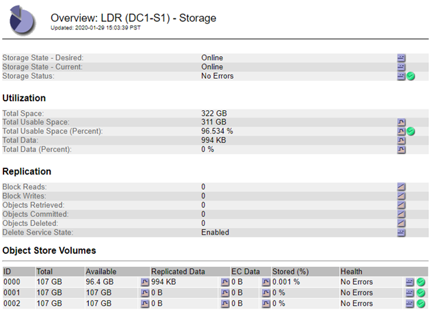

= Pannes du magasin d'objets (volume de stockage)
:allow-uri-read: 
:icons: font
:imagesdir: ../media/

[role="lead"]
Le stockage sous-jacent sur un nœud de stockage est divisé en magasins d’objets.  Les magasins d’objets sont également appelés volumes de stockage.

Vous pouvez afficher les informations du magasin d’objets pour chaque nœud de stockage. Les magasins d'objets sont affichés en bas de la page *NODES* > *_Storage Node_* > *Storage*.

image::../media/nodes_page_storage_nodes_storage_tables.png[Nœuds Page Stockage Nœud Stockage Tables]

Pour en voir pluslink:../monitor/viewing-grid-topology-tree.html["détails sur chaque nœud de stockage"] , suivez ces étapes :

. Sélectionnez *SUPPORT* > *Outils* > *Topologie de grille*.
. Sélectionnez *_site_* > *_Nœud de stockage_* > *LDR* > *Stockage* > *Aperçu* > *Principal*.

Selon la nature de la panne, les défauts d'un volume de stockage peuvent se refléter danslink:../monitor/alerts-reference.html["alertes de volume de stockage"] .  Si un volume de stockage tombe en panne, vous devez réparer le volume de stockage défaillant pour restaurer le nœud de stockage à toutes ses fonctionnalités dès que possible.  Si nécessaire, vous pouvez aller dans l'onglet *Configuration* etlink:../maintain/checking-storage-state-after-recovering-storage-volumes.html["placer le nœud de stockage dans un état de lecture seule"] afin que le système StorageGRID puisse l'utiliser pour la récupération des données pendant que vous vous préparez à une récupération complète du serveur.
