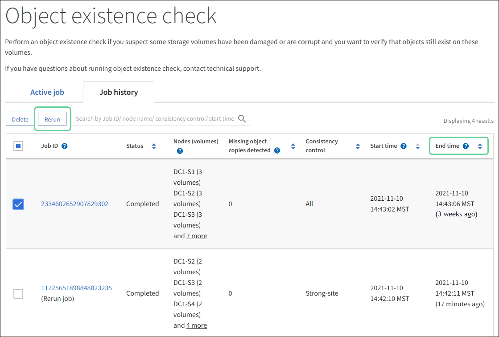

= Vérifier l'intégrité de l'objet
:allow-uri-read: 
:icons: font
:imagesdir: ../media/

[role="lead"]
Le système StorageGRID vérifie l'intégrité des données d'objet sur les nœuds de stockage, en recherchant les objets corrompus et manquants.

Il existe deux processus de vérification : la vérification en arrière-plan et la vérification de l'existence de l'objet (anciennement appelée vérification au premier plan).  Ils travaillent ensemble pour garantir l’intégrité des données.  La vérification en arrière-plan s'exécute automatiquement et vérifie en permanence l'exactitude des données de l'objet.  La vérification de l'existence d'un objet peut être déclenchée par un utilisateur pour vérifier plus rapidement l'existence (mais pas l'exactitude) des objets.

== Qu’est-ce que la vérification des antécédents?

Le processus de vérification en arrière-plan vérifie automatiquement et en continu les nœuds de stockage pour détecter les copies corrompues des données d'objet et tente automatiquement de réparer tous les problèmes qu'il détecte.

La vérification en arrière-plan vérifie l’intégrité des objets répliqués et des objets codés par effacement, comme suit :

* *Objets répliqués* : si le processus de vérification en arrière-plan détecte un objet répliqué corrompu, la copie corrompue est supprimée de son emplacement et mise en quarantaine ailleurs sur le nœud de stockage.  Ensuite, une nouvelle copie non corrompue est générée et placée pour satisfaire les politiques ILM actives.  La nouvelle copie peut ne pas être placée sur le nœud de stockage qui a été utilisé pour la copie d'origine.

NOTE: Les données d'objet corrompues sont mises en quarantaine plutôt que supprimées du système, de sorte qu'elles restent accessibles.  Pour plus d'informations sur l'accès aux données des objets mis en quarantaine, contactez le support technique.

* *Objets codés par effacement* : si le processus de vérification en arrière-plan détecte qu'un fragment d'un objet codé par effacement est corrompu, StorageGRID tente automatiquement de reconstruire le fragment manquant en place sur le même nœud de stockage, en utilisant les fragments de données et de parité restants.  Si le fragment corrompu ne peut pas être reconstruit, une tentative est effectuée pour récupérer une autre copie de l'objet.  Si la récupération réussit, une évaluation ILM est effectuée pour créer une copie de remplacement de l'objet codé par effacement.
+
Le processus de vérification en arrière-plan vérifie les objets sur les nœuds de stockage uniquement.  Il ne vérifie pas les objets dans un pool de stockage cloud.  Les objets doivent être âgés de plus de quatre jours pour être admissibles à la vérification des antécédents.

La vérification des antécédents s'exécute à un rythme continu conçu pour ne pas interférer avec les activités ordinaires du système.  La vérification des antécédents ne peut pas être arrêtée.  Cependant, vous pouvez augmenter le taux de vérification en arrière-plan pour vérifier plus rapidement le contenu d'un nœud de stockage si vous suspectez un problème.

=== Alertes liées à la vérification des antécédents

Si le système détecte un objet corrompu qu'il ne peut pas corriger automatiquement (parce que la corruption empêche l'identification de l'objet), l'alerte *Objet corrompu non identifié détecté* est déclenchée.

Si la vérification en arrière-plan ne peut pas remplacer un objet corrompu car elle ne peut pas localiser une autre copie, l'alerte *Objets perdus* est déclenchée.

=== Modifier le taux de vérification des antécédents

Vous pouvez modifier la vitesse à laquelle la vérification en arrière-plan vérifie les données d'objet répliquées sur un nœud de stockage si vous avez des inquiétudes concernant l'intégrité des données.

.Avant de commencer
* Vous devez être connecté au Grid Manager à l'aide d'unlink:../admin/web-browser-requirements.html["navigateur Web pris en charge"] .
* Tu aslink:../admin/admin-group-permissions.html["autorisations d'accès spécifiques"] .

.À propos de cette tâche
Vous pouvez modifier le taux de vérification pour la vérification en arrière-plan sur un nœud de stockage :

* Adaptatif : paramètre par défaut.  La tâche est conçue pour vérifier à un maximum de 4 Mo/s ou 10 objets/s (selon la première valeur dépassée).
* Élevé : la vérification du stockage se déroule rapidement, à un rythme qui peut ralentir les activités ordinaires du système.

Utilisez le taux de vérification élevé uniquement lorsque vous suspectez qu'une panne matérielle ou logicielle a pu corrompre les données de l'objet.  Une fois la vérification d'arrière-plan haute priorité terminée, le taux de vérification est automatiquement réinitialisé sur Adaptatif.

.Étapes
. Sélectionnez *SUPPORT* > *Outils* > *Topologie de grille*.
. Sélectionnez *_Nœud de stockage_* > *LDR* > *Vérification*.
. Sélectionnez *Configuration* > *Principal*.
. Accédez à *LDR* > *Vérification* > *Configuration* > *Principal*.
. Sous Vérification en arrière-plan, sélectionnez *Taux de vérification* > *Élevé* ou *Taux de vérification* > *Adaptatif*.
+
image::../media/background_verification_rate.png[réglage du taux de vérification]

. Cliquez sur *Appliquer les modifications*.
. Surveillez les résultats de la vérification en arrière-plan pour les objets répliqués.
+
.. Accédez à *NODES* > *_Storage Node_* > *Objects*.
.. Dans la section Vérification, surveillez les valeurs pour *Objets corrompus* et *Objets corrompus non identifiés*.
+
Si la vérification en arrière-plan détecte des données d'objet répliquées corrompues, la mesure *Objets corrompus* est incrémentée et StorageGRID tente d'extraire l'identifiant d'objet des données, comme suit :

+
*** Si l’identifiant de l’objet peut être extrait, StorageGRID crée automatiquement une nouvelle copie des données de l’objet.  La nouvelle copie peut être effectuée n'importe où dans le système StorageGRID qui satisfait aux politiques ILM actives.
*** Si l'identifiant de l'objet ne peut pas être extrait (car il a été corrompu), la mesure *Objets corrompus non identifiés* est incrémentée et l'alerte *Objet corrompu non identifié détecté* est déclenchée.

.. Si des données d'objet répliquées corrompues sont détectées, contactez le support technique pour déterminer la cause première de la corruption.

. Surveillez les résultats de la vérification en arrière-plan pour les objets codés par effacement.
+
Si la vérification en arrière-plan détecte des fragments corrompus de données d'objet codées par effacement, l'attribut Fragments corrompus détectés est incrémenté.  StorageGRID récupère en reconstruisant le fragment corrompu en place sur le même nœud de stockage.

+
.. Sélectionnez *SUPPORT* > *Outils* > *Topologie de grille*.
.. Sélectionnez *_Nœud de stockage_* > *LDR* > *Codage d'effacement*.
.. Dans le tableau Résultats de vérification, surveillez l’attribut Fragments corrompus détectés (ECCD).

. Une fois les objets corrompus restaurés automatiquement par le système StorageGRID , réinitialisez le nombre d'objets corrompus.
+
.. Sélectionnez *SUPPORT* > *Outils* > *Topologie de grille*.
.. Sélectionnez *_Nœud de stockage_* > *LDR* > *Vérification* > *Configuration*.
.. Sélectionnez *Réinitialiser le nombre d'objets corrompus*.
.. Cliquez sur *Appliquer les modifications*.

. Si vous êtes sûr que les objets mis en quarantaine ne sont pas nécessaires, vous pouvez les supprimer.
+

NOTE: Si l'alerte *Objets perdus* a été déclenchée, le support technique peut souhaiter accéder aux objets mis en quarantaine pour aider à déboguer le problème sous-jacent ou pour tenter de récupérer des données.

+
.. Sélectionnez *SUPPORT* > *Outils* > *Topologie de grille*.
.. Sélectionnez *_Nœud de stockage_* > *LDR* > *Vérification* > *Configuration*.
.. Sélectionnez *Supprimer les objets mis en quarantaine*.
.. Sélectionnez *Appliquer les modifications*.

== Qu'est-ce que la vérification de l'existence d'un objet ?

La vérification de l'existence d'un objet vérifie si toutes les copies répliquées attendues des objets et des fragments codés par effacement existent sur un nœud de stockage.  La vérification de l'existence d'un objet ne vérifie pas les données de l'objet lui-même (la vérification en arrière-plan le fait) ; au lieu de cela, elle fournit un moyen de vérifier l'intégrité des périphériques de stockage, en particulier si un problème matériel récent a pu affecter l'intégrité des données.

Contrairement à la vérification en arrière-plan, qui se produit automatiquement, vous devez démarrer manuellement une tâche de vérification de l'existence d'un objet.

La vérification de l'existence des objets lit les métadonnées de chaque objet stocké dans StorageGRID et vérifie l'existence des copies d'objets répliquées et des fragments d'objets codés par effacement.  Toute donnée manquante est traitée comme suit :

* *Copies répliquées* : si une copie des données d'objet répliquées est manquante, StorageGRID tente automatiquement de remplacer la copie à partir d'une copie stockée ailleurs dans le système.  Le nœud de stockage exécute une copie existante via une évaluation ILM, qui déterminera que la politique ILM actuelle n'est plus respectée pour cet objet car une autre copie est manquante.  Une nouvelle copie est générée et placée pour satisfaire les politiques ILM actives du système.  Cette nouvelle copie peut ne pas être placée au même endroit où la copie manquante a été stockée.
* *Fragments codés par effacement* : si un fragment d'un objet codé par effacement est manquant, StorageGRID tente automatiquement de reconstruire le fragment manquant en place sur le même nœud de stockage à l'aide des fragments restants.  Si le fragment manquant ne peut pas être reconstruit (parce que trop de fragments ont été perdus), ILM tente de trouver une autre copie de l'objet, qu'il peut utiliser pour générer un nouveau fragment codé par effacement.

=== Exécuter la vérification de l'existence de l'objet

Vous créez et exécutez une tâche de vérification de l’existence d’un objet à la fois.  Lorsque vous créez une tâche, vous sélectionnez les nœuds de stockage et les volumes que vous souhaitez vérifier.  Vous sélectionnez également la consistance du travail.

.Avant de commencer
* Vous êtes connecté au Grid Manager à l'aide d'unlink:../admin/web-browser-requirements.html["navigateur Web pris en charge"] .
* Vous avez lelink:../admin/admin-group-permissions.html["Autorisation d'accès de maintenance ou root"] .
* Vous avez vérifié que les nœuds de stockage que vous souhaitez vérifier sont en ligne. Sélectionnez *NODES* pour afficher le tableau des nœuds. Assurez-vous qu'aucune icône d'alerte n'apparaît à côté du nom du nœud pour les nœuds que vous souhaitez vérifier.
* Vous avez vérifié que les procédures suivantes ne sont *pas* en cours d'exécution sur les nœuds que vous souhaitez vérifier :
+
** Extension du réseau pour ajouter un nœud de stockage
** Mise hors service du nœud de stockage
** Récupération d'un volume de stockage défaillant
** Récupération d'un nœud de stockage avec un lecteur système défaillant
** Rééquilibrage de la CE
** Clonage de nœud d'appareil

La vérification de l'existence de l'objet ne fournit pas d'informations utiles pendant que ces procédures sont en cours.

.À propos de cette tâche
Une tâche de vérification de l'existence d'un objet peut prendre des jours ou des semaines, selon le nombre d'objets dans la grille, les nœuds et volumes de stockage sélectionnés et la cohérence sélectionnée.  Vous ne pouvez exécuter qu'une seule tâche à la fois, mais vous pouvez sélectionner plusieurs nœuds de stockage et volumes en même temps.

.Étapes
. Sélectionnez *MAINTENANCE* > *Tâches* > *Vérification de l'existence de l'objet*.
. Sélectionnez *Créer un travail*.  L'assistant Créer une tâche de vérification de l'existence d'un objet s'affiche.
. Sélectionnez les nœuds contenant les volumes que vous souhaitez vérifier.  Pour sélectionner tous les nœuds en ligne, cochez la case *Nom du nœud* dans l'en-tête de la colonne.
+
Vous pouvez rechercher par nom de nœud ou par site.

+
Vous ne pouvez pas sélectionner des nœuds qui ne sont pas connectés au réseau.

. Sélectionnez *Continuer*.
. Sélectionnez un ou plusieurs volumes pour chaque nœud de la liste.  Vous pouvez rechercher des volumes à l’aide du numéro de volume de stockage ou du nom du nœud.
+
Pour sélectionner tous les volumes pour chaque nœud sélectionné, cochez la case *Volume de stockage* dans l'en-tête de colonne.

. Sélectionnez *Continuer*.
. Sélectionnez la consistance pour le travail.
+
La cohérence détermine le nombre de copies de métadonnées d'objet utilisées pour la vérification de l'existence de l'objet.

+
** *Site fort* : Deux copies de métadonnées sur un seul site.
** *Strong-global* : Deux copies de métadonnées sur chaque site.
** *Tous* (par défaut) : les trois copies de métadonnées sur chaque site.
+
Pour plus d’informations sur la cohérence, consultez les descriptions dans l’assistant.

. Sélectionnez *Continuer*.
. Vérifiez et révisez vos sélections.  Vous pouvez sélectionner *Précédent* pour accéder à une étape précédente de l'assistant afin de mettre à jour vos sélections.
+
Une tâche de vérification de l'existence d'un objet est générée et s'exécute jusqu'à ce que l'un des événements suivants se produise :

+
** Le travail est terminé.
** Vous mettez en pause ou annulez le travail.  Vous pouvez reprendre un travail que vous avez suspendu, mais vous ne pouvez pas reprendre un travail que vous avez annulé.
** Le travail stagne.  L'alerte *La vérification de l'existence de l'objet est bloquée* est déclenchée.  Suivez les actions correctives spécifiées pour l’alerte.
** Le travail échoue.  L'alerte *La vérification de l'existence de l'objet a échoué* est déclenchée.  Suivez les actions correctives spécifiées pour l’alerte.
** Un message « Service indisponible » ou « Erreur interne du serveur » s'affiche.  Après une minute, actualisez la page pour continuer à surveiller le travail.
+

NOTE: Si nécessaire, vous pouvez quitter la page de vérification de l'existence de l'objet et y revenir pour continuer à surveiller le travail.

. Pendant l'exécution du travail, affichez l'onglet *Tâche active* et notez la valeur de Copies d'objets manquantes détectées.
+
Cette valeur représente le nombre total de copies manquantes d'objets répliqués et d'objets codés par effacement avec un ou plusieurs fragments manquants.

+
Si le nombre de copies d'objets manquants détectées est supérieur à 100, il peut y avoir un problème avec le stockage du nœud de stockage.

+
image::../media/oec_active.png[Emploi actif OEC]

. Une fois le travail terminé, effectuez les actions supplémentaires requises :
+
** Si le nombre de copies d'objets manquantes détectées est nul, aucun problème n'a été détecté.  Aucune action n'est requise.
** Si le nombre de copies d'objets manquantes détectées est supérieur à zéro et que l'alerte *Objets perdus* n'a pas été déclenchée, alors toutes les copies manquantes ont été réparées par le système. Vérifiez que tous les problèmes matériels ont été corrigés pour éviter de futurs dommages aux copies d’objets.
** Si le nombre de copies d'objets manquantes détectées est supérieur à zéro et que l'alerte *Objets perdus* a été déclenchée, l'intégrité des données peut être affectée. Contactez le support technique.
** Vous pouvez enquêter sur les copies d'objets perdues en utilisant grep pour extraire les messages d'audit LLST : `grep LLST audit_file_name` .
+
Cette procédure est similaire à celle pourlink:../troubleshoot/investigating-lost-objects.html["enquête sur les objets perdus"] , bien que pour les copies d'objets, vous recherchez `LLST` au lieu de `OLST` .

. Si vous avez sélectionné la cohérence Strong-Site ou Strong-Global pour le travail, attendez environ trois semaines pour la cohérence des métadonnées, puis réexécutez le travail sur les mêmes volumes.
+
Lorsque StorageGRID a eu le temps d'assurer la cohérence des métadonnées pour les nœuds et les volumes inclus dans la tâche, la réexécution de la tâche peut effacer les copies d'objets manquantes signalées par erreur ou entraîner la vérification de copies d'objets supplémentaires si elles ont été manquées.

+
.. Sélectionnez *MAINTENANCE* > *Vérification de l'existence de l'objet* > *Historique des tâches*.
.. Déterminer les tâches prêtes à être réexécutées :
+
... Consultez la colonne *Heure de fin* pour déterminer quelles tâches ont été exécutées il y a plus de trois semaines.
... Pour ces tâches, scannez la colonne de contrôle de cohérence pour strong-site ou strong-global.

.. Cochez la case correspondant à chaque tâche que vous souhaitez réexécuter, puis sélectionnez *Réexécuter*.
+

.. Dans l'assistant de réexécution des tâches, vérifiez les nœuds et les volumes sélectionnés ainsi que la cohérence.
.. Lorsque vous êtes prêt à réexécuter les tâches, sélectionnez *Réexécuter*.

L'onglet Travail actif apparaît.  Tous les travaux que vous avez sélectionnés sont réexécutés comme un seul travail avec une cohérence de site forte.  Un champ *Tâches associées* dans la section Détails répertorie les identifiants de tâche pour les tâches d'origine.

.Après avoir terminé
Si vous avez encore des inquiétudes concernant l'intégrité des données, accédez à *SUPPORT* > *Outils* > *Topologie de grille* > *_site_* > *_Nœud de stockage_* > *LDR* > *Vérification* > *Configuration* > *Principal* et augmentez le taux de vérification en arrière-plan.  La vérification en arrière-plan vérifie l'exactitude de toutes les données d'objet stockées et répare tous les problèmes qu'elle détecte.  Trouver et réparer les problèmes potentiels le plus rapidement possible réduit le risque de perte de données.
